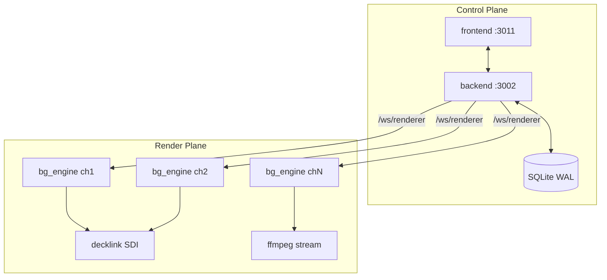

# Архитектура Titulus

Полный технический справочник. Краткие правила для агентов — `.cursor/rules/architecture.mdc`.

История по фазам: `docs/development-phases/README.md`.

---

## 1. Принципы и NFR

Titulus — proprietary cloud/on-prem broadcast graphics. Два плоскости: **control plane** (React + Express) и **render plane** (`bg_engine`, C++20 + CEF OSR).

| Принцип | Требование |
|---|---|
| CPU-only render | CEF OSR, `--disable-gpu`. GPU только через отдельный gate-doc |
| HTML5/DOM | Единственный template runtime. Нет PIXI/GSAP/WebGL-as-primary |
| Frame-accurate SDI | DeckLink scheduled playback; для decklink-каналов SDI = master clock |
| Per-channel output | `browser` \| `obs_vmix` \| `decklink` \| `stream` |
| Свой control plane | Не AMCP, не CasparCG Client |
| Perf MVP | ≥3×1080i50, drops <0.1%, mask/alpha overhead ≤5% |
| Git-first | Ветка → PR → merge в `main` |

| NFR | Реализация |
|---|---|
| NFR-1 On-air persistence | SQLite `on_air` + replay-on-connect |
| NFR-3 Security baseline | Auth, WS validation, upload guards, security headers |
| WYSIWYG | Один `@titulus/runtime` для editor/engine/thumbnails |
| CasparCG parity | Clean-room reimplement by reference — `docs/CASPARRCG_PORTING.md` |

---

## 2. Topology

```text
┌─ CONTROL PLANE ─────────────────────┐   ┌─ RENDER PLANE ──────────────────┐
│ frontend (React/Vite) :3011         │   │ bg_engine × N (1 proc = 1 ch)   │
│ /login /templates /editor /control  │   │ CEF OSR → BGRA → consumers      │
│ backend (Express/WS/SQLite) :3002   │◀─▶│                                 │
│ REST /api/*  WS /ws/*               │   │ null | pipe | preview | decklink│
└─────────────────────────────────────┘   │              | stream           │
                                          └─────────────────────────────────┘
         ┌─ SHARED RUNTIME ─────────────────────────────────────────────┐
         │ @titulus/runtime → bg-runtime.js (IIFE window.BG)            │
         └──────────────────────────────────────────────────────────────┘
```



---

## 3. Структура репозитория

| Каталог | Назначение |
|---|---|
| `engine/` | C++20 render host, consumers, supervisor scripts |
| `runtime/` | `@titulus/runtime` — JSON→DOM, единая render-логика |
| `backend/` | REST, WS, SQLite, media, auth |
| `frontend/` | Editor + control panel SPA |
| `shared/` | `template.schema.json` (AI-ready) |
| `bench/` | Perf harness, stress HTML scenes |
| `docs/` | Документация, `development-phases/`, `CASPARRCG_PORTING.md` |

**External reference (gitignored):** CasparCG `server/`, DeckLink SDK, CEF dist.

---

## 4. Process model

| Процесс | Count | Роль |
|---|---|---|
| `backend` | 1 | API, WS hub, DB, media jobs |
| `frontend` | 1 | Dev Vite (:3011) или static prod |
| `bg_engine` | 1 per channel | CEF render + primary output |
| `ffmpeg` child | 0–1 per engine | Только `stream` consumer |

### CPU affinity

- Каждый `bg_engine` pinned к non-overlapping core set через `taskset` / `CPUAffinity`
- **2 dedicated физических cores на канал** (+ SMT siblings, Phase 10.3)
- `run-engines.sh` читает `/api/channels`, назначает cores locale-safe (`lscpu -p=CPU,CORE`)

### RT priority

- `SCHED_FIFO` priority 2 на render pump — **только** decklink-driven (`HasExternalClock()`)
- Soft-fail без `CAP_SYS_NICE` / `RLIMIT_RTPRIO`
- `dev-start.sh`: `nice -n 10` для backend/frontend

### Supervisor tree

```text
run-engines.sh (parent)
  └── run-channel.sh × N (while-true loop, restart ~3s)
        └── bg_engine (exit 42 → profile restart)
```

### Environment variables

| Variable | Назначение |
|---|---|
| `TITULUS_DATA` | SQLite + uploads path (prod: `/var/lib/titulus`) |
| `PORT` | Backend port (dev: 3002) |
| `TITULUS_API_TOKEN` / user+password | Auth для `run-engines.sh` |
| `TITULUS_HOST` | Bind address (`0.0.0.0` default в dev) |
| `BACKEND_URL` | Supervisor → API base |

---

## 5. Control plane — Backend

### Stack

- Node.js 20+, ESM (`"type": "module"`)
- Express 4 + express-ws
- SQLite WAL (`better-sqlite3`)
- ajv + ajv-formats для template validation
- multer для uploads

### Auth / RBAC

- Token sessions в таблице `sessions`
- Роли: `admin` | `operator`
- Bootstrap admin: `admin` / `admin123` (dev only)
- `/ws/control` требует auth token (query `?token=` или header)
- Admin-only: `/api/channels`, `/api/license`, `/api/settings`, `/api/audit`

### REST API (полный список)

| Method | Path | Auth | Описание |
|---|---|---|---|
| GET | `/api/health` | — | Health check |
| POST | `/api/auth/login` | — | `{username, password}` → token |
| POST | `/api/auth/logout` | ✓ | Invalidate session |
| GET | `/api/auth/me` | ✓ | Current user |
| GET/POST | `/api/auth/users` | admin | User management |
| GET | `/api/templates` | ✓ | List templates |
| POST | `/api/templates` | ✓ | Create |
| GET | `/api/templates/schema` | ✓ | JSON Schema |
| POST | `/api/templates/validate` | ✓ | AJV validate → 200/422 |
| GET/PUT/DELETE | `/api/templates/:id` | ✓ | CRUD |
| GET/POST | `/api/channels` | admin | Channel list/create |
| GET/PUT/DELETE | `/api/channels/:id` | admin | Channel CRUD |
| GET/POST | `/api/rundowns` | ✓ | Rundown list/create |
| POST | `/api/rundowns/reorder` | ✓ | Reorder rundowns |
| GET/PUT/DELETE | `/api/rundowns/:id` | ✓ | Rundown CRUD |
| GET | `/api/onair` | ✓ | Current on-air state |
| GET/PUT | `/api/settings` | ✓ / admin | Key-value settings |
| POST | `/api/uploads` | ✓ | Media upload → transcode job |
| GET | `/api/uploads/jobs/:id` | ✓ | Transcode job status |
| GET | `/api/license` | admin | License status |
| POST | `/api/license/activate` | admin | Activate key |
| POST | `/api/license/deactivate` | admin | Deactivate |
| POST | `/api/license/check` | admin | Check validity |
| GET | `/api/billing/entitlements` | ✓ | Plan entitlements |
| POST | `/api/billing/hook` | secret | Webhook skeleton |
| GET | `/api/audit/events` | admin | Audit trail |

Static: `/uploads/*`, `/fonts/*`, `/channel.html`, `/bg-runtime.js`

### WebSocket

#### `/ws/control`

Входящие (от operator UI):

```json
{ "type": "take", "templateId": "...", "channelId": "...", "template": {...}, "variables": {...} }
{ "type": "update", "templateId": "...", "channelId": "...", "variables": {...} }
{ "type": "clear", "templateId": "...", "channelId": "..." }
```

- Message size cap: **256 KB** → close `1009`
- Structured error replies: `INVALID_JSON`, `INVALID_CHANNEL_ID`, etc.
- Requires auth token

#### `/ws/renderer?channel=<id>`

- Fan-out take/update/clear to engine `channel.html`
- **Replay-on-connect:** все active takes для channel при подключении
- CLEAR ALL fan-out при clear all templates

### SQLite schema (ключевые таблицы)

| Таблица | Назначение |
|---|---|
| `templates` | `id`, `name`, `data` (JSON) |
| `channels` | `output_mode`, `device_index`, `display_mode`, `keyer_mode`, `stream_url` |
| `rundowns` | `slots` JSON, `channel_id`, `sort_order` |
| `settings` | key-value store |
| `on_air` | `channel_id`, `template_id`, `command_json`, **`order_index`** |
| `license_state` | Singleton license row |
| `users`, `sessions`, `tenants` | Auth |
| `audit_events` | Persisted audit trail |

### OnAirManager

`backend/src/onair.js`:

1. `applyTake` — in-memory stack + SQLite persist + WS fan-out
2. `applyUpdate` — variables merge, no z-order change
3. `applyClear` — remove template from channel stack
4. `order_index` — deterministic replay order after backend restart

### Media pipeline

1. `POST /api/uploads` — multer, MIME/extension allow-list
2. `media.js` — ffmpeg VP9/WebM alpha transcode, poster frame
3. Retry, timeout guard, structured job errors
4. Served at `/uploads/<id>/...`

### License / Billing / Audit

- License: local foundation (no external provider yet)
- Entitlements tied to plan: `none|starter|pro|enterprise`
- Audit: sanitized payload, admin visibility in Settings

---

## 6. Control plane — Frontend

- React 18 + TypeScript 5 + Vite 5
- Zustand + zundo (undo/redo), Tailwind CSS 3
- Routes: `/login`, `/templates`, `/editor/:id`, `/control`, `/settings`, `/renderer`
- Vite proxy: `/api`, `/ws`, `/uploads`, `/channel.html`, `/bg-runtime.js`, `/fonts`

### Editor

- `CanvasArea` — WYSIWYG через `TemplateRenderer` из `@titulus/runtime`
- Panels: Layers, Properties, Variables, Timeline (dope sheet, curve editor)
- Mask UI: Mode, Shape, Radius; Tilt X/Y; anchor pivot

### Control panel

- Templates tab: TAKE/UPDATE/CLEAR, Program Monitor iframe
- Rundown tab (Phase 8): slot-aware transport PREV/TAKE/NEXT, hotkeys
- Browser Source URL for OBS/vMix

### Settings (admin)

- Channel CRUD, output mode per channel
- License activation UI
- Recent audit events

---

## 7. Shared runtime (`@titulus/runtime`)

Build: `cd runtime && npm run build` → `backend/public/bg-runtime.js` (IIFE `window.BG`).

### Модули

| Модуль | Роль |
|---|---|
| `schema.ts` | Domain model: 6 layer types, timeline, variables |
| `timeline.ts` | Directors, keyframes, compiled tracks (Phase 9.2) |
| `domRenderer.ts` | `TemplateRenderer` — mount, seek, masks, 3D |
| `channelClient.ts` | WS client take/update/clear |
| `easing.ts` | Easing functions |
| `transform.ts` | Anchor pivot, CSS 3D, `transformHas3D` |
| `stackOrder.ts` | DFS z-order flatten |
| `clock.ts` | strftime-like formatting |
| `fonts.ts` | CSS Font Loading API |
| `maskScopes.ts` | Stack-scoped mask compile (Phase 9.3) |
| `maskGeometry.ts` | Projected polygon masks (Phase 9.6) |
| `stats.ts` | `RenderStats` dirty-check counters (Phase 9.1) |

### Playback modes

| Mode | Где | Tick source |
|---|---|---|
| `'fixed'` | Engine (`channel.html?engine=1`) | Fixed-step внутри rAF (Phase 11.2) |
| `'raf'` | Editor, browser preview | Browser vsync |

### Mask cost tiers

| Tier | Условие | CSS |
|---|---|---|
| T1 | Axis-aligned rect | `clip-path: inset(...)` |
| T2 | Rounded / ellipse | `inset(round)` / `ellipse` |
| T3 | Rotation / tilt | `clip-path: polygon(...)` projected |

---

## 8. channel.html

Путь: `backend/public/channel.html`

### Query parameters

| Param | Значение |
|---|---|
| `channel` | Channel ID для WS |
| `engine=1` | Engine mode (fixed-step tick) |
| `preview=1` | Preview без WS |
| `ws` | WS base URL override |
| `fps` | Target FPS (default 50) |
| `hud=1` | RenderStats HUD |

### Критические механизмы

1. **Perpetual rAF heartbeat** — без него CEF OSR перестаёт `OnPaint` на static take
2. **Damage beacon** — 1×1px alpha toggle каждый rAF (Phase 10.5)
3. **External BeginFrame** — engine вызывает `SendExternalBeginFrame` каждый tick (Phase 10.5b)
4. **Unified clock** — JS timeline tick внутри того же rAF что paint (Phase 11.2)

---

## 9. Render plane — bg_engine

### CEF OSR configuration

- `windowless_rendering_enabled=true`, `no_sandbox=true`
- Switches: `disable-gpu`, `disable-gpu-compositing`, `disable-gpu-vsync`
- `ozone-platform=headless` (без DISPLAY)
- `enable-begin-frame-scheduling`, `autoplay-policy=no-user-gesture-required`
- **Уникальный `cache_path` per channel** (обязательно)
- `CefExecuteProcess` **до** arg-parse (subprocess guard)
- Phase 11.6: `disable-renderer-backgrounding`, `disable-background-timer-throttling`

### OnPaint

- `PET_VIEW` only
- Single `memcpy` BGRA на Linux
- `device_scale_factor=1.0`
- → `FrameRing` SPSC (latest frame)

### Research flag: `BG_LAYERED_COMPOSITOR` (Phase 19 Doc02)

Optional default-**off** path that captures per-layer CEF snapshots and mixes
them on CPU (`engine/src/compositor/`, `engine/src/mixer/`). Phase 19 Doc02
**K2 STOP**: paired 3ch DeckLink `test1` uplift was ≪1.2×, so this path is
**not** a production lever. Keep the flag unset/`0` unless explicitly
researching a new capture/compose contract. Details:
`docs/performance investigation/reports/p19-02-layer-compositor.md`.

### Stats / SUMMARY

`engine/src/stats.cpp` — контракт с `bench/run-bench.sh`:

```text
SUMMARY fps=... drops=...% p50=...us p99=...us late=...
```

Не ломать формат без обновления bench scripts.

### Frame pipeline

```text
WS take/update/clear
 → ChannelClient (bg-runtime.js)
 → TemplateRenderer × N (z-order, transforms, masks)
 → CEF compositor (CPU Skia raster)
 → CefRenderHandler::OnPaint(BGRA)
 → FrameRing (SPSC)
 → Consumer(s)
```

### Clock model (decision table)

| Consumer | `HasExternalClock()` | Pump mechanism |
|---|---|---|
| `decklink` | **true** | `WaitForTick()` ← `ScheduledFrameCompleted` |
| `null`, `pipe`, `preview`, `stream` | false | `MessagePump` self-timer ~50Hz |
| browser (channel.html) | false | rAF + engine BeginFrame bridge |

**Правило:** изменения decklink clock path не должны ломать browser/stream/null.

### Consumers

| Consumer | CLI | Output | Notes |
|---|---|---|---|
| `null` | `--consumer=null` | Discard | Benchmark |
| `pipe` | `--consumer=pipe` | Raw BGRA stdout | Debug |
| `preview` | `--consumer=preview` | Throttled JPEG | Operator monitor |
| `decklink` | `--consumer=decklink` | SDI Fill+Key | Scheduled, weave, keyer |
| `stream` | `--consumer=stream --stream-url=...` | SRT/RTMP via ffmpeg child | Phase 5 |

### DeckLink consumer (детали)

- `StartScheduledPlayback` + `ScheduledFrameCompleted` callback
- Late frame skip-ahead
- Weave 1080i UFF — field-pairing starvation policy (Phase 10.2)
- Keyer: `IDeckLinkKeyer` external/internal/fill_only
- Telemetry: `telemetry5s`, `stages5s` (copy/weave/schedule µs)
- Buffer pool + AVX2 weave (Phase 11.3)
- Low-latency flag + preroll formula (Phase 11.5)
- Profile switch → exit 42 → supervisor restart

### Engine CLI (основные флаги)

```text
--consumer=null|pipe|preview|decklink|stream
--url=<file:// or http:// channel.html or bench>
--fps=50
--width=1920 --height=1080
--duration=N
--cache-dir=/tmp/unique-per-channel
--device-index=N          (decklink)
--stream-url=srt://...    (stream)
```

---

## 10. Template schema

Источник правды: `shared/template.schema.json`

### Layer types (6)

`rectangle`, `ellipse`, `text`, `image`, `video`, `mask`, `group`

### Timeline

- Directors with keyframes per target property
- Actions: show/hide/play/pause/seek
- `playbackMode`: `bounded` | `loop`
- Compiled tracks (Phase 9.2) — binary search на hot path

### Variables

- Typed: `string`, `number`, `boolean`, `color`
- Constraints: `defaultValue`, animatable whitelist

### Validation

```bash
POST /api/templates/validate
→ 200 { valid: true } | 422 { valid: false, errors: [...] }
```

---

## 11. Output modes (deployment matrix)

| Mode | Consumer / path | Use case |
|---|---|---|
| `browser` | `/renderer` или `channel.html?preview=1` | Control panel, QA |
| `obs_vmix` | Browser Source `channel.html?channel=<id>` | Streaming без SDI |
| `decklink` | `decklink_consumer` | Broadcast on-prem SDI |
| `stream` | `ffmpeg_consumer` | Cloud SRT/RTMP |

Configured per channel in Settings → stored in SQLite → `run-engines.sh` reads API.

### Cloud SaaS profile

- browser/stream outputs
- Auth + license + billing hooks
- `TITULUS_DATA=/var/lib/titulus`

### On-prem broadcast profile

- decklink SDI на HW-хосте с genlock
- `collect-decklink-evidence.sh` для acceptance
- systemd `bg-engine@.service` skeleton

---

## 12. Performance notes

### Phase 0 proven (null consumer)

- 3ch 60s: avg **47.88 fps**, **0 drops**, p99 ~21.4ms
- Mask/alpha overhead: **0.7%**

### Phase 12 findings (Blink research)

- Animating `x/y` → `left`/`top` → **layout every tick** (~50/s)
- Damage beacon forces paint+raster even when `styleWrites=0`
- Translate-only path (outer/inner split) — **отложенный архитектурный fix**
- Projected masks T3 — content hotspot ~25fps on some templates

### SDI live (Phase 10–11)

- Beacon + external BeginFrame: 28.7→50fps OSR
- DeckLink clock unification: pairs:singles 4:1 → 8–100:1
- 28.6-min 3ch soak: 0 dropped/flushed/late at SDI level

---

## 13. Reference model

| Reference | Роль |
|---|---|
| CasparCG `server/` | Primary render-engine reference (GPLv3+, read-only, не линкуем) |
| `docs/CASPARRCG_PORTING.md` | File mapping + зафиксированные развилки spec-vs-CasparCG |
| `engine/THIRD_PARTY_NOTICES.md` | GPL-PORT log для legal review |

**Reimplement by reference** — изучаем алгоритмы CasparCG, пишем свой proprietary код. Не копируем GPL дословно.

### Зафиксированные развилки (не переоткрывать)

1. Decklink clock через `WaitForTick` (Phase 11); browser — self-timer
2. Keyer: `IDeckLinkKeyer`, не 2dfd profile API
3. Genlock: `GetReferenceStatus` polling
4. BGRA end-to-end
5. Weave — consumer-side UFF
6. CEF pacing: push BeginFrame vs CasparCG pull — другой механизм, тот же SDI effect

---

## 14. Operational entry points

| Документ | Назначение |
|---|---|
| `docs/GETTING_STARTED.md` | Первый запуск, dev stack |
| `docs/RUNBOOK.md` | Production bootstrap, troubleshooting |
| `docs/PRODUCT.md`, `docs/DESIGN.md` | UI/product context |
| `.cursor/rules/development-plan.mdc` | Phase snapshot |
| `docs/development-phases/` | Детальная история по фазам |

### Dev stack

```bash
./dev-start.sh    # frontend :3011, backend :3002, engines supervisor
./dev-stop.sh
```

### Pitfalls (кратко)

- Не запускать backend из subshell `( )` — сброс CWD
- Убивать backend по PID порта (`ss -ltnp`), не `pkill -f "PORT=..."`
- Перед DeckLink: `pgrep -af "bg_engine|run-channel|run-engines"`
- После Write `.sh` — `chmod +x`

---

## 15. Связь с фазами разработки

| Phase | Тема | Документ |
|---|---|---|
| 0 | Engine + bench | phase-00-engine-bench.md |
| 1 | Runtime + channel | phase-01-runtime-channel.md |
| 2 | Control plane | phase-02-control-plane.md |
| 3 | DeckLink SDI | phase-03-decklink-sdi.md |
| 4 | Backend hardening | phase-04-backend-hardening.md |
| 5 | Stream + schema | phase-05-stream-schema.md |
| 6 | SaaS + DeckLink closure | phase-06-saas-decklink.md |
| 7 | Docs v1 consolidation | phase-07-docs-consolidation.md |
| 8 | Rundown v2 | phase-08-rundown-v2.md |
| 9 | 2.5D + masks | phase-09-25d-masks.md |
| 10 | SDI perf fixes | phase-10-sdi-perf.md |
| 11 | CasparCG-parity perf | phase-11-casparcg-parity.md |
| 12 | Blink research | phase-12-blink-pipeline.md |
| 13 | Documentation rework | phase-13-documentation.md |
