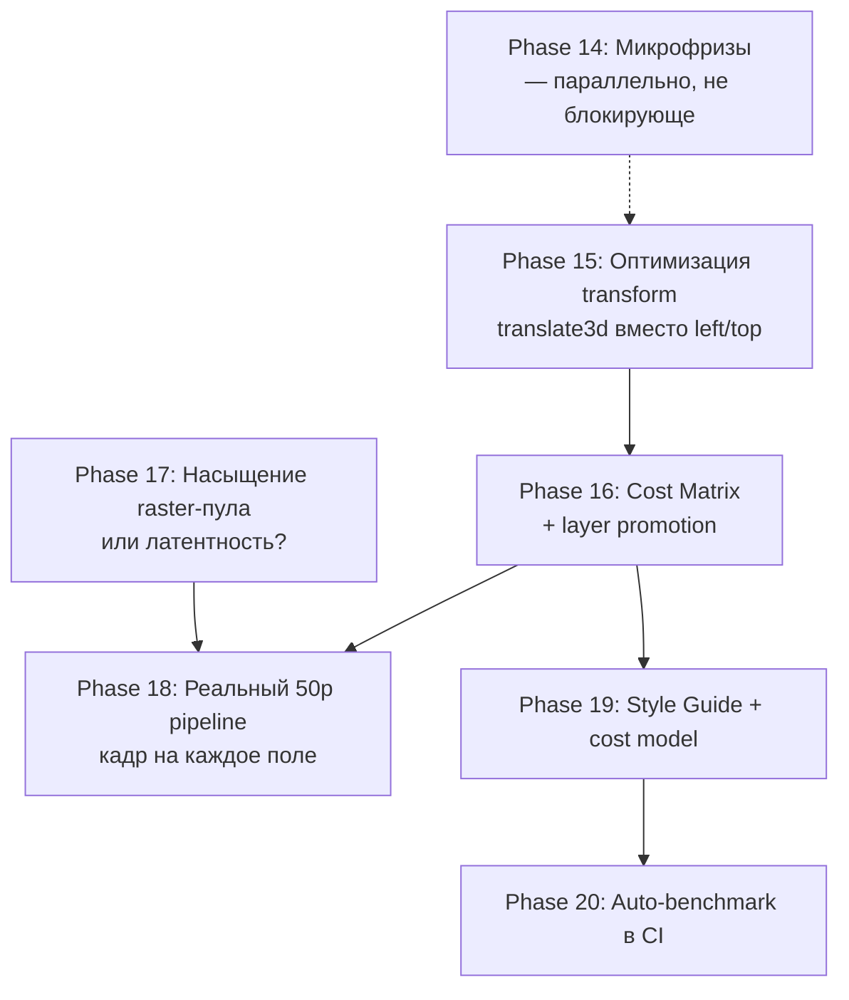

# Performance Roadmap — Phase 15 onward

**Дата:** 7 июля 2026. Краткий обзор запланированных фаз для достижения целей пользователя:

1. **Цель 1.** Стабильные `in_fps ≥ 25` (текущий движковый потолок для 50i) на сложном шаблоне `test1` при 3 каналах DeckLink 1080i50 — исчезновение постоянной нехватки кадров.
2. **Цель 2.** Реальное временное разрешение 50 (движение сдвигается между полями одной пары) — требует архитектурной работы поверх Goals 1.
3. **Цель 3 (долгосрочная).** Cost model внутри runtime — система «знает», какое свойство дорогое, и предупреждает / выбирает автоматически.

Полный контекст и текущее понимание проблемы — в [PERFORMANCE_INVESTIGATION_PLAN.md](PERFORMANCE_INVESTIGATION_PLAN.md). Детальные планы по микрофризам и по Phase 15 — в [PHASE_14_MICROFREEZE_PLAN.md](PHASE_14_MICROFREEZE_PLAN.md) и [PHASE_15_PERFORMANCE_PLAN.md](PHASE_15_PERFORMANCE_PLAN.md) соответственно.

---

## Сводная карта фаз

---

## Phase 15 — Оптимизация transform (ТЕКУЩИЙ ФОКУС)

**Деливерабл:** [docs/PHASE_15_PERFORMANCE_PLAN.md](PHASE_15_PERFORMANCE_PLAN.md).
**Цель:** `in_fps` на `test1` с ~24 → 25 при 3 каналах.

**Главная находка:** [runtime/src/transform.ts](../runtime/src/transform.ts) и [runtime/src/domRenderer.ts](../runtime/src/domRenderer.ts) пишут `left/top` в CSS на каждый кадр для каждого слоя — это триггерит Layout в Blink, что форсирует ~10× дороже raster. Перевод в `transform: translate3d()` — главное направление.

**Подэтапы:** P0 (телеметрия Layout/Paint/Raster events) → P1 (cost matrix на bench-шаблонах) → P2 (решение) → P3 (правка transform.ts/domRenderer.ts) → P4 (width-анимация на масках) → P5 (layer promotion если P3-P4 недостаточно) → P6 (soak-валидация).

**Критерий успеха:** `in_fps=25` стабильно на test1 при 3 каналах, `d_pairs > 0` в каждом окне, Layout events/frame < 3.

---

## Phase 16 — Performance Matrix + layer promotion (ЗАВЕРШЕНО, 8 июля 2026)

**Деливерабл:** [docs/development-phases/phase-16-performance-matrix.md](development-phases/phase-16-performance-matrix.md).

**Цель:** систематизировать стоимость всех CSS-свойств в нашем CPU-renderer и зафиксировать layer promotion стратегию.

- Расширен bench-набор (clip-circle, css-blur, drop-shadow, text-100, image-stack, gradients + layer A/B стенды).
- Построена матрица 20+ свойств/паттернов с измерениями.
- Layer promotion A/B: `will-change` и `contain` не дали статистически значимого выигрыша в CPU-only OSR (решение: не включать в runtime по умолчанию).
- Реализован Class A (composited position в `transform.ts`/`domRenderer.ts`), сохранён контракт editor overlay (`left/top/width/height`).
- Валидация: editor без визуальных регрессий, 3-канальный DeckLink soak 15 мин (`fps≈24.98`, `d_late=0`, `d_dropped=0`).

**Критерий успеха:** таблица из 20+ свойств с измеренной стоимостью; принятое решение по layer promotion.

**Фактический результат:** критерий выполнен. Дополнительно закрыт перенос из
Phase 15: Class A реализован и validated.

**Зависимости:** Phase 15 завершена (чтобы baseline-числа были после основных оптимизаций, а не до).

---

## Phase 17 — Почему CPU ~60%, а не 100%? (ЗАВЕРШЕНО, 8 июля 2026)

**Деливерабл:** [docs/development-phases/phase-17-raster-latency.md](development-phases/phase-17-raster-latency.md).

**Цель:** количественный ответ на вопрос пользователя «почему ядра не загружены полностью?».

**Вердикт — смешанный, по pump-режиму:**
- **Self-timer/headless** (editor-preview, browser/OBS·vMix): гипотеза A
  (raster pool) подтверждена — `num-raster-threads=3` (вместо
  Chromium-автовыбора 2) даёт +5.6% fps / −44% paint-latency p95 на `test1`.
- **DeckLink-driven** (production): гипотеза B (латентность/архитектура)
  доминирует — pump-цикл синхронно опрашивает `paint_seq` до дедлайна поля
  независимо от скорости raster; выигрыш от N=3 всего +1.6% fps.

**Реализовано:**
- `--frame-log` (`pump_active_us`/`paint_latency_us`/`waited_deadline`) +
  `engine/research/analyze-frame-log.mjs`.
- `BG_NUM_RASTER_THREADS` env-hook в `engine_app.cpp`; закреплён как default
  `(закреплённые логические ядра канала − 1)` в
  [engine/run-channel.sh](../engine/run-channel.sh).
- 3-канальный DeckLink soak (~16.7 мин): `d_late=0 d_dropped=0` на всех
  каналах, без регрессии.

**Критерий успеха:** выполнен — однозначный (хоть и по-разному для двух
pump-режимов) ответ получен с числами.

**Для Phase 18:** увеличение raster-параллелизма НЕ решает потолок
`in_fps=25` на production DeckLink-пути — нужна переработка pump-архитектуры
(например, конвейеризация кадров in-flight), не просто больше CPU.

**Зависимости:** Phase 15/16 (после Class A — реальная картина raster-нагрузки
изменилась, замеры Phase 17 сделаны поверх неё).

---

## Phase 18 — Реальный 50p progressive pipeline

**Цель:** поднять `in_fps` с 25 (текущий ceiling) до **50** — настоящее временное разрешение для 50i.

**В чём проблема (понятно из логов):** `out_fps=25.0` означает, что DeckLink получает 25 уникальных кадров в секунду, и каждые 2 поля пары формируются из одного bitmap. Это визуально «25p, отправленное как 50i» — движения между полями нет. Чтобы движение сдвигалось, движок должен на каждое поле (50 раз/с) давать либо новый кадр, либо чётный/нечётный под-set пикселей одного кадра (true interlace).

**Возможные подходы (для оценки в Phase 18, не окончательные):**

1. **Двойная частота pump.** Сейчас pump работает на 50 тиков/с от DeckLink-карты, но каждый кадр — это пара полей. Сделать так, чтобы на каждый чётный tick генерировался «field A», на каждый нечётный — «field B» с микросдвигом анимации (полуп шаг). Требует: (a) регистрации в timeline «field-phase aware» интерполяции; (b) изменений в weave-логике DeckLink (сейчас он берёт один bitmap и делает из него два поля, нужно — два разных bitmap).
2. **Истинный interlace.** Рендерить каждый bitmap только с нечётными/чётными строками (half-height), отправлять как реальное поле. Это классическая телевизионная интерлейс-съёмка, но в CSS-renderer реализуется сложно — нет API «рендерить только чётные scanlines».
3. **Гибрид:** 50 уникальных прогрессивных кадров, отправляемых как 50i (каждое поле = свой bitmap). Это **фактически 50p, упакованное в 50i**. Самый простой подход, но требует raster pipeline, который реально выдаёт 50 bitmap/с (что и есть исходная цель пользователя, переформулированная).

**Действия (когда дойдём):**

- Измерить, насколько текущая raster-стоимость кадра близка к 20мс (бюджет 50fps). Если после Phase 15-16 кадр стоит ~10мс, то 50p достижимо. Если ~18мс — нет, нужно дальнейшее сокращение raster work.
- Решить архитектурно между подходами 1/2/3.
- Реализовать выбранный подход в [decklink_consumer.cpp](../engine/src/consumers/decklink_consumer.cpp) (weave logic) и в [main.cpp](../engine/src/main.cpp) (pump pacing).
- Soak-валидация на 50fps.

**Критерий успеха:** `in_fps=50` стабильно на test1 при 3 каналах, визуально плавное движение на SDI (видим разницу между 25p-as-50i и 50p-as-50i при быстрой анимации).

**Зависимости:** Phase 15 (кадр должен быть достаточно дёшев, чтобы 50 штук в секунду было достижимо), Phase 17 (понятно, узкое место throughput или latency — если latency, 50p не получится без архитектурной переработки pump).

---

## Phase 19 — Style Guide + Cost Model в runtime

**Цель:** зафиксировать знания из Phase 15-16 в:

1. `docs/TEMPLATE_PERFORMANCE_GUIDE.md` — для дизайнеров шаблонов: «предпочитай transform, избегай width-анимации на масках» и т.д.
2. Cost model в [runtime/src/transform.ts](../runtime/src/transform.ts) (или новом `runtime/src/costModel.ts`) — каждая анимируемая операция получает оценку стоимости; при загрузке шаблона runtime логирует предупреждения вида «анимация `width` на слое X стоит ~Y ms/frame, рассмотрите `scaleX`».

**Действия:**

- Документ на основе matrix из Phase 16.
- В runtime: при `setTemplate()` пробегать по timeline, для каждого анимируемого свойства смотреть cost-таблицу, суммировать ожидаемую стоимость кадра. Если > 15мс (75% бюджета 50fps) — предупреждение в лог.
- Опционально: UI-индикатор в editor — «этот шаблон оценочно ~X ms/frame, при 3 каналах упрётся в потолок».

**Критерий успеха:** style guide опубликован; cost model выводит хотя бы одно предупреждение на test1 (до применения фиксов Phase 15) и ноль — после.

**Зависимости:** Phase 16 (нужна заполненная matrix).

---

## Phase 20 — Auto-benchmark в CI

**Цель:** каждая изменения движка/runtime автоматически измеряет влияние на производительность; регрессии ловятся до merge.

**Действия:**

- Скрипт `engine/research/run-benchmark.mjs`:
  - Поднимает отдельный bg_engine с `--consumer=null` (чтобы не занимать DeckLink).
  - Грузит bench-шаблон из `bench/`.
  - Запускает на 60с, пишет `--frame-log` + `blink-trace.json`.
  - Анализирует через `analyze-blink-trace.mjs`.
  - Выводит JSON-метрики.
- GitHub Action (или локальный pre-push hook) запускает на PR.
- Сравнение с baseline в `main` — если raster events/frame выросли >10%, PR помечается `perf-regression`.

**Критерий успеха:** bench работает на CI; хотя бы один метрик (raster events/frame) отслеживается между коммитами.

**Зависимости:** Phase 15 P0 (телеметрия), Phase 16 (набор bench-шаблонов).

---

## Приблизительная последовательность и тайминг

| Фаза | Длительность (оценка) | Зависимости | Можно ли параллельно с другими? |
|---|---|---|---|
| 14 (микрофризы) | 1-2 дня | — | Да, с Phase 15 (на разных каналах) |
| **15 (transform optimization)** | 3-5 дней | — | Текущий фокус |
| 16 (cost matrix) | 2-3 дня | 15 | — |
| 17 (raster pool / latency) | 1-2 дня | 15 | Да, с 16 |
| 18 (50p pipeline) | 5-10 дней | 15, 16, 17 | — |
| 19 (style guide + cost model) | 2-3 дня | 16 | Да, с 18 |
| 20 (auto-benchmark) | 2-3 дня | 15, 16 | Да, с 19 |

**Итого до цели 2 (50p):** ~3-4 недели сфокусированной работы, при условии что гипотезы Phase 15 подтверждаются. Если на каком-то этапе окажется, что направление неверно (например, Blink всё равно форсит raster на transform) — дороги назад нет, придётся копать глубже в property trees / cc::TileManager (Research 4, 7 из development-proposals).

---

## Что точно НЕ в roadmap

- **Переписывание decklink consumer / weave / pipeline копирования.** Development-proposals Research 6 + Recommendation 6 + Recommendation 7 — однозначно: это не bottleneck, оптимизация даёт <5%.
- **GPU rendering.** Проект принципиально CPU-only (см. `engine_app.cpp:53-55` — `disable-gpu` всегда). Это архитектурное решение, не меняется без отдельного большого обсуждения.
- **Замена CEF на другой html-движок.** WebKitGTK в Linux ещё медленнее; Servo не готов. CEF — единственный реалистичный вариант.
- **Переписывание timeline engine.** Interpolation правильная; проблема в том, **куда** пишется результат, не как он считается.
- **Многоканальный процесс (один bg_engine на N каналов).** Текущая модель «один процесс на канал» даёт изоляцию и независимый crash recovery; переход на многопоточный усилит competition за raster pool. Не трогаем.
