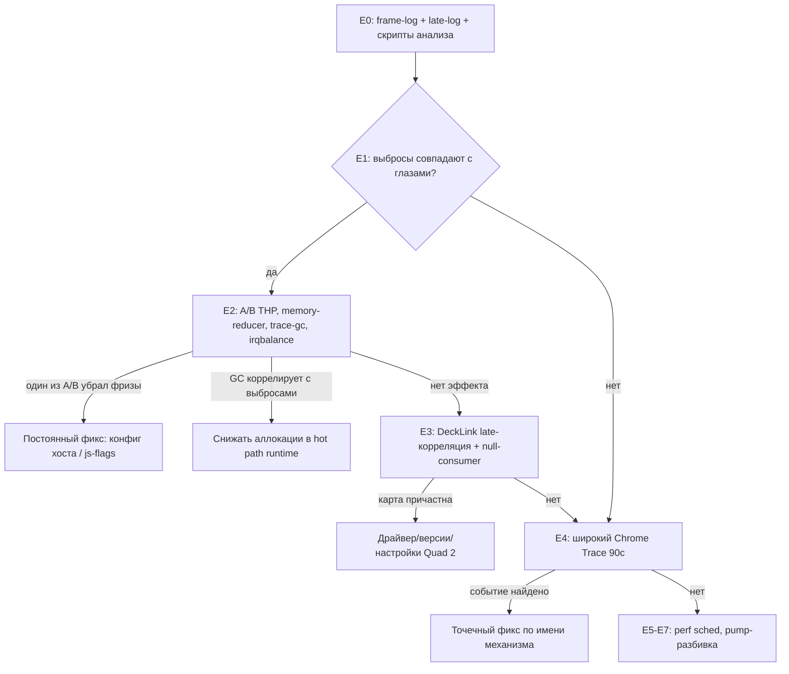

# Phase 14 — Детальный план расследования микрофризов (Вопрос B)

**Дата:** 5 июля 2026 (обновлено 7 июля). **Цель:** найти и устранить хаотичные микрофризы (~5-11с, не привязаны к контенту), видимые глазом на SDI-мониторе TV Logic. Подчинённый документ к [PERFORMANCE_INVESTIGATION_PLAN.md](PERFORMANCE_INVESTIGATION_PLAN.md), заменяет разделы 2.3 / 2.4 Части II.

**Обновление 7 июля 2026 — имена шаблонов поменяны местами:** актуальное соответствие (шаблоны спасены в `tests/templates/test.json` и `tests/templates/test1.json`):
- `test` — **простой**: 1 группа, rect + clock, X/Y-loop. На нём ~49 in_fps.
- `test1` — **сложный**: 11 слоёв, маски, timeline. На нём ~24 in_fps.

В этом документе (написанном 5 июля, до переименования) ряд мест исправлен на актуальные имена, но если где-то осталось упоминание в старом смысле — приоритет за актуальным соответствием выше. Для E1-E4 используется простой `test`, для E7 — сложный `test1`.

**Контекст (важные факты, уже установленные в расследовании):**

- Фризы воспроизводятся на **двух стендах**: Ryzen 5 3600 (Ubuntu 22.04.5 LTS) у пользователя и мощный Xeon (Ubuntu 24.04.2 LTS) у друга. На обеих машинах — DeckLink Quad 2, полный пайплайн `decklink_consumer`, движение шаблона по SDI.
- Фризы воспроизводятся даже на тривиальном контенте (1 квадратик, X/Y-loop).
- Фризы **не привязаны** к конкретной фазе анимации/маски; период нестрогий (5-11с, не фиксированный таймер).
- В шаблоне `test` нет видео вообще.
- Тепловая/деградационная гипотеза снята (3+ часа под нагрузкой без дрейфа).
- Периодическая логика с интервалом 5-11с в собственном коде (`main.cpp`, `decklink_consumer.cpp`, `channel.html`, backend WS) не найдена — буферные пулы ограничены по размеру, не по времени; нет `setInterval`/keepalive.
- Телеметрия 5-секундными окнами (`telemetry5s`, `Stats::Progress()`) слишком грубая, чтобы поймать паттерн — фризы подтверждены визуально, но не измерены количественно.

## Что было переоценено по новым ответам пользователя

| Гипотеза | Статус | Основание |
|---|---|---|
| `irqbalance` ребалансировка каждые 10с | **Исключена как общая причина** | У друга `systemctl is-active irqbalance` = **inactive**, фризы есть. Остаётся только локальный sanity-тест на стенде пользователя (может добавлять *дополнительные* фризы именно у него) |
| `khugepaged` / THP (madvise, scan 10с) | **Остаётся общим кандидатом** | У обоих `transparent_hugepage/enabled = madvise`, `khugepaged/scan_sleep_millisecs = 10000` (дефолт Ubuntu, не менялся между 22.04 и 24.04) |
| Тепловая, governor, C-state, что-либо CPU-специфичное | **Исключена** | Не объяснила бы воспроизводимость на Ryzen + Xeon |
| Баг в собственном коде (`bg_engine`/`channel.html`/backend) | **Ослаблена, но не исключена** | Аудит не нашёл периодической логики; остаётся в резерве E5-E7 |
| **Новый сильный кандидат: V8 memory reducer** | **Добавлен** | Встроенный механизм V8, при стабильной скорости аллокации запускает Mark-Compact GC квази-периодично (по объёму, не по таймеру). Проверяется одним флагом `--js-flags=--no-memory-reducer`. Идеально ложится на паттерн «стабильная анимация → стабильный churn → квази-периодичный длинный GC» |
| **DeckLink Quad 2 как общее железо** | **Приоритет поднят** | Единственное физически общее железо двух стендов. Периодическая внутренняя работа драйвера (genlock/reference check, тайминги вывода) ранее не рассматривалась. Проверяется корреляцией late/dropped с frame-log и тестом через `null_consumer` |

## Текущие гипотезы (по приоритету)

1. **Внутренний механизм CEF/Chromium/V8** — V8 GC / V8 memory reducer / `cc::TileManager` эвикция / PartitionAlloc reclaimer. Общий бинарник на обеих машинах.
2. **Дефолты ОС-дистрибутива** — `khugepaged` (THP). Общие для обеих версий Ubuntu.
3. **Драйвер/SDK Blackmagic DeckLink Quad 2** — единственное общее железо.
4. (резерв) Что-то в собственном коде `bg_engine`/`channel.html`/backend.
5. (исключено) `irqbalance` как общая причина; CPU governor/C-state; thermal.

---

# Карта экспериментов

Эксперименты расположены **по возрастанию стоимости**: сначала то, что не требует пересборки и делается за минуты, затем то, что требует пересборки, в самом конце — тяжелое наблюдение через `perf`.



**Ключевое методологическое правило:** сначала строится объективный детектор фризов (E0) и валидируется глазами (E1), и только потом запускаются A/B тесты (E2). Без этого каждый A/B пришлось бы оценивать «на глаз», что при хаотичном паттерне 5-11с превращает эксперимент в угадайку.

---

# E0 — Подготовка: объективный детектор фризов

Цель: получить инструмент, который по логу прогона автоматически находит моменты фризов и сравнивает их с любым другим временным рядом (GC-события, late/dropped карты, ОС-события).

## E0.1 — Флаг `--frame-log=<path>` (нужна пересборка)

Пишет построчно в CSV `wall_clock_us, interval_us, paint_seq` каждый раз, когда движок доставляет новый кадр. Точка вставки — сразу после `stats.RecordFrame(interval_us, expected_us)` в **обеих** ветках main loop:

- decklink_driven ветка: [engine/src/main.cpp](../engine/src/main.cpp) после строки ~266 (`stats.RecordFrame(...)`)
- self-timer ветка: [engine/src/main.cpp](../engine/src/main.cpp) после строки ~355 (`stats.RecordFrame(...)`)

### Изменения в коде

**[engine/src/config.h](../engine/src/config.h)** — добавить поле в `struct Config` (район строки 68, рядом с `blink_research`):

```cpp
// Phase 14: per-frame CSV log for microfreeze diagnostics. Empty = off.
// Format per line: wall_clock_us,interval_us,paint_seq
std::string frame_log;
```

**[engine/src/config.cpp](../engine/src/config.cpp)** — env fallback (после строки ~123, рядом с другими env):

```cpp
frame_log       = env_or("FRAME_LOG",    frame_log.c_str());
```

разбор CLI (район строки 168, рядом с `--blink-research`):

```cpp
if (match_prefix(arg, "--frame-log",  val, i, argc, argv)) { frame_log = val; continue; }
```

в `print_usage()` (после `--blink-research=N`):

```
"  --frame-log=PATH         per-frame CSV: wall_clock_us,interval_us,paint_seq\n"
```

в `Describe()` — добавить ` frame_log=...` в snprintf-строку, чтобы было видно в startup-логе.

**[engine/src/main.cpp](../engine/src/main.cpp)** — открыть файл сразу после `bg::Config cfg;` (строка ~87). **Важно:** используем `system_clock`, а не `steady_clock` — `steady_clock` на Linux это `CLOCK_MONOTONIC` с произвольной «эпохой» (обычно момент загрузки системы), а нам нужно сопоставлять wall-clock с `date +%s%6N` из `mark-freeze.sh` (это Unix epoch, `CLOCK_REALTIME`). `steady_clock` для измерения *интервалов* внутри движка остаётся как есть — он правильно монотонный.

```cpp
std::FILE* frame_log_file = nullptr;
if (!cfg.frame_log.empty()) {
    frame_log_file = std::fopen(cfg.frame_log.c_str(), "w");
    if (frame_log_file) {
        std::setvbuf(frame_log_file, nullptr, _IOLBF, 0);  // line-buffered
        std::fprintf(frame_log_file, "wall_clock_us,interval_us,paint_seq\n");
    } else {
        std::fprintf(stderr, "bg_engine: cannot open --frame-log=%s\n", cfg.frame_log.c_str());
    }
}
auto write_frame_log = [&](uint64_t interval_us, uint64_t cur_seq) {
    if (!frame_log_file) return;
    // system_clock::time_since_epoch() = Unix epoch (CLOCK_REALTIME) — совместимо с date +%s%6N.
    const auto now = std::chrono::system_clock::now();
    const auto wall_us = std::chrono::duration_cast<std::chrono::microseconds>(
        now.time_since_epoch()).count();
    std::fprintf(frame_log_file, "%llu,%llu,%llu\n",
                 (unsigned long long)wall_us,
                 (unsigned long long)interval_us,
                 (unsigned long long)cur_seq);
};
```

В обеих ветках цикла (decklink_driven после `stats.RecordFrame(interval_us, expected_us);` строки ~266 и в self-timer после строки ~355) добавить сразу:

```cpp
write_frame_log(interval_us, cur_seq);
```

Перед `return exit_code;` (строка ~424) закрыть:

```cpp
if (frame_log_file) std::fclose(frame_log_file);
```

### Сборка

```bash
cd /home/requestin/Titulus/engine
cmake --build build -j
```

### Передача флага через run-channel.sh

В [engine/run-channel.sh](../engine/run-channel.sh) есть уже парсинг `--remote-debugging-port`. По аналогии добавить `--frame-log=PATH`:

```bash
FRAME_LOG="${FRAME_LOG:-}"
# в парсинг аргументов:
--frame-log=*)   FRAME_LOG="${1#*=}" ;;
# в run_once(), после блока REMOTE_DEBUGGING_PORT:
if [[ -n "$FRAME_LOG" ]]; then
  cmd+=(--frame-log="$FRAME_LOG")
fi
```

Запуск одного канала с логом:

```bash
FRAME_LOG=/tmp/titulus-engines/frame-Ch1.csv \
  engine/run-channel.sh --id=<Ch1-UUID> --name=Ch1 --output-mode=decklink --device-index=0 --cores=0-1
```

## E0.2 — Поштучное логирование late/dropped карты (та же пересборка)

Сейчас в [engine/src/consumers/decklink_consumer.cpp](../engine/src/consumers/decklink_consumer.cpp) есть только 5с-агрегаты `d_late/d_dropped/d_flushed` (район строки 676). Покадровая корреляция невозможна. Добавим отдельный CSV `late_log` — по одной строке на каждое завершённое `ScheduledFrameCompleted` с не-OK результатом.

Точка вставки — [engine/src/consumers/decklink_consumer.cpp](../engine/src/consumers/decklink_consumer.cpp) строки 491-506, внутри `OnScheduledFrameCompleted`. Здесь тоже `system_clock` (та же причина — сопоставимость с `mark-freeze.sh` и с `frame-log`):

```cpp
// Сразу после блока if/else if, увеличивающего late_/dropped_/flushed_:
if (late_log_file_ && result != bmdOutputFrameCompleted) {
    const auto now_us = std::chrono::duration_cast<std::chrono::microseconds>(
        std::chrono::system_clock::now().time_since_epoch()).count();
    const char* tag =
        result == bmdOutputFrameDisplayedLate ? "late" :
        result == bmdOutputFrameDropped        ? "dropped" :
        result == bmdOutputFrameFlushed        ? "flushed" : "other";
    std::fprintf(late_log_file_, "%llu,%s\n",
                 (unsigned long long)now_us, tag);
}
```

В класс `DecklinkConsumer::Impl` (район строки 1053, рядом с атомиками) добавить:

```cpp
std::FILE* late_log_file_ = nullptr;
```

В конструктор `Impl` — принимать опциональный путь:

```cpp
// В DecklinkConsumer ctor пробросить cfg-параметр; либо из env BG_ENGINE_LATE_LOG.
if (const char* p = std::getenv("BG_ENGINE_LATE_LOG")) {
    late_log_file_ = std::fopen(p, "w");
    if (late_log_file_) {
        std::setvbuf(late_log_file_, nullptr, _IOLBF, 0);
        std::fprintf(late_log_file_, "wall_clock_us,event\n");
    }
}
```

В деструкторе — `if (late_log_file_) std::fclose(late_log_file_);`.

(Не добавляем отдельный CLI-флаг в config.h — это diagnostics-only, env-переменной достаточно.)

## E0.3 — Скрипт анализа `engine/research/analyze-frame-log.mjs` (новый)

Вход: CSV из E0.1. Выход: текстовый отчёт с (1) списком выбросов `interval_us > 2.5 × expected` (expected = 20000мкс для 50fps), (2) гистограммой интервалов между последовательными выбросами, (3) автокорреляцией `interval_us` для поиска скрытой периодичности, (4) опциональное сопоставление с отметками оператора (`operator_marks.csv` из E1).

Скелет:

```javascript
#!/usr/bin/env node
// engine/research/analyze-frame-log.mjs
// Usage: node engine/research/analyze-frame-log.mjs --log=frame-Ch1.csv \
//          [--marks=operator_marks.csv] [--expected-us=20000] [--threshold-mult=2.5]
import { readFileSync } from 'node:fs';

function arg(name, fallback) {
  const hit = process.argv.find((a) => a.startsWith(`--${name}=`));
  return hit ? hit.split('=').slice(1).join('=') : fallback;
}

const logPath = arg('log', '');
const marksPath = arg('marks', '');
const expectedUs = Number(arg('expected-us', '20000'));
const thrMult = Number(arg('threshold-mult', '2.5'));

const rows = readFileSync(logPath, 'utf8')
  .split('\n').slice(1).filter(Boolean)
  .map((line) => {
    const [wall, interval, seq] = line.split(',').map(Number);
    return { wall, interval, seq };
  });

// 1. Выбросы
const threshold = expectedUs * thrMult;
const spikes = rows.filter((r) => r.interval > threshold);
console.log(`[analyze] всего кадров: ${rows.length}`);
console.log(`[analyze] порог выброса: ${threshold}мкс (= ${thrMult}×${expectedUs})`);
console.log(`[analyze] выбросов: ${spikes.length} (доля ${(100*spikes.length/rows.length).toFixed(2)}%)`);

// 2. Интервалы между выбросами
const intervals = spikes.slice(1).map((s, i) => ({
  wall: s.wall, delta_s: (s.wall - spikes[i].wall) / 1e6
}));
const hist = {};
for (const iv of intervals) {
  const bucket = Math.round(iv.delta_s);  // округлить до секунды
  hist[bucket] = (hist[bucket] || 0) + 1;
}
console.log('[analyze] гистограмма интервалов между выбросами (сек → кол-во):');
for (const k of Object.keys(hist).sort((a,b) => +a - +b)) {
  console.log(`  ${k}с: ${hist[k]}`);
}

// 3. Автокорреляция: для лагов 1..100 (50мс..2с при 50fps) и отдельно 100..1000 (2с..20с)
function autocorr(data, lag) {
  if (lag >= data.length) return 0;
  let s = 0;
  for (let i = lag; i < data.length; i++) {
    s += (data[i].interval - expectedUs) * (data[i-lag].interval - expectedUs);
  }
  return s / (data.length - lag);
}
console.log('[analyze] автокорреляция (пик укажет на скрытую периодичность):');
for (const lag of [25, 50, 100, 250, 500, 750]) {  // 0.5с, 1с, 2с, 5с, 10с, 15с
  console.log(`  лаг ${lag} кадров (~${(lag/50).toFixed(1)}с): ${autocorr(rows, lag).toExponential(3)}`);
}

// 4. Сверка с отметками оператора
if (marksPath) {
  const marks = readFileSync(marksPath, 'utf8').split('\n').slice(1)
    .filter(Boolean).map((l) => Number(l.split(',')[0]));
  let matched = 0, unmatched = 0;
  for (const m of marks) {
    const hit = spikes.find((s) => Math.abs(s.wall - m) < 700000);  // ±0.7с
    if (hit) matched++; else unmatched++;
  }
  console.log(`[analyze] отметок оператора: ${marks.length}`);
  console.log(`[analyze]   совпало с выбросом (±0.7с): ${matched}`);
  console.log(`[analyze]   без совпадения: ${unmatched}`);
}
```

## E0.4 — Скрипт-«кнопка» `mark-freeze.sh` (новый)

Запускается оператором **в отдельном терминале** во время прогона. Каждое нажатие Enter пишет строку `wall_clock_us,manual` в CSV. Подробная инструкция для оператора — в E1.

```bash
#!/usr/bin/env bash
# engine/research/mark-freeze.sh
# Usage: ./engine/research/mark-freeze.sh operator_marks.csv
# Затем: смотри на SDI-монитор. При виде фриза — жми Enter.
# Ctrl-C — выйти.
set -euo pipefail
OUT="${1:-operator_marks.csv}"
echo "wall_clock_us,event" > "$OUT"
echo "[mark] пишу отметки в $OUT. Жми Enter при фризе. Ctrl-C — выйти."
while IFS= read -r _; do
  ts=$(date +%s%6N)
  echo "${ts},manual" >> "$OUT"
  echo "[mark] +1 @ $(date -Iseconds)"
done
```

`date +%s%6N` — микросекунды от Unix-эпохи (GNU date). То же самое даёт `std::chrono::system_clock::now().time_since_epoch()` в C++ (см. E0.1) — обе шкалы `CLOCK_REALTIME`, Unix-epoch в мкс, прямой сопоставимый wall-clock. (Важно: `steady_clock` для этой цели **не** подходит — у него на Linux произвольная эпоха.)

## Критерий успеха E0

Сборка прошла, на тестовом прогоне `analyze-frame-log.mjs` отработал без ошибок и выдал осмысленные числа (количество выбросов, гистограмма интервалов). До этого к E1 не переходить.

---

# E1 — Валидация детектора глазами

Цель: убедиться, что автоматические «выбросы interval_us > 2.5×» действительно соответствуют тому, что оператор субъективно видит как фриз. Если да — все дальнейшие A/B тесты оцениваются объективно по скрипту, без необходимости каждый раз смотреть на SDI-монитор.

## Прогон

1. Запустить **1 канал** (не 3 — чтобы глаз не метался между каналами), шаблон **`test`** (простой — 1 группа, rect + clock, X/Y-loop). **Важно:** 7 июля 2026 имена test/test1 поменяны местами — актуальный простой шаблон называется `test`, сложный (с масками и timeline) — `test1`. Простой `test` выбран для E1, чтобы отделить фоновые «микро-фризы» от визуальных последствий низкой FPS, которая на сложном `test1` будет ~24.

```bash
# Терминал A — канал с frame-log
FRAME_LOG=/tmp/titulus-engines/frame-e1.csv \
  engine/run-channel.sh --id=<Ch1-UUID> --name=Ch1 --output-mode=decklink --device-index=0 --cores=0-1
```

2. Через backend сделать `take test1` на канале.
3. В терминале B — запустить `mark-freeze.sh`:

```bash
./engine/research/mark-freeze.sh /tmp/titulus-engines/operator_marks.csv
```

4. Смотреть на SDI-мониторе TV Logic **15 минут**. При каждом замеченном фризе (даже лёгком подёргивании) — жать Enter. Периодически (раз в 2-3 минуты) также делать «контрольные отметки» — жать Enter в момент, когда **явно нет фриза** — это нужно, чтобы потом скрипт посчитал false-positive rate. Записать ~20-40 отметок фризов и ~10-15 контрольных.
5. Остановить канал (Ctrl-C в терминале A), закрыть mark-freeze.sh (Ctrl-C в терминале B).

## Анализ

```bash
node engine/research/analyze-frame-log.mjs \
  --log=/tmp/titulus-engines/frame-e1.csv \
  --marks=/tmp/titulus-engines/operator_marks.csv \
  --expected-us=20000 \
  --threshold-mult=2.5
```

## Критерии успеха E1

| Что показал скрипт | Интерпретация | Что делать дальше |
|---|---|---|
| ≥70% отметок оператора совпало с выбросом ±0.7с И ≥70% контрольных отметок не совпало с выбросом | Детектор валиден | Переходим к E2, оцениваем всё по скрипту |
| Отметки совпадают, но порог 2.5×даёт много false-positive или false-negative | Поиграть `--threshold-mult` (1.8, 2.0, 3.0), найти оптимальный | Затем E2 |
| <30% отметок совпало с выбросами при любом пороге | Наше определение «выброс interval_us» **не ловит** то, что видит глаз. Возможно, фриз — это не «длинный интервал», а «выдача одинакового кадра 2-3 раза подряд» (визуальный стасис при формально-нормальных interval_us) | Дополнить детектор: флаг «3+ одинаковых paint_seq подряд», см. ниже |
| Гистограмма интервалов между выбросами показывает чёткий кластер (например 4-12с) | Подтверждена периодичность 5-11с из наблюдений пользователя | Это уже половина ответа на «что это?» — узнав ЧТО именно повторяется с этим периодом, получим источник |

**Дополнение детектора для случая «визуальный стасис без длинного интервала»**: добавить в `analyze-frame-log.mjs` альтернативный детектор — серии из 3+ строк с одинаковым `paint_seq` (движок доставлял один и тот же кадр). Это модель «фриза без просрочки interval_us», возможна при работе `d_singles/d_starved` логики поляковки.

---

# E2 — Дешёвые A/B тесты (требуют пересборки только для E2c)

Четыре теста, каждый ~10-15 минут. Все прогоняются с включённым `--frame-log` и оцениваются скриптом — никаких «посмотри на монитор и скажи стало ли лучше». **Важно**: между прогонами возвращать изменённую настройку в исходное состояние, чтобы тесты были независимы.

Каждый прогон — на шаблоне **test1** (тривиальный), 1 канал, те же ядра, тот же device-index. Файл `frame-log` уникален для каждого прогона (frame-e2a.csv, frame-e2b.csv и т.д.).

## E2a — THP off (общий кандидат №2)

Без пересборки. Действует на обе машины (общий дефолт Ubuntu).

```bash
# Сохранить текущее состояние
cat /sys/kernel/mm/transparent_hugepage/enabled > /tmp/thp-before.txt

# Применить
echo never | sudo tee /sys/kernel/mm/transparent_hugepage/enabled
echo never | sudo tee /sys/kernel/mm/transparent_hugepage/defrag

# Прогон 10-15 мин с frame-log
FRAME_LOG=/tmp/titulus-engines/frame-e2a.csv \
  engine/run-channel.sh --id=<Ch1-UUID> --name=Ch1 --output-mode=decklink --device-index=0 --cores=0-1

# Вернуть
echo madvise | sudo tee /sys/kernel/mm/transparent_hugepage/enabled
echo madvise | sudo tee /sys/kernel/mm/transparent_hugepage/defrag
```

**Постоянное решение при успехе:** kernel-параметр `transparent_hugepage=never` в `/etc/default/grub` → `update-grub`. Попросить друга сделать то же на 24.04.

## E2b — V8 memory reducer off (новый кандидат №1b)

Требует плюмбинга `js-flags` через CEF. **Одна правка**, которая работает и для E2c (`--trace-gc`) — поэтому делаем их вместе.

### Плюмбинг в коде

В [engine/src/engine_app.cpp](../engine/src/engine_app.cpp) рядом с `g_blink_research` (строка 21) добавить:

```cpp
std::string g_js_flags;  // пустая = не передавать
```

В `OnBeforeCommandLineProcessing` для renderer-процесса (после блока `if (process_type.empty()) {...}`, добавить отдельную ветку):

```cpp
if (process_type == "renderer" && !g_js_flags.empty()) {
    cmd->AppendSwitchWithValue("js-flags", g_js_flags);
}
```

В `EngineInit` — читать env:

```cpp
if (const char* p = std::getenv("BG_ENGINE_JS_FLAGS")) {
    g_js_flags = p;
}
```

Сборка:

```bash
cd /home/requestin/Titulus/engine && cmake --build build -j
```

### Прогон

```bash
BG_ENGINE_JS_FLAGS="--no-memory-reducer" \
FRAME_LOG=/tmp/titulus-engines/frame-e2b.csv \
  engine/run-channel.sh --id=<Ch1-UUID> --name=Ch1 --output-mode=decklink --device-index=0 --cores=0-1
```

`--no-memory-reducer` отключает именно V8 memory reducer (тот самый квази-периодичный механизм, описанный в гипотезе №1b). V8 GC при этом продолжает работать по обычным правилам (по объёму аллокаций), но без агрессивного фонового reducer-потока.

## E2c — `--trace-gc` и корреляция с frame-log

Без отдельной пересборки (используем тот же плюмбинг, что в E2b). Здесь мы **не отключаем** ничего — мы пишем лог всех GC-событий и смотрим, коррелируют ли они с выбросами.

```bash
BG_ENGINE_JS_FLAGS="--trace-gc --trace-gc-verbose" \
FRAME_LOG=/tmp/titulus-engines/frame-e2c.csv \
  engine/run-channel.sh --id=<Ch1-UUID> --name=Ch1 --output-mode=decklink --device-index=0 --cores=0-1 \
  2>/tmp/titulus-engines/gc-e2c.log
```

V8 пишет GC-события в stderr. Формат строк примерно:

```
[1234:0x...] 8 ms: Scavenge 2.3 (3.5) -> 1.5 (4.0) MB, 0.8 / 0.0 ms  (average...
[1234:0x...] 8234 ms: Mark-sweep 12.1 (15.0) -> 5.2 (16.5) MB, 18.2 / 0.0 ms ...
```

Первое число — миллисекунды от старта процесса. Нам нужны **Mark-sweep** / **Mark-compact** события (длинные, >5мс) — Scavenge (молодое поколение) обычно слишком короткие.

### Скрипт `correlate-gc-framelog.mjs` (новый)

```javascript
#!/usr/bin/env node
// engine/research/correlate-gc-framelog.mjs
// Сопоставляет GC-события из gc.log с выбросами interval_us из frame-log.csv
// Usage: node correlate-gc-framelog.mjs \
//          --gc=gc-e2c.log --log=frame-e2c.csv --expected-us=20000 --threshold-mult=2.5
import { readFileSync } from 'node:fs';

function arg(n, f) { const h = process.argv.find(a => a.startsWith(`--${n}=`)); return h ? h.split('=').slice(1).join('=') : f; }

const gcPath = arg('gc', '');
const logPath = arg('log', '');
const expectedUs = Number(arg('expected-us', '20000'));
const thr = Number(arg('threshold-mult', '2.5')) * expectedUs;

// GC-события: только Mark-sweep/Mark-compact, длительность > 5мс
const procStartWallUs = (() => {
  // первая строка frame-log даёт wall_clock старта процесса; GC-timestamps — относительно старта V8
  // это грубая привязка, но достаточная для ±100мс
  const first = readFileSync(logPath, 'utf8').split('\n')[1].split(',');
  return Number(first[0]) - Number(first[1]);  // wall - interval_v_кадра
})();

const gcText = readFileSync(gcPath, 'utf8');
const gcEvents = [];
for (const line of gcText.split('\n')) {
  const m = line.match(/^\[\d+:\S+\]\s+(\d+)\s+ms:\s+(Mark-sweep|Mark-compact|Scavenge)\s+.+?([\d.]+)\s+\/\s+[\d.]+\s+ms/);
  if (!m) continue;
  const [, msStr, kind, durStr] = m;
  const ms = Number(msStr);
  const dur = Number(durStr);
  if (kind === 'Scavenge' || dur < 5) continue;
  gcEvents.push({
    wall_us: procStartWallUs + ms * 1000,
    kind, dur_ms: dur,
  });
}
console.log(`[corr] Mark-sweep/Mark-compact событий (>5мс): ${gcEvents.length}`);
console.log(`[corr] интервалы между ними (с):`);
const gcIntervals = gcEvents.slice(1).map((e, i) => (e.wall_us - gcEvents[i].wall_us) / 1e6);
const gcHist = {};
for (const s of gcIntervals) { const b = Math.round(s); gcHist[b] = (gcHist[b]||0)+1; }
for (const k of Object.keys(gcHist).sort((a,b)=>+a-+b)) console.log(`  ${k}с: ${gcHist[k]}`);

// Выбросы из frame-log
const rows = readFileSync(logPath, 'utf8').split('\n').slice(1).filter(Boolean)
  .map(l => { const [w,i] = l.split(',').map(Number); return { wall: w, interval: i }; });
const spikes = rows.filter(r => r.interval > thr);
console.log(`[corr] выбросов interval_us > ${thr}: ${spikes.length}`);

// Сопоставление: GC-событие в окне ±500мс вокруг выброса
let matched = 0;
for (const sp of spikes) {
  const hit = gcEvents.find(g => Math.abs(g.wall_us - sp.wall) < 500000);
  if (hit) matched++;
}
console.log(`[corr] выбросов, совпавших с GC ±500мс: ${matched} (${(100*matched/spikes.length).toFixed(1)}%)`);
```

## E2d — irqbalance off (только локальный sanity)

Поскольку у друга irqbalance inactive и фризы есть, это не может быть общей причиной. Но если у пользователя есть **дополнительные** фризы именно от irqbalance (свои 10-секундные, наслаивающиеся на общие), тест может их убрать. Делается для полноты, без пересборки.

```bash
sudo systemctl stop irqbalance
FRAME_LOG=/tmp/titulus-engines/frame-e2d.csv \
  engine/run-channel.sh --id=<Ch1-UUID> --name=Ch1 --output-mode=decklink --device-index=0 --cores=0-1
sudo systemctl start irqbalance
```

## Критерии успеха E2

Сравнить метрики `analyze-frame-log.mjs` по 4 прогонам:

| Прогон | Что смотрим |
|---|---|
| baseline (E1) | опорные числа: кол-во выбросов, гистограмма интервалов |
| E2a (THP off) | если выбросов **значимо** меньше — THP причастен |
| E2b (memory-reducer off) | если выбросов **значимо** меньше — V8 memory reducer причастен |
| E2c (trace-gc) | корреляция Mark-sweep с выбросами >70% — GC-давление подтверждено |
| E2d (irqbalance off) | locals sanity, ожидать малого/нулевого эффекта |

«Значимо меньше» — снижение количества выбросов хотя бы на 50% при сопоставимой длительности прогона.

---

# E3 — Проверка DeckLink-гипотезы

Если E2 не дал ответа — следующая по приоритету версия: что-то в драйвере/SDK Blackmagic Quad 2 (единственное общее железо). Подразделы можно делать параллельно.

## E3a — Корреляция late/dropped карты с frame-log

Использовать лог из E1 или любого прогона E2, но прогнать его повторно с включённым `BG_ENGINE_LATE_LOG`:

```bash
BG_ENGINE_LATE_LOG=/tmp/titulus-engines/late-e3a.csv \
FRAME_LOG=/tmp/titulus-engines/frame-e3a.csv \
  engine/run-channel.sh --id=<Ch1-UUID> --name=Ch1 --output-mode=decklink --device-index=0 --cores=0-1
```

Расширить `analyze-frame-log.mjs` опциональным флагом `--late=...` — сверять события late/dropped с выбросами `interval_us` ±50мс (карта и движок работают в одном wall-clock). Если 80%+ frame-log-выбросов совпадают с late/dropped карты — карта сообщает о пропуске именно в моменты фризов, то есть карта либо источник проблемы, либо по крайней мере честно фиксирует просрочку.

Если late-события есть, но **не** совпадают с выбросами frame-log — карта работает нормально в моменты фризов, источник выше по пайплайну (CEF/V8/ОС).

## E3b — Прогон через `null_consumer`

Шаблон test1, но `--consumer=null` вместо decklink. Это переключает на **self-timer ветку** main loop (см. [engine/src/main.cpp:207](../engine/src/main.cpp) `decklink_driven = consumer && consumer->HasExternalClock()` — у NullConsumer `HasExternalClock()` по умолчанию false из [consumer.h](../engine/src/consumers/consumer.h)).

**Важная оговорка по интерпретации:** self-timer ветка использует `MessagePump::Tick()` для пейсинга, а не `WaitForTick()` от карты. Это **другая** логика синхронизации — фризы от DeckLink-драйвера в этой ветке физически не появятся (карта не драйвит), но **и** фризы от CEF/V8/ОС тоже могут проявиться иначе (другая частота тиков, другой sleep-паттерн). Результат надо интерпретировать осторожно:

- Если в null-consumer **фризов нет** (по frame-log) — сильный сигнал, что DeckLink-карта/драйвер причастна.
- Если фризы **остались** — карта ни при чём, источник в CEF/V8/ОС (то же, что и на Xeon-стенде без карты).
- Если фризы **изменились по характеру** (другой период, другая амплитуда) — смешанный случай; null-consumer-ветка вносит свою периодичность.

```bash
# null_consumer — отдельный запуск, не через run-channel.sh (там зашит decklink path),
# либо через DRY_RUN посмотреть команду и подменить consumer.
FRAME_LOG=/tmp/titulus-engines/frame-e3b.csv \
taskset -c 0-1 engine/build/Release/bg_engine \
  --name=Ch1-null --url='http://127.0.0.1:3001/channel.html?channel=<Ch1-UUID>&engine=1&engine_fps=50&w=1920&h=1080' \
  --width=1920 --height=1080 --fps=50 --duration=900 \
  --consumer=null --cache-dir=/tmp/titulus-engines/cache-Ch1-null \
  --frame-log=/tmp/titulus-engines/frame-e3b.csv
```

## E3c — Версии драйвера Blackmagic

Сравнить у пользователя и у друга — если версии совпадают, гипотеза «баг конкретного драйвера» усиливается; если разные, а фризы те же — драйвер менее вероятен как причина, более вероятен сам SDK/паттерн его использования в нашем `decklink_consumer.cpp`.

```bash
modinfo blackmagic_io 2>/dev/null | grep -E '^(filename|version|description)'
modinfo blackmagic      2>/dev/null | grep -E '^(filename|version|description)'
# ИЛИ для новой схемы:
lsmod | grep -i blackmagic
dpkg -l | grep -i desktopvideo 2>/dev/null
dpkg -l | grep -i blackmagic 2>/dev/null
```

---

# E4 — Прямая идентификация через длинный Chrome Trace

Цель: если E2-E3 не дали ответа, не угадывать больше гипотезы, а один раз захватить широкий Chrome Trace и посмотреть **по именам событий**, что именно срабатывает каждые 5-11с.

## E4.1 — Расширение trace-startup-категорий (нужна пересборка)

В [engine/src/engine_app.cpp](../engine/src/engine_app.cpp) сейчас зашит `kTraceStartupCategories` (строки 23-27), плюс 15с длительности (строка 111). Делаем конфигурируемым через env:

```cpp
// В namespace { } (строка 16):
const char* kDefaultTraceCategories =
    "blink,cc,devtools.timeline,disabled-by-default-devtools.timeline,"
    "disabled-by-default-devtools.timeline.invalidationTracking,"
    "disabled-by-default-devtools.timeline.frame,"
    "disabled-by-default-v8.cpu_profiler,v8";
std::string g_trace_categories = kDefaultTraceCategories;
```

В блоке трассировки (строки 79-85) заменить `kTraceStartupCategories` на `g_trace_categories.c_str()`.

В `EngineInit`:

```cpp
if (const char* p = std::getenv("BG_TRACE_CATEGORIES")) g_trace_categories = p;
if (const char* p = std::getenv("BG_TRACE_SECONDS"))   g_trace_startup_seconds = std::atoi(p);
```

## E4.2 — Прогон

```bash
BG_TRACE_CATEGORIES="v8,disabled-by-default-v8.gc,disabled-by-default-v8.gc_stats,cc,toplevel,sequence_manager,base" \
BG_TRACE_SECONDS=90 \
engine/run-channel.sh --id=<Ch1-UUID> --name=Ch1 --output-mode=decklink --device-index=0 --cores=0-1 \
  --remote-debugging-port=9222
```

**Важно:** trace-startup начинает запись с момента старта процесса, поэтому нужно сделать `take test1` **в первые ~5-10 секунд** после старта bg_engine — иначе трейс будет содержать idle-период, бесполезный для диагностики. Поэтому:

```bash
# Терминал A: старт канала с трейсом
BG_TRACE_CATEGORIES="v8,disabled-by-default-v8.gc,cc,toplevel,sequence_manager,base" \
BG_TRACE_SECONDS=90 \
engine/run-channel.sh --id=<Ch1-UUID> --name=Ch1 --output-mode=decklink --device-index=0 --cores=0-1 \
  --remote-debugging-port=9222

# Терминал B: немедленно (в первые 5-10с) сделать take через backend API или UI
# Дальше — ждать завершения записи (~90с), канал сам ничего не выведет про трейс,
# файл blink-trace.json появится в cache-dir
ls /tmp/titulus-engines/cache-<Ch1-UUID>/blink-trace.json
```

## E4.3 — Скрипт `find-periodic-events.mjs` (новый)

Загружает trace JSON, группирует события по имени, для каждого имени ищет такие, у которых:
- длительность > 5мс
- интервалы между последовательными появлениями кластеризуются в диапазоне 4-12с

```javascript
#!/usr/bin/env node
// engine/research/find-periodic-events.mjs
// Находит в Chrome Trace события с квази-периодом 4-12с и длительностью > 5мс.
// Usage: node find-periodic-events.mjs --trace=blink-trace.json [--min-dur-ms=5] [--min-period-s=4] [--max-period-s=12]
import { readFileSync } from 'node:fs';

function arg(n, f) { const h = process.argv.find(a => a.startsWith(`--${n}=`)); return h ? h.split('=').slice(1).join('=') : f; }

const tracePath = arg('trace', '');
const minDurMs = Number(arg('min-dur-ms', '5'));
const minPeriodS = Number(arg('min-period-s', '4'));
const maxPeriodS = Number(arg('max-period-s', '12'));

const json = JSON.parse(readFileSync(tracePath, 'utf8'));
const events = (json.traceEvents || []).filter(e => e.ph === 'X' || e.ph === 'R');  // complete events
console.log(`[find] всего complete-событий: ${events.length}`);

// Группировка по имени
const byName = new Map();
for (const e of events) {
  if (!byName.has(e.name)) byName.set(e.name, []);
  byName.get(e.name).push(e);
}

const candidates = [];
for (const [name, evs] of byName) {
  // Оставить только достаточно длинные
  const long = evs.filter(e => (e.dur || 0) >= minDurMs * 1000);
  if (long.length < 3) continue;
  long.sort((a, b) => a.ts - b.ts);
  // Интервалы между последовательными
  const periodsMs = long.slice(1).map((e, i) => e.ts - long[i].ts);
  const inRange = periodsMs.filter(p => p >= minPeriodS*1000 && p <= maxPeriodS*1000);
  if (inRange.length < periodsMs.length * 0.5) continue;  // ≥50% интервалов в диапазоне
  const avg = inRange.reduce((a,b)=>a+b,0) / inRange.length;
  const avgDur = long.reduce((s,e)=>s+e.dur,0) / long.length;
  candidates.push({ name, count: long.length, avgPeriod_s: avg/1000, avgDur_ms: avgDur/1000, inRangeFrac: inRange.length/periodsMs.length });
}
candidates.sort((a, b) => b.inRangeFrac - a.inRangeFrac);

console.log(`[find] кандидаты (период ${minPeriodS}-${maxPeriodS}с, длит. ≥${minDurMs}мс):\n`);
console.log('name                                                count  avgPeriod_s  avgDur_ms  inRange%');
for (const c of candidates.slice(0, 30)) {
  console.log(
    c.name.padEnd(50) +
    String(c.count).padStart(5) + '  ' +
    c.avgPeriod_s.toFixed(1).padStart(11) + '  ' +
    c.avgDur_ms.toFixed(1).padStart(9) + '  ' +
    (c.inRangeFrac * 100).toFixed(0).padStart(7) + '%'
  );
}
```

## Критерий успеха E4

В выводе `find-periodic-events.mjs` видно конкретное имя события (например, `V8.GCScavenger`, `TileManager::ManageTiles`, `MemoryAllocatorPool::Purge`, `ThreadController::RunPendingTask` и т.п.) с avgPeriod_s в диапазоне 5-11 и приличным inRange%. Это **прямой ответ** на вопрос «что срабатывает каждые 5-11с» — дальше точечно фиксить именно этот механизм.

---

# E5-E7 — Резерв

Если E1-E4 не дали ответа, переходить сюда.

## E5 — perf sched на pump-потоке

Если фриз — это блокировка/вытеснение pump-потока на OS-уровне (хотя мы это уже ослабили после воспроизведения на двух CPU):

```bash
# Найти PID bg_engine (browser process) и его pump-поток
PUMP_PID=$(pgrep -f 'bg_engine.*--name=Ch1' | head -1)
sudo perf sched record -p $PUMP_PID -- sleep 600
sudo perf sched timehist --pid=$PUMP_PID | head -200 > /tmp/perf-sched-Ch1.txt
# Искать длинные switch-out окна (>5мс) и их причины
```

## E6 — Покадровый лог «работа vs ожидание» в pump-цикле

Расширить `--frame-log` CSV ещё одним полем `pump_active_us` — сколько микросекунд за этот тик ушло на `CefDoMessageLoopWork()` vs на сон в ожидании paint. Точка вставки — [engine/src/main.cpp](../engine/src/main.cpp) строки 241-251 (decklink_driven ветка): считать сумму `slice` до break и сумму sleeps.

Если фризы коррелируют с высоким `pump_active_us` (движок **делает работу** дольше обычного) — проблема в CEF work-load. Если с обычным `pump_active_us`, но долгим `interval_us` — проблема в ожидании (карта/IPC).

## E7 — Повтор E2-E4 на сложном `test1`

Если E1-E4 делались на тривиальном test1 и не дали результата — повторить минимальный набор (E2b, E2c, E4) на нагруженном `test` с масками. Возможно, на тривиальном контенте фоновая периодичность от CEF/V8 есть, но маскируется под ровный фон; на тяжёлом — становится визуально заметной.

---

# Шаблон манифеста прогона

Каждый прогон E1-E7 фиксируется в `/tmp/titulus-engines/run-manifest-<exp>.json`:

```json
{
  "exp": "E2b",
  "date": "2026-07-06",
  "template": "test1",
  "channels": [{"id": "Ch1-UUID", "device_index": 0, "cores": "0-1"}],
  "duration_min": 12,
  "env_changes": {
    "BG_ENGINE_JS_FLAGS": "--no-memory-reducer"
  },
  "config_changes": {},
  "artifacts": {
    "frame_log": "/tmp/titulus-engines/frame-e2b.csv",
    "late_log": null,
    "trace": null,
    "operator_marks": null
  },
  "expected_us": 20000,
  "threshold_mult": 2.5,
  "analyze_output": "<вставить вывод analyze-frame-log.mjs>",
  "verdict": "pending | positive | negative | inconclusive",
  "verdict_notes": ""
}
```

Это позволяет сравнивать результаты прогонов между собой и не путаться в версиях.

---

# Что НЕ делать в Phase 14

1. **Не оценивать A/B тесты «на глаз»** без frame-log. Паттерн 5-11с хаотичный, глазом отличить «10 фризов за 12 минут» от «7 фризов за 12 минут» практически невозможно — только скриптом.
2. **Не запускать одновременно больше одного A/B-изменения** — THP + memory-reducer в одном прогоне ничего не скажет о том, кто из них помог.
3. **Не забывать возвращать настройки** (THP, irqbalance, env) между прогонами — иначе «baseline» следующего теста уже не baseline.
4. **Не гонять E1-E4 на 3 каналах одновременно** — это в 3 раза усложнит интерпретацию. По одному каналу; масштабирование на 3 — после того, как фикс найден.
5. **Не использовать сложный `test1` для E1** — его собственная низкая FPS (~24) даст постоянный «фон» выбросов interval_us, на котором отдельные микрофризы будет трудно различить. Используем простой `test`.

---

# Сводка следующего шага

После утверждения плана — реализовать E0 (правки кода, сборка, скрипты), затем попросить оператора прогнать E1 по инструкции выше. Результат E1 определит, можно ли доверять детектору и переходить к E2, либо нужно доработать детектор под alternative-определение фриза (визуальный стасис без длинного interval_us).
