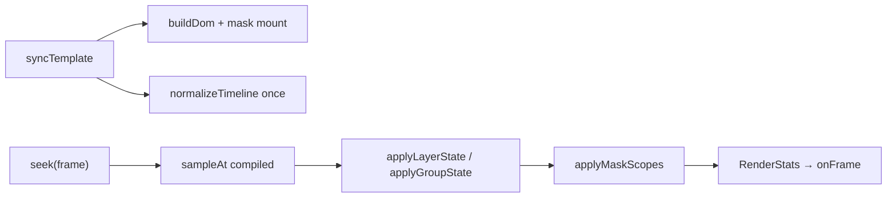

# Фаза 9 — 2.5D transforms + stack-scoped masks

## Мета

| Поле | Значение |
|---|---|
| **Статус** | DONE |
| **PR** | #41–#47, #48 (sergey-v1 merge) |
| **Merge** | июнь 2026 |
| **Ветки** | `feature/phase-9-*` |

---

## 1. Цель / зачем

Сделать в Titulus рабочую **broadcast-графику уровня 2.5D** (наклон плоских слоёв в перспективе) и **функциональные маски по дереву слоёв** — с WYSIWYG в редакторе, анимацией на таймлайне и приемлемой производительностью на CPU-only CEF pipeline (CasparCG-aligned).

**Бизнес-контекст:** оператор должен видеть в editor то же, что уходит в эфир; маски и tilt — стандартные приёмы новостной графики.

---

## 2. Исходное состояние (до Phase 9)

### Уже было

| Компонент | Где |
|---|---|
| `rotationX`, `rotationY`, `perspective`, `anchorX`, `anchorY` | `runtime/src/schema.ts`, `shared/template.schema.json` |
| Анимация 2.5D в keyframes | `ANIMATABLE_PROPS` |
| CSS 3D строка | `runtime/src/transform.ts` |
| Тип `MaskLayer`, черновик UI | schema, editor panels |
| Bench 2D mask/alpha | `bench/bench-alpha.html` (~0.7% overhead Phase 0) |

### Критические пробелы

1. Маска не работала — `clip-path` на div маски, а не на siblings ниже.
2. Нет `preserve-3d` для групп с tilt.
3. Нет rotationX/Y в UI.
4. Anchor: `x/y` = `left/top` без согласованной pivot-семантики.
5. Нет dirty-check — unconditional `style.*` каждый кадр.
6. Нет `RenderStats`.
7. Нет bench 2.5D.

Render authority = CasparCG + свой `domRenderer`, без PIXI/GSAP.

---

## 3. Scope (deliverables)

1. **9.1** — `RenderStats` + per-node dirty-check DOM writes
2. **9.2** — Compiled timeline tracks, binary search keyframes
3. **9.3** — Stack-scoped masks 2D (normal/inverted, rect/ellipse) + UI cleanup
4. **9.4** — rotationX/Y UI, anchor pivot fix
5. **9.5** — `preserve-3d` + perspective inheritance
6. **9.6** — Projected clip-path для rotated/tilted masks
7. **9.7** — Bench сцены + документация

---

## 4. Реализация

### Архитектура runtime

```
runtime/src/
  stats.ts          — RenderStats (9.1)
  timeline.ts       — compiled tracks (9.2)
  maskScopes.ts     — stack-scoped mask compile + 2D clip (9.3)
  maskGeometry.ts   — projected polygon (9.6)
  transform.ts      — pivot, transformHas3D (9.4–9.5)
  domRenderer.ts    — mount mask scopes, preserve-3d (9.3–9.6)
```

Один `TemplateRenderer` для engine, editor, thumbnails.

### Mount model маски

```
stack container (root или groupStacks[gid])
  maskScopeWrapper
    clipHost  ← full-container; clip-path описывает зону
      … siblings НИЖЕ маски (рекурсивно) …
  mask layer (видим только в editor)
  … siblings ВЫШЕ маски …
```

### Cost tiers маски

| Tier | Условие | Механизм |
|---|---|---|
| T1 | axis-aligned rect | `clip-path: inset(...)` |
| T2 | rounded / ellipse | `inset(round)` / `ellipse` |
| T3 | rotation / tilt | `clip-path: polygon(...)` projected |

### Сознательно НЕ делали

- `RendererBackend` / WebGL path
- Копирование sandbox engine
- Outer/inner wrapper на каждый слой (MVP)
- Matrix world-transform для всех групп

---

## 5. PR / Git

| # | Title | Ключевые файлы |
|---|---|---|
| 41 | [Phase 9.1] RenderStats + dirty-check foundation | `runtime/src/stats.ts`, `domRenderer.ts` |
| 42 | [Phase 9.2] Timeline compile + keyframe indexes | `runtime/src/timeline.ts` |
| 43 | [Phase 9.3] stack-scoped functional masks 2D + mask UI cleanup | `maskScopes.ts`, editor panels |
| 44 | [Phase 9.4] 2.5D transform UI (rotationX/Y) + anchor fix | `transform.ts`, `CanvasArea.tsx` |
| 45 | [Phase 9.5] preserve-3d + perspective inheritance | `domRenderer.ts`, `transform.ts` |
| 46 | [Phase 9.6] 3D-rotated masks (projected polygon) | `maskGeometry.ts` |
| 47 | [Phase 9.7] bench 2.5D/masks + phase9 doc | `bench/bench-25d.html`, `bench-mask-stack.html` |
| 48 | [Phase 9.x] merge sergey-v1 fixes | CEF path, decklink symbols, mask semantics, editor UX |

---

## 6. Проверка

```bash
cd runtime && npm run build

# Stack-scoped masks
engine/build/Release/bg_engine \
  --consumer=null \
  --url="file://$PWD/bench/bench-mask-stack.html" \
  --fps=50 --duration=60 \
  --cache-dir=/tmp/bench-mask

# 2.5D stress
engine/build/Release/bg_engine \
  --consumer=null \
  --url="file://$PWD/bench/bench-25d.html" \
  --fps=50 --duration=60 \
  --cache-dir=/tmp/bench-25d
```

Editor HUD: `channel.html?hud=1` — `styleWrites` / `skippedWrites`.

Dirty-check smoke: повторный `seek` на том же кадре без промежуточного `syncTemplate` → `skippedWrites` >> `styleWrites`.

---

## 7. Результаты

| Критерий | Статус |
|---|---|
| Маска обрезает siblings ниже в stack | ✅ |
| Inverted + rounded + ellipse (2D) | ✅ |
| 3D tilt masks (projected polygon) | ✅ |
| rotationX/Y в UI + keyframes | ✅ |
| preserve-3d для 3D subtree | ✅ |
| Anchor pivot согласован | ✅ |
| dirty-check + RenderStats | ✅ |
| Editor WYSIWYG = engine | ✅ |
| Bench smoke 3s mask-stack | ✅ drops=0%, p50≈20.7ms |

Mask/alpha overhead в рамках Phase 0 budget (≤5%).

---

## 8. Ограничения / отложено

- **Hotspot:** projected mask + rotateY ~25fps на `template_test_1` — отложено (Phase 11.6).
- 3D mask projection — упрощённая модель; extreme perspective может расходиться с compositor.
- `clip-path: polygon()` на анимированных масках дороже axis-aligned.
- Outer/inner layout split — возможная future оптимизация.
- SDI parity 2.5D — валидация на DeckLink (Phase 6.4).

---

## 9. Артефакты

| Путь | Роль |
|---|---|
| `runtime/src/domRenderer.ts` | Mount, apply state, masks, 3D |
| `runtime/src/maskScopes.ts` | Stack scope compile, 2D clip |
| `runtime/src/maskGeometry.ts` | Projected mask quads |
| `runtime/src/transform.ts` | Pivot, CSS 3D |
| `runtime/src/timeline.ts` | Compiled tracks |
| `runtime/src/stats.ts` | RenderStats |
| `bench/bench-25d.html` | 2.5D stress |
| `bench/bench-mask-stack.html` | Mask stack regression |
| `shared/template.schema.json` | Mask schema |

---

## 10. Hot path (mermaid)



**Порядок CSS transform:** `perspective → rotateX → rotateY → rotate(Z) → scale`. Pivot через `transform-origin`; позиция через derived `left`/`top` (anchor model Phase 9.4).

---

## 11. Продуктовая специфика маски (заказчик)

- **Иконка:** прямоугольник с «М», размер как Rectangle
- **Свойства:** позиция, размер, anchor, scale, radius, Rotate Z, Tilt X/Y, Mode (normal/inverted), Shape (rect/ellipse)
- **Без:** fill, border, opacity, blend
- **Normal:** siblings ниже в stack видны только внутри маски
- **Inverted:** видно всё вне маски; внутри вырезается
- **Группа:** маска влияет только на siblings в той же группе
- **2.5D:** при tilt обрезка следует повёрнутым границам (T3 projected)

---

## 12. Чеклист приёмки

| Критерий | Статус |
|---|---|
| Formal 60s multi-channel soak 2.5D+mask на bare-metal | ⏳ рекомендуется |
| WS take/update/clear без регрессии | ✅ |
| Bench + документация | ✅ |
