# Phase 20 — Visual Frame Pacing + Microfreeze

**Статус:** IN PROGRESS
**Дата открытия:** 2026-08-09
**Предшественник:** Phase 19 Doc02 K2 PASS (PR #84)
**Scope:** dev/hardware-validation стенд, DeckLink Quad 2, HD1080i50,
CPU-only CEF OSR, HTML5/DOM runtime.

## 1. Зачем нужна отдельная фаза

Phase 19 доказал throughput и delivery health canonical `test1`: в allowlisted
layered path измерены `in_fps≈50`, `d_pairs≈125/5s`, zero DeckLink
`late/drop/flush` и locked reference. Это не равно доказательству ровного
движения на мониторе.

В визуальных прогонах 2026-08-09 оператор наблюдал:

- на трёх каналах плавность периодически выглядит как 25–30 fps при
  `telemetry5s in_fps≈50`;
- регулярные рывки на 1–2 поля/кадра и заметный красный след на движущемся
  элементе часов;
- симптом присутствует на всех элементах, часы лишь делают его заметнее;
- два монитора: первый канал наблюдался непрерывно, второй монитор
  переключался между каналами 2 и 3.

Это валидное операторское наблюдение, а не технический диагноз. Задача
Phase 20 — установить, на каком участке temporal path возникает эффект и
проверить результат на самом SDI-сигнале.

## 2. Базовые факты и границы интерпретации

Финальный 2-минутный прогон после полного restart dev stack показал:

| Канал | `in_fps` min/median/max | `d_pairs` | DeckLink errors | compose p95 |
|---|---:|---:|---:|---:|
| 1 | 50.0 / 50.0 / 50.0 | ~125/5s | 0 | 1.737 ms |
| 2 | 50.0 / 50.0 / 50.0 | ~125/5s | 0 | 2.740 ms |
| 3 | 50.0 / 50.0 / 50.0 | ~125/5s | 0 | 1.869 ms |

Все каналы оставались `mode=composing`, с `capture_failures=0`, `fallback=0`
и `ref=locked`.

Одновременно `Stats::Progress` в тех же прогонах показывал неравномерные
интервалы между render delivery: p50 около 12.6–17.4 ms, p99 около 35 ms,
минимумы 3–6 ms и отдельные максимумы десятков миллисекунд. Около 47–48%
интервалов превышали внутренний порог `1.5 × 20 ms = 30 ms`.

Термины нельзя смешивать:

| Метрика | Что она подтверждает | Чего она не подтверждает |
|---|---|---|
| `in_fps` | скорость `Consumer::OnFrame` enqueue в среднем за 5 s | равномерность delivery и уникальность движения |
| `out_fps≈25` | scheduled 1080i50 containers/s | «потерю половины кадров»; 50 fields/s — нормальный режим |
| `d_pairs` | consumer взял два queued frame objects | spacing двух semantic states и порядок их content time |
| `d_late/drop/flush` | BMD completion result | CEF/pump hitch, duplicate pose, monitor deinterlace artifact |
| `Stats late/drops` | delivery interval >30 ms | DeckLink `d_late` или физический SDI drop |

Следовательно, Phase 20 не отменяет K2 PASS: он добавляет отсутствующую
visual-pacing acceptance plane.

## 3. Рабочие гипотезы

### H20.1 — batch cadence в decklink-driven path

`DecklinkConsumer` запрашивает два tick после completion одного 40-ms
interlaced output frame. В [main.cpp](../../engine/src/main.cpp) Phase 18
сознательно запускает второй sub-tick сразу после первого, не ожидая остаток
20-ms field budget. В [channel.html](../../backend/public/channel.html)
timeline advance привязан к wall-time accumulator rAF.

Комбинация может дать 0 или 2 logical timeline tick на соседних paint:
`in_fps=50` и `d_pairs≈125` останутся зелёными, а poses попадут на SDI
неравномерно. Это наиболее сильная гипотеза, но до semantic identity и
loopback она не считается доказанной.

### H20.2 — interlace / field order / monitor deinterlacer

При настоящей паре engine weave берёт линии старшего/младшего поля из двух
разных progressive bitmaps. Движущийся красный объект может давать comb/trail
на progressive display path даже при правильном DeckLink completion. Нужно
отделить ожидаемый interlace look от inverted field order или ошибки
деинтерлейсера монитора.

### H20.3 — редкие microfreeze поверх cadence

Исторический незакрытый трек
[06-microfreeze-elimination.md](../performance%20investigation/06-microfreeze-elimination.md)
описывает 50–200-ms hitches примерно раз в 5–11 s на простом motion template.
V8 MemoryReducer, THP/khugepaged, scheduler и DeckLink driver остаются
**непроверенными**, а не подтверждёнными гипотезами.

## 4. Дизайн доказательств

```mermaid
flowchart LR
  Callback["DeckLink completion"] --> Tokens["Two field tokens"]
  Tokens --> BeginFrame["CEF BeginFrame"]
  BeginFrame --> Raf["rAF and timeline state"]
  Raf --> Paint["CEF OnPaint"]
  Paint --> Compose["Layered or monolith compose"]
  Compose --> Queue["DeckLink input queue"]
  Queue --> Weave["Field A and Field B weave"]
  Weave --> SDI["SDI output"]
  SDI --> Capture["Loopback capture"]
```

Каждый участок должен получить одну временную шкалу и identity:

1. **Timeline/CEF:** rAF sequence and delta, `ticks_per_raf`, logical frame
   before/after, BeginFrame token, raw CEF paint sequence.
2. **Graph/composition:** graph/state revision, live update generation,
   compose sequence and reuse marker.
3. **Queue/weave:** source sequence A/B, delta/order, queue depth before pop,
   pair/single/starve mode and scheduled display time.
4. **DeckLink/SDI:** completion timestamp/result, locked-reference transitions,
   captured field semantic ID and field order.

Timestamps use both monotonic µs (durations) and Unix realtime µs
(cross-process correlation). Existing `FrameLog` calls a `steady_clock`
epoch `wall_clock_us`; it must not be used to join `date`, GC or operator
marks until this is corrected.

## 5. Work packages

### P20.0 — baseline and terminology

- Preserve the 2026-08-09 visual observations and current logs as baseline.
- Publish the metric dictionary above in tooling output and reports.
- Keep three classifications separate: systematic cadence, rare microfreeze,
  interlace/deinterlacer trail.

### P20.1 — provenance and detector

- Extend frame-log and runtime telemetry with the identities in §4.
- Add a timestamped DeckLink late/completion log, disabled by default.
- Add `mark-freeze.sh` and `analyze-microfreeze.mjs`, including synthetic
  fixtures for soft hitch (≥30 ms), microfreeze (≥50 ms), hard freeze
  (≥100 ms), clusters and operator-mark joins.
- Add a deterministic moving-bar/frame-ID template whose semantic state is
  recoverable independently from even and odd SDI fields.
- Add deterministic unit tests for duplicate, skipped and reversed field IDs.

### P20.2 — reference-preserving SDI loopback

Follow [phase-20-loopback-capture.md](phase-20-loopback-capture.md). Keep
Reference In connected; confirm mapping/profile while engines are stopped;
run one-channel smoke first; then validate two channels in parallel and the
third in a second pass.

### P20.3 — one-factor cadence A/B

Only after P20.1/P20.2 baseline:

1. One fixed logical step per engine-mode rAF/BeginFrame, without wall-time
   catch-up in engine fixed mode.
2. Existing accumulator with decklink-only sub-ticks returned to an absolute
   20-ms field grid.
3. Both changes, only if the independent runs explain separate parts of the
   defect.
4. Independent 1ch layered OFF/ON and TFF/BFF test-pattern checks.

No default behavior changes on browser, stream, preview or null paths.
Do not reopen dual in-flight BeginFrame: Phase 18 already measured
`pctTicksDeltaGe2=0%`.

### P20.4 — residual microfreeze isolation

Calibrate detector versus operator marks on `test`, then repeat final
acceptance on `test1`. Test one factor per run: V8 flags, THP policy,
null-vs-DeckLink, CEF trace, `perf sched`, frame-log overhead and specific
engine paths. A mitigation needs timestamp correlation, not only a better
average FPS.

### P20.5 — acceptance

| Gate | Criterion |
|---|---|
| Semantic cadence | after warm-up, captured logical field IDs advance `+1`; zero duplicate, skip or reversed fields |
| Delivery | `d_late=d_dropped=d_flushed=0`, no steady-state overwrite, reference continuously locked |
| Visual detector | operator freeze mark correlation ≥70%; control-mark false positive ≤20% |
| Microfreeze | zero hard clusters; microfreeze rate ≤0.05/min or zero when claiming elimination |
| Soak | 1ch 10–15 min detector+loopback, 3ch 15 min, final 3ch 60 min |
| Visual review | no systematic perceived 25–30 fps segments on `test1` |

## 6. Rollback

Instrumentation is opt-in and must have no hot-path work when disabled.
Every cadence A/B ships behind an explicit dev flag, with baseline as default
until loopback evidence passes. Revert a selected PR or unset its flag, restart
the affected engine supervisor tree, then perform a 15-minute baseline smoke.

## 7. Out of scope

- GPU renderer, alternative runtime and CasparCG runtime are prohibited.
- Average `in_fps` alone, JPEG preview and visual judgment alone are not
  acceptance evidence.
- Full 8-hour production soak is owned by Phase 6.4, not this dev phase.
