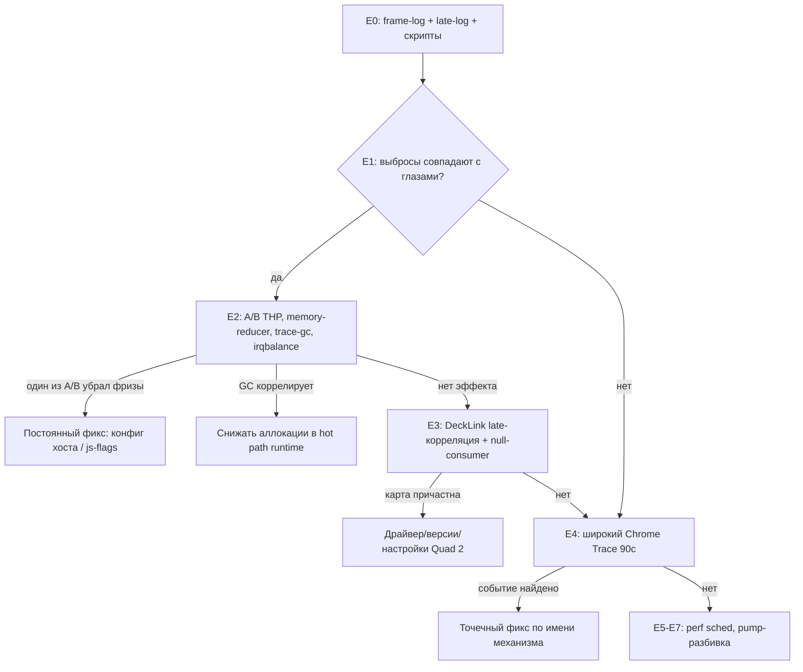

# Titulus — план расследования и устранения проблем производительности

**Дата:** 5 июля 2026 (обновлено 7 июля 2026). **Цель:** стабильные 50 fps на канал (1080i50, 3 канала DeckLink Quad 2) без микрофризов, с плавной отработкой анимаций. **Статус кода на момент написания:** `main` = Phase 0–13 (PR #1–#57), последний merge — Phase 13 (документация + Phase 12 Blink-research). Между PR #56 (02.07, последний код-PR) и обоими стресс-тестами (04.07, 05.07) в движок изменений не вносилось — оба теста прогоняют код Phase 11.

**Обновление 7 июля 2026:** добавлены два подчинённых документа, в которые вынесена детальная работа — [docs/other/PHASE_14_MICROFREEZE_PLAN.md](PHASE_14_MICROFREEZE_PLAN.md) (микрофризы) и [docs/other/PHASE_15_PERFORMANCE_PLAN.md](PHASE_15_PERFORMANCE_PLAN.md) (оптимизация throughput). Сводный обзор всех фаз 15-20 — в [docs/other/PERFORMANCE_ROADMAP.md](PERFORMANCE_ROADMAP.md). Также см. §1.1.1 (новая находка: потолок `in_fps` = 25, не 50) и §1.1.2 (главное: проблема в `left/top` в `transform.ts`/`domRenderer.ts`, подтверждено кодом).

Документ построен на: анализе кода (`engine/`, `runtime/`, `backend/public/channel.html`), git/PR-истории, логах двух стресс-тестов (`logs stress test/04.07.26`, `05.07.26`), живых измерениях на текущем стенде (снято 05.07 в ходе работы над этим документом), диалоге пользователя с внешним программистом (`docs/other/development-proposals.md`) и серии уточнений от пользователя и его друга, тестировавшего проект на отдельном сервере.

Проблема распадается на два независимых вопроса:

- **Вопрос A — низкий FPS.** С реальным контентом движок упирается в потолок, зависящий от сложности шаблона: простой шаблон `test` (1 группа: rect + clock) держит ~49 in_fps, сложный `test1` (11 слоёв с масками, картинками, текстом и timeline-анимациями) проседает до ~24 in_fps. Целевой показатель 50 in_fps на сложном шаблоне пока не достигнут. Дополнительно выяснилось (см. 1.1.1 ниже): текущий движковый потолок для 1080i50 — это **25 уникальных in_fps** (out_fps=25), поскольку пара полей формируется из одного bitmap; достижение 50 in_fps — отдельная архитектурная задача (Phase 18).

**Важно про имена шаблонов (обновление от 7 июля 2026):** в первой версии этого документа имена шли наоборот. Уточнённое и зафиксированное соответствие (шаблоны спасены в `tests/templates/test.json` и `tests/templates/test1.json`):

- `test` — **простой** шаблон: одна группа, в ней rect + clock, X/Y-loop по диагонали. На нём ~49 in_fps при загрузке CPU 10-20%.
- `test1` — **сложный** шаблон: 11 слоёв (2 маски, 2 текста, 3 картинки, 2 rect, 1 clock), timeline анимирует `x`, `y`, `rotation`, `width`. На нём ~24 in_fps при загрузке CPU 50-60%.
- **Вопрос B — хаотичные микрофризы.** Пользователь визуально видит на SDI-мониторе (TV Logic) регулярные, но не строго периодичные подёргивания картинки — примерно раз в 5–11 секунд (в ~80% случаев ближе к 7–10с).

Ниже — итоговая картина по каждому вопросу: что подтверждено, что было ошибочно заподозрено и отброшено, и конкретный план дальнейших действий.

---

## Важный урок из первой части расследования: не путать «нет контента» с «деградацией»

Первая версия анализа стресс-теста 05.07.26 ошибочно интерпретировала резкий обвал FPS с 50 до 17–18 на 27-й минуте как системную аномалию (тепловой троттлинг). В логах `bg_engine` нет маркера «оператор включил темплейт» — видно только создание браузера при старте процесса и телеметрию DeckLink. На деле первые ~27 минут теста движок работал **без загруженного шаблона** (отдавал в DeckLink почти пустой кадр — только DOM damage-beacon), а затем пользователь вручную включил сложный шаблон (тогда он назывался `test`, сейчас после переименования 7 июля — `test1`, см. §1.1.2) на всех трёх каналах, что и подняло стоимость рендера. Это штатный переход «рендерить почти нечего → рендерить реальный контент», а не деградация.

Заодно проверялась и гипотеза теплового троттлинга (замер Tctl=66°C показался подозрительным для «простоя», но на деле это было измерение **под нагрузкой ~60%**, что для Ryzen 5 3600 с воздушным охлаждением нормально). Повторный live-замер после 3+ часов непрерывной работы всех трёх каналов со сложным шаблоном показал: Tctl 65°C, Tccd1 62°C, частота ядер стабильно 3.7–3.96 GHz, governor schedutil, без малейшего признака троттлинга. **Тепловая/системная гипотеза полностью снята** и больше не рассматривается.

Практический вывод на будущее (закреплён в протоколе тестирования ниже): манифест любого стресс-теста обязан фиксировать точное время каждого ручного действия оператора (когда включён/выключен/сменён шаблон на каждом канале) — без этого телеметрию невозможно корректно интерпретировать задним числом.

---

# Часть I — Вопрос A: почему FPS упирается в content-bound потолок

## 1.1 Доказательная база

Самое чистое свидетельство из всех собранных данных — прямой контраст на живом стенде: пока шаблон не загружен (только 1×1px DOM damage-beacon, почти нулевая нагрузка на raster), движок **тривиально держит 50 fps**. Как только на всех трёх каналах включается реальный контент, FPS падает и стабилизируется на content-bound плато: простой шаблон `test` — ~49 in_fps, сложный `test1` — ~24 in_fps (при 3 каналах одновременно, замер 7 июля 2026). Потолок в 50 fps архитектурно достижим — конкретный контент шаблона слишком дорог для рендера при текущей реализации.

### 1.1.1 Важное уточнение от 7 июля 2026: потолок `in_fps` = 25, не 50

Анализ живых логов дал принципиально новую информацию, которой не было в первой версии документа. Из типичной строки `telemetry5s`:

```
in_fps=24.6 out_fps=25.0 queue=0 d_pairs=0-9 d_singles=110-120 d_starved=1-10 ...
```

`out_fps=25.0` означает, что **DeckLink работает в режиме «25 прогрессивных кадров, отправляемых как 50i»**: пара полей формируется из одного bitmap, оба поля пары содержат одинаковое изображение. Это даёт корректный 50i сигнал, но **визуальное временное разрешение — 25p**, не 50p: движение не сдвигается между двумя полями одной пары.

Это зашито в архитектуру движка (`decklink_consumer.cpp`): пара полей строится из одного приходящего от CEF кадра; движок запрашивает у CEF новый кадр только когда `paint_seq` изменился, иначе пара берётся из старого. Поэтому **целевой потолок `in_fps` = 25, а не 50** на сложном контенте. Phase 18 ([PERFORMANCE_ROADMAP.md](PERFORMANCE_ROADMAP.md), [phase-18-true-50p-pipeline.md](../development-phases/phase-18-true-50p-pipeline.md)) показал: на empty/cheap контенте потолок уже **50** (`d_pairs≈125`); на `test1` pump-переработка (Fallback eager packing) **не** поднимает потолок — CEF OSR коалесцирует dual BeginFrame, а один raster `test1` съедает ~field budget. Потолок 25 на `test1` остаётся **content/raster-bound**, не «архитектурный запрет weave».

**Переформулированная цель Вопроса A (Phase 15):** поднять `in_fps` на `test1` с текущих ~24 до стабильных 25 при 3 каналах — это означает, что движок перестаёт «не успевать» и регулярно даёт свежие пары полей (`d_pairs > 0` стабильно, `d_starved` падает). Кажется скромным как цифра, но именно это даёт визуально плавную картинку. Реальные 50 — отдельная цель Phase 18.

### 1.1.2 Главная находка 7 июля 2026: проблема в `left/top` (подтверждено кодом)

[runtime/src/transform.ts:56-65](../../runtime/src/transform.ts) возвращает позицию слоя как `left`/`top` + отдельное поле `transform` только для rotation/scale/perspective. [runtime/src/domRenderer.ts:601-602, 750-751](../../runtime/src/domRenderer.ts) пишет `el.style.left = "${at.left}px"; el.style.top = "${at.top}px"` на каждый кадр для каждого слоя и каждой маски. В test1 анимируются именно `x`, `y` (→ `left`, `top`), `rotation`, `width`. То есть **каждый кадр триггерит Layout** внутри Blink, что форсирует Paint + Raster повреждённой области — ~10× дороже raster, чем если бы те же координаты писались через `transform: translate3d(...)`.

Это количественно объясняет разницу: простой `test` (1 слой, layout дешевле) → ~49 fps; сложный `test1` (11 слоёв, layout дороже) → ~24 fps. И это согласуется с Research 3 / Recommendation 2 из `docs/other/development-proposals.md`, но теперь у нас есть **конкретная точка правки в коде**, а не абстрактная рекомендация. Детальный план оптимизации — [docs/other/PHASE_15_PERFORMANCE_PLAN.md](PHASE_15_PERFORMANCE_PLAN.md).

Это ровно диагноз, который независимо поставил внешний программист в `docs/other/development-proposals.md`: узкое место — программная растеризация Skia (CPU raster), вызываемая избыточной Paint Invalidation внутри Blink. Findings Phase 12 (research другого агента, см. `docs/development-phases/phase-12-blink-pipeline.md`) подтверждают механизм на уровне кода:

1. Beacon вызывает paint+raster на каждый `requestAnimationFrame`, даже когда `styleWrites=0` (`channel.html:134-153`).
2. Таймлайн-движок Titulus анимирует `left`/`top`, а не `transform` — то есть каждый кадр анимации это полноценный **Layout**, а не только Composite.
3. `DisplayItemList` переиспользуется между кадрами, а bitmap — нет.
4. Ни один из этих выводов ещё не применён к продакшн-коду — только задокументирован.

## 1.2 Что уже подтверждено и не является причиной

| Утверждение | Статус | Комментарий |
|---|---|---|
| DeckLink pipeline (copy+weave+schedule) — узкое место | ❌ Опровергнуто | ~9–11% бюджета кадра и в архивных, и в живых логах — согласуется с независимым выводом внешнего программиста |
| Clock inversion / буферный пул / SIMD (Phase 11) | ✅ Работают корректно | `main.cpp:207-322`, `decklink_consumer.cpp:843-882` — утечек и джиттера от этого кода не видно |
| `SCHED_FIFO priority 2` | ❌ Недоступен на этом хосте | Во всех логах: `unavailable (Операция не позволена)` — нет прав RT. Второстепенный открытый пункт |
| Тепловой троттлинг | ❌ Опровергнуто | См. выше — 3+ часа под нагрузкой без малейшего дрейфа температуры/частоты |

## 1.3 Оценка рекомендаций `docs/other/development-proposals.md`

Диагноз внешнего программиста (Perf → Chrome Trace → invalidation tracking → Skia CPU raster) подтверждается напрямую нашими данными и принимается как основной ориентир. Построчные вердикты:

| Рекомендация | Вердикт |
|---|---|
| 1. Минимизировать Paint Invalidation (CRITICAL) | **Адаптировать.** Beacon форсирует paint каждый кадр намеренно (нужен для пейсинга DeckLink) — убрать нельзя, но можно сделать дешёвым через layer isolation (Phase 15). Сам beacon почти бесплатен (50fps без контента) — дорог именно контент, значит усилия нужно сместить на изоляцию инвалидации контента, а не только beacon |
| 2. Compositor-friendly свойства вместо `left`/`top` (CRITICAL) | **Принять**, с оговоркой на CPU-only рендеринг (нет GPU-композитинга) — см. Phase 16 |
| 3. Performance Matrix (HIGH) | **Принять полностью** — приоритет №1 наравне с Рекомендацией 1 |
| 4. Property Trees Blink (HIGH, гипотеза) | Отложить до результатов Phase 15/16 |
| 5. Style Guide (HIGH) | Принять — после Phase 16 |
| 6. Не оптимизировать DeckLink (LOW) | Принять, подтверждено дважды (~9–11% бюджета) |
| 7. Не микрооптимизировать memcpy (LOW) | Принять |
| 8. Развивать телеметрию (HIGH) | Принять и расширить — переориентировано на Вопрос B (микрофризы), см. Часть II |
| 9. Автоматический Benchmark (HIGH, долгосрочно) | Адаптировать, после Phase 18 |
| 10. «Chromium как платформа оптимизации» (CRITICAL) | **Принять полностью** — следующий уровень производительности Titulus лежит в понимании и оптимизации Blink/Skia hot path, а не в собственном pipeline или инфраструктуре хоста |

## 1.4 Ранжированный список подтверждённых причин

| # | Причина | Статус |
|---|---|---|
| 1 | Реальный контент шаблона — прямая причина просадки до content-bound потолка | **Подтверждено** (контраст beacon-only vs beacon+content + Phase 12) — **главная причина** |
| 2 | Таймлайн анимирует `left`/`top` вместо `transform` → лишний Layout на каждый кадр | **Подтверждено** Phase 12 research |
| 3 | DeckLink pipeline — не узкое место (~9-11% бюджета) | Подтверждено, не проблема |
| 4 | `SCHED_FIFO` недоступен | Подтверждено, второстепенно, может усиливать джиттер |
| 5 | Chromium raster-пул может не насыщать 4 выделенных логических ядра на канал (объясняет «60% CPU при нехватке FPS») | **Частично подтверждено** Phase 17 — верно для self-timer/headless пути, для production DeckLink-пути доминирует латентность pump-цикла, не raster |

## 1.5 Разовая аномалия Channel 3 (не подтверждена, низкий приоритет)

В архивном тесте 05.07.26 Channel 3 после общего перехода «нет шаблона → есть шаблон» продолжил самостоятельно деградировать ещё почти час (с ~18 fps до ~6.6 fps), пока Ch1/Ch2 стабилизировались сразу. В текущем живом прогоне (3+ часа с тем же шаблоном) Channel 3 ведёт себя идентично Ch1/Ch2 (`in_fps=17.2–18.1`, без деградации) — аномалия не воспроизводится. Вывод: разовый эффект конкретного прогона (возможно, фоновый процесс хоста в тот момент). Не расследовать глубоко, мониторить в будущих длинных прогонах.

---

# Часть II — Вопрос B: хаотичные микрофризы

## 2.1 Что именно наблюдается

Пользователь видит на SDI-мониторе регулярные, но не строго периодичные подёргивания картинки. Ключевые уточнённые характеристики:

- Период нестрогий: ~80% случаев в диапазоне 7–10с, но бывает и 5с, и 11с — **не фиксированный таймер**.
- Не привязаны к конкретной фазе анимации/маски в шаблоне — заанимированная rotation-маска проходит свой цикл много раз, фриз не появляется каждый раз в одной и той же точке.
- В сложном шаблоне (`test1` после переименования 7 июля; ранее эта фраза относилась к `test`) нет видео вообще — только примитивы, картинки, часы и заанимированные маски.
- **Воспроизводятся даже на тривиальном контенте** — один примитив, двигающийся туда-обратно по X в loop, без масок, без часов, без картинок.
- **Воспроизводятся на совершенно другом железе**: друг пользователя тестировал проект на своём сервере (мощный Xeon против домашнего Ryzen 5 3600 у пользователя) и тоже увидел микрофризы — собственно, именно он обратил на них внимание первым. Друг тестировал **полный пайплайн с реальным выводом на DeckLink Quad 2** (та же модель карты, что и у пользователя), не упрощённое браузерное превью.
- Единственное известное отличие между двумя стендами — версия ОС: у пользователя Ubuntu 22.04.5 LTS, у друга Ubuntu 24.04.2 LTS.

Телеметрия 5-секундными окнами (`telemetry5s`/`Stats::Progress()`) слишком грубая, чтобы поймать паттерн такого масштаба, — микрофризы подтверждены визуально, но не измерены количественно. Отдельно: устойчивое `d_pairs=0` (движок никогда не получает вовремя два свежих поля подряд при текущей content-bound нагрузке) и ~7.6 `d_starved`/с — это фон общей «шершавости» картинки от нехватки FPS (Вопрос A), происходящий значительно чаще, чем раз в 5-11с, и явно отдельное от Вопроса B явление.

## 2.2 Гипотезы, которые были рассмотрены и отброшены

| Гипотеза | Почему отброшена |
|---|---|
| Decode-хитч на loop видео в шаблоне | В сложном шаблоне (`test1`) нет видео вообще |
| Дорогой keyframe в конкретном месте таймлайна (например, в цикле rotation-маски) | Фризы не привязаны к конкретной фазе анимации |
| Фиксированный WebSocket keep-alive/ping backend↔engine | Период нестрогий (5-11с, не строго N секунд); к тому же в коде backend WS-роута нет периодического ping вообще |
| Фоновые сетевые запросы самого Chromium (GCM registration retry, dbus/xdg) | Проверено по логам: всего 6 таких строк за ~2 часа теста, с явным экспоненциальным backoff (21с, 21с, 58с, 98с, 110с, 210с...) — на порядки реже наблюдаемого паттерна |
| Тепловой троттлинг / деградация конкретного CPU | Опровергнуто прямым измерением (см. выше), и в любом случае не объяснило бы воспроизводимость на Xeon |
| Systemd-таймеры хоста (`anacron`, `logrotate`, `fstrim`, `apt-daily`, и т.д.) | Проверено: ни один не срабатывает чаще раза в ~7 минут |
| Что-то в собственном коде `bg_engine`/`channel.html`/`backend` (буферные пулы, watchdog, stats-интервал) | Прямой аудит кода не нашёл периодической логики с интервалом 5-11с: буферные пулы (`recycle_pool_`/`input_pool_`, `kMaxRecycledBuffers=8`) ограничены по **размеру**, а не по времени; `stats_interval_sec` — просто печать в лог; watchdog в `main.cpp:361-373` реагирует на **отсутствие** paint, а не создаёт периодическую нагрузку; в `channel.html` нет `setInterval` с фиксированным периодом (только rAF-heartbeat). Гипотеза не исключена полностью, но заметно ослаблена |

## 2.3 Текущие рабочие гипотезы (по приоритету)

Воспроизводимость на архитектурно совершенно разном CPU (AMD Ryzen десктопная платформа vs Intel Xeon серверная) практически исключает что-либо специфичное для конкретного процессора, чипсета или его power management (governor/C-state переходы, thermal, AMD-специфичные core-parking баги). Это смещает вес на факторы, общие для обеих машин, — то есть на **софт и общее железо DeckLink**, а не на CPU.

Уточнения от пользователя и друга по настройкам обеих машин:

| Параметр | Пользователь (Ubuntu 22.04.5) | Друг (Ubuntu 24.04.2) |
|---|---|---|
| `irqbalance` | **active** (10с по умолчанию, без banned cpus) | **inactive** |
| `transparent_hugepage/enabled` | `madvise` | `madvise` |
| `khugepaged/scan_sleep_millisecs` | 10000 (10с, дефолт) | с высокой вероятностью тоже 10000 (дефолт Ubuntu, не менялся) |
| CPU | Ryzen 5 3600 | Xeon (модель не уточнялась) |
| DeckLink-карта | Quad 2 | **Quad 2** (та же модель) |
| Полный пайплайн | да | да (друг видел фризы именно с DeckLink-выводом) |

Это сразу даёт важный вывод: **`irqbalance` исключён как общая причина** — у друга inactive, а фризы есть. Остаётся только как локальный sanity-тест на стенде пользователя (возможно, добавляет *дополнительные* фризы именно у него, поверх общего источника). `khugepaged`/THP — общий кандидат (оба в `madvise`). DeckLink Quad 2 — единственное общее железо, приоритет его проверки поднят.

| # | Гипотеза | Обоснование | Как проверить |
|---|---|---|---|
| 1 | **V8 memory reducer** + общий внутренний механизм CEF/Chromium/V8 (PartitionAlloc memory reclaimer, V8 idle-time GC/idle tasks, `cc::TileManager`/`ResourcePool` эвикция неиспользуемых тайлов) | Часть одного и того же бинарника — выполняется идентично независимо от CPU, объясняет воспроизводимость на любом железе и любом контенте. Memory reducer — встроенный механизм V8, который при стабильной скорости аллокации запускает Mark-Compact GC квази-периодично (по объёму, не по таймеру) — идеально ложится на паттерн «стабильная анимация → стабильный churn → квази-периодичный длинный GC» | `--no-memory-reducer` через плюмбинг `js-flags` (E2b детального плана) + `--trace-gc` для корреляции (E2c) |
| 2 | Драйвер/SDK карты Blackmagic DeckLink Quad 2 (единственное общее железо) | В отличие от CPU, DeckLink-карта физически совпадает на обеих машинах; периодическая внутренняя работа драйвера (проверка genlock/reference, пересчёт таймингов вывода) — правдоподобный источник | Корреляция late/dropped карты с frame-log (E3a) + тест через `null_consumer` (E3b) |
| 3 | `khugepaged` / THP (общий дефолт Ubuntu, `madvise` на обеих машинах) | THP в `madvise` + khugepaged-скан каждые 10с — общий дефолт Ubuntu, не менялся между 22.04 и 24.04 | OS A/B тест `echo never > .../enabled` (E2a детального плана); попросить друга проверить `scan_sleep_millisecs` на его 24.04 |
| 4 (понижен) | Что-то в собственном коде `bg_engine`/`channel.html`/`backend` | Ослаблена аудитом кода (см. 2.2), но не исключена полностью — особенно если E1-E4 детального плана не дадут результата | E5-E7 детального плана (perf sched, pump-разбивка) |
| 5 (исключён из приоритетных) | CPU governor/C-state, thermal, что-либо hardware-специфичное для конкретного CPU | Крайне маловероятно после воспроизведения на Ryzen И Xeon одновременно |
| — (исключён как общая причина) | `irqbalance` ребалансировка каждые 10с | У друга `irqbalance` inactive, фризы есть — не может быть общей причиной. Только локальный sanity-тест для пользователя (E2d детального плана), поскольку у него active |

## 2.4 План действий — Phase 14

**Полная, очень подробная техническая версия плана с командами, код-диффами, скриптами анализа и пошаговыми инструкциями для оператора вынесена в отдельный документ:** [docs/other/PHASE_14_MICROFREEZE_PLAN.md](PHASE_14_MICROFREEZE_PLAN.md). Ниже — краткая сводка.

Ключевое методологическое правило детального плана, которого не было в первоначальном наброске: **сначала строится объективный детектор фризов (покадровый `--frame-log` + скрипт `analyze-frame-log.mjs`) и валидируется глазами (E1), и только потом запускаются A/B тесты.** Без этого каждый A/B приходится оценивать «на глаз», что при хаотичном паттерне 5-11с превращает эксперимент в угадайку.

Эксперименты расположены по возрастанию стоимости:

| ID | Что | Пересборка? | Кратко |
|---|---|---|---|
| E0 | `--frame-log` CSV + late-log + скрипты анализа + скрипт-«кнопка» для оператора | да | Объективный детектор фризов |
| E1 | Валидация детектора глазами: оператор жмёт Enter при фризах, скрипт сверяет | — | Решает: можно ли доверять детектору |
| E2a | THP off (общий кандидат №3) | нет | `echo never > .../enabled` |
| E2b | V8 memory reducer off (кандидат №1) | да | `BG_ENGINE_JS_FLAGS=--no-memory-reducer` |
| E2c | `--trace-gc` и корреляция Mark-sweep с frame-log | да | Подтверждение/опровержение GC-гипотезы |
| E2d | irqbalance off (локальный sanity для пользователя) | нет | Не общая причина, но может снимать доп. фризы |
| E3a | Корреляция late/dropped карты с frame-log | да | Карта сообщает о просрочке в моменты фризов? |
| E3b | Прогон test1 через `null_consumer` | — | Если фризы пропадут без DeckLink — карта причастна |
| E3c | Сравнение версий драйвера Blackmagic у пользователя и друга | — | Совпадение усилит гипотезу, различие ослабит |
| E4 | Длинный Chrome Trace с широкими категориями (`v8,cc,toplevel,sequence_manager,disabled-by-default-v8.gc`) + новый скрипт `find-periodic-events.mjs` | да | Прямая идентификация механизма по имени события |
| E5-E7 | Резерв: `perf sched`, покадровый лог «работа vs ожидание», повтор на тяжёлом `test` | — | Если E1-E4 не дали ответа |

Дерево решений:



---

# Часть III — Дальнейший план по Вопросу A (Phase 15-20)

```
Phase 15 (текущий фокус: оптимизация transform → translate3d) ──┐
Phase 16 (Performance Matrix + layer promotion)                 ├──→ Phase 18 (true 50p pipeline) ──→ Phase 19 (Style Guide + cost model) ──→ Phase 20 (auto-benchmark в CI)
Phase 17 (насыщение raster-пула / латентность)                  ┘
```

**Все детали вынесены в отдельные документы:**

- [docs/other/PHASE_15_PERFORMANCE_PLAN.md](PHASE_15_PERFORMANCE_PLAN.md) — детальный план текущей фазы (P0-P6: телеметрия → cost matrix → правка `transform.ts`/`domRenderer.ts` → валидация).
- [docs/other/PERFORMANCE_ROADMAP.md](PERFORMANCE_ROADMAP.md) — сводный обзор всех фаз 15-20 с зависимостями, приблизительными сроками и критериями успеха.

Краткое резюме по фазам:

## Phase 15 — Оптимизация transform (ТЕКУЩИЙ ФОКУС, 3-5 дней)

**Статус 7 июля 2026: ЗАВЕРШЕНО.** Полный отчёт с числами и изменениями в
коде — [docs/other/PHASE_15_RESULTS.md](PHASE_15_RESULTS.md).
Краткий итог: 3-канальный DeckLink soak (15 минут) достиг **in_fps≈25** на
всех каналах (потолок 25p-as-50i, был ~24), raster p95 упал с 234.7 до 189.9
ms/frame за счёт P3-B (мемоизация projected-mask геометрии). Класс A
(left/top → translate3d) **отменён обоснованно**: P1 не показал выигрыша на
изолированном bench, а корректная реализация требует custom-декомпозиции
`transform` (наивный `translate3d` ломает пивот вращения для всех слоёв с
`anchorX/Y ≠ 0`) — переносится в Phase 16.

**Главная находка:** [runtime/src/transform.ts](../../runtime/src/transform.ts) и [runtime/src/domRenderer.ts](../../runtime/src/domRenderer.ts) пишут `left`/`top` в CSS на каждый кадр — это триггерит Layout в Blink и делает кадр в ~10× дороже raster, чем нужно. Перевод `x`/`y`/`rotation` в единый `transform: translate3d(...) rotate(...)` — главное направление. **Цель:** `in_fps` на `test1` с ~24 → 25 (достигнуть движкового потолка). Реальные 50 — Phase 18.

## Phase 16 — Performance Matrix + layer promotion (ЗАВЕРШЕНО, 8 июля 2026)

Деливерабл: [docs/development-phases/phase-16-performance-matrix.md](../development-phases/phase-16-performance-matrix.md).

Краткий итог:
- Расширена матрица bench-стендов (clip-circle, css-blur, drop-shadow, text-100, image-stack, gradients + layer A/B).
- Layer promotion (`will-change`, `contain`) в CPU-only OSR не дал выигрыша (в пределах шума), поэтому не включён в runtime.
- Реализован перенос Class A из Phase 15: composited position (`left/top -> transform`) с сохранением editor-совместимого контракта `AppliedTransform`.
- Валидация: editor без визуальных регрессий; 3-канальный DeckLink soak 15 минут около потолка `in_fps≈25` (`d_late=0`, `d_dropped=0`).

## Phase 17 — Почему CPU ~60%, а не 100%? (ЗАВЕРШЕНО, 8 июля 2026)

Деливерабл: [docs/development-phases/phase-17-raster-latency.md](../development-phases/phase-17-raster-latency.md).

Вердикт смешанный: raster-пул недонасыщен для self-timer/headless пути
(`num-raster-threads=3` даёт +5.6% fps / −44% paint-latency p95), но для
production DeckLink-пути доминирует латентность pump-цикла (+1.6% fps —
CPU не является главным ограничителем там). `num-raster-threads = N_cores −
1` закреплён как default в `run-channel.sh`. 3-канальный soak (~16.7 мин)
подтвердил отсутствие регрессии (`d_late=0 d_dropped=0`). Для Phase 18 вывод:
нужна переработка pump-архитектуры, не просто больше CPU.

## Phase 18 — Реальный 50p progressive pipeline — DONE (потолок задокументирован)

См. [phase-18-true-50p-pipeline.md](../development-phases/phase-18-true-50p-pipeline.md). Approach A (CEF in-flight) опровергнут; Approach B не обоснован бюджетом; Fallback реализован. На `test1` 3ch: `in_fps≈25`, `d_pairs` без lift vs Phase 17. True 50p на empty/cheap уже работает. Следующий рычаг — снижение стоимости кадра (Phase 19), не pump.

## Phase 19 — Style Guide + Cost Model в runtime (2-3 дня)

`docs/TEMPLATE_PERFORMANCE_GUIDE.md` для дизайнеров + автоматический cost model в runtime, который при загрузке шаблона логирует предупреждения о дорогих анимациях. Зависит от 16.

## Phase 20 — Auto-benchmark в CI (2-3 дня)

Скрипт `engine/research/run-benchmark.mjs` + GitHub Action, ловящий регрессии raster events/frame до merge. Зависит от 15, 16.

---

# Часть IV — Протокол стресс-тестирования на будущее

Манифест теста обязан фиксировать не только конфигурацию, но и хронологию ручных действий оператора:

```json
{
  "date": "2026-07-05",
  "duration_planned_min": 60,
  "engines_started_at": "18:12:00",
  "manual_actions": [
    {"time": "18:40:03", "action": "3 канала созданы/подключены, шаблон НЕ загружен (idle/beacon-only)"},
    {"time": "??:??:??", "action": "оператор включил шаблон 'test' на всех трёх каналах"}
  ],
  "channels": [
    {"id": 1, "template": "test", "device_index": 0},
    {"id": 2, "template": "test", "device_index": 1},
    {"id": 3, "template": "test", "device_index": 2}
  ],
  "microfreeze_observations": [
    {"approx_time": "напр. 19:15:30", "channel": 1, "note": "визуально заметен фриз на SDI-мониторе"}
  ]
}
```

Требования: (1) каждое ручное действие оператора фиксируется с точным временем — обязательно; (2) минимум 45–60 минут теста **после** момента, когда контент реально загружен на всех каналах; (3) по возможности — моменты визуальных микрофризов с таймкодом (для Phase 14.5); (4) явно указывать шаблон на каждом канале.

---

# Часть V — Риски и что явно не делать

1. Не путать «нет контента» с «деградацией» — любое резкое изменение fps в логах сначала проверять на «а не было ли в этот момент команды оператора», прежде чем строить системные гипотезы.
2. Не тратить время на тепловую/энергетическую диагностику — закрыта прямым измерением (3+ часа под нагрузкой без признаков троттлинга).
3. Не начинать переписывание таймлайн-движка (`left`/`top` → `transform`) без Phase 16 baseline-измерений — нужна точная величина выигрыша на конкретном контенте Titulus, а не общие рекомендации, ориентированные на GPU-рендеринг.
4. Не трогать weave/field-pairing логику без веской причины — не бутылочное горлышко.
5. Не повторять ошибку Invalidate-флуда (Phase 10.4, отменено в Phase 10.5) — любые изменения в области forced-paint (Phase 15) проверять на живом SDI-мониторе, не только по телеметрии.
6. Не менять CPU pinning вслепую до результатов Phase 17.

---

# Часть VI — Открытые вопросы к пользователю

1. Есть ли уже готовый тривиальный шаблон «квадратик, X-loop»? Если да — прислать/указать имя, чтобы использовать как контрольный образец с минимальным контентом во всех тестах Phase 14.
2. Можешь ли попросить друга проверить на его сервере (Ubuntu 24.04.2) `systemctl is-active irqbalance` и `cat /sys/kernel/mm/transparent_hugepage/enabled` — совпадение или несовпадение с хостом пользователя (Ubuntu 22.04.5, оба фактора активны) напрямую скажет, насколько гипотеза про OS-дефолты общая для обеих машин.
3. Если ни один из тестов Phase 14.1–14.4 не даст чёткого результата — готов ли отмечать по секундомеру/таймкоду моменты видимых микрофризов на SDI-мониторе во время следующего теста?
4. Повторялась ли когда-нибудь ситуация «один канал из трёх постепенно проседает по fps сильнее других за долгое время» (аномалия Channel 3, §1.5), помимо того единственного случая? Если нет — считаем разовой аномалией низкого приоритета.
5. Приемлемо ли на время экспериментов Phase 14-17 временно добавлять debug-логирование (`--frame-log`, `--trace-gc`), дающее небольшую дополнительную нагрузку на диск/CPU/лог ради точности диагностики?
6. Нужно ли распространить итоговые фиксы (после Phase 15/16) не только на шаблон `test`, но и перепроверить на шаблонах дня 1 (`template_test_1/2/3`) — чтобы план учитывал весь набор реальных шаблонов?

**Все 6 вопросов закрыты ответами пользователя (5 июля):**

1. **Закрыто**: есть два готовых шаблона. **Внимание: 7 июля 2026 имена поменяны местами** — актуальное соответствие: `test` = простой (1 группа, rect + clock), `test1` = сложный (11 слоёв, маски, timeline-анимации x/y/rotation/width). Шаблоны спасены в `tests/templates/test.json` и `tests/templates/test1.json`. Используются в Phase 14 (микрофризы) и Phase 15 (оптимизация) по умолчанию.
2. **Закрыто**: у друга `irqbalance` = **inactive** (исключён как общая причина, остаётся только локальным sanity-тестом у пользователя), THP `madvise` (как и у пользователя — общий кандидат).
3. **Закрыто**: да, готов. Подробная инструкция для оператора (один терминал на `mark-freeze.sh`, Enter при фризах) — в [docs/other/PHASE_14_MICROFREEZE_PLAN.md](PHASE_14_MICROFREEZE_PLAN.md), эксперимент E1.
4. **Закрыто**: не повторялась, считаем разовой аномалией и больше не расследуем.
5. **Закрыто**: да, приемлемо.

**Новые открытые вопросы по итогам этих ответов:**

6. Готов ли друг при случае проверить `cat /sys/kernel/mm/transparent_hugepage/khugepaged/scan_sleep_millisecs` на его 24.04? Ожидается 10000 (как у пользователя) — если совпадает, гипотеза №3 (khugepaged) усиливается; если отличается — ослабляется.
7. Знает ли друг точную модель своего Xeon (можно `lscpu | head`)? Не критично, но если это серверный Xeon с NUMA/mesh — это полезный контекст для исключения ещё целого класса CPU-специфичных гипотез в будущем.
8. Нужно ли распространить итоговые фиксы (после Phase 15/16) не только на `test1` (сложный), но и перепроверить на `test` (простой) — чтобы убедиться, что фиксы не ломают простейшие шаблоны?

---

# Приложение — ключевые сырые данные

**День 1 (04.07.26).** Все три канала стабильно на ~24.8 fps (мин 22.2, макс 50.0 в первые пары замеров) весь тест (~119 мин), без резких переходов — шаблон был загружен с начала теста. Всплески `d_starved` распределены кластерами, не строго периодично каждые 7-10с — телеметрия не подтверждает чёткую периодичность Вопроса B даже в тесте, где пользователь впервые заметил фризы.

**День 2 (05.07.26), переход idle→loaded:**

```
t=1595с (26.6мин) fps=50.0   ← ещё нет шаблона
t=1600с fps=43.0             ← шаблон включён примерно здесь
t=1605с fps=24.8
t=1610с fps=24.0
t=1615с fps=43.1             ← переходный процесс, ещё не устоялось
t=1620с fps=34.4
t=1625с fps=21.2
t=1630с fps=18.0             ← новое content-bound плато достигнуто
```

Все три канала проходят переход в одном окне ±10 секунд — логично, если шаблон включался на всех каналах одной командой/почти одновременно.

**Долгосрочный тренд Channel 3 (архивный день 2, не воспроизводится в live):**

| t, мин | Ch1 fps | Ch2 fps | Ch3 fps |
|---|---|---|---|
| 0–26.7 | 50.0 | 50.0 | 50.0 |
| 28.3 | 18.1 | 17.0 | 18.3 |
| 60.0 | 17.4 | 17.1 | 17.8 |
| 83.3 | 18.5 | 17.0 | **12.1** ← начало отдельной деградации |
| 100.0 | 16.7 | (лог закончен) | 8.3 |
| 128.3 | 19.6 | — | 6.6 |

**Live-измерение (05.07.26, три канала работают с `test` 3+ часа):**

```
Tctl: 65-66°C, Tccd1: 62-63°C (стабильно)
Частота ядер (avg): 3735-3963 MHz (стабильно, без падений)
Governor: schedutil
Load average: 7.81/8.10/7.87 из 12 логических ядер (~65%)
in_fps (все каналы): 17.0-18.1, стабильно, без деградации за 3ч
d_pairs: 0 (устойчиво — ни разу 2 свежих поля подряд за окно)
d_singles: ~87-91/5с (≈17.5/с)
d_starved: ~35-41/5с (≈7.6/с)
Память процессов renderer: 276-488MB, признаков утечки за 3+ часа не видно
```

Это измерение — прямое воспроизводимое опровержение тепловой гипотезы и одновременно количественное подтверждение content-bound природы Вопроса A (сложный контент упирается в ~17-18 fps стабильно на тесте от 5 июля, без деградации во времени — если бы это была накопительная проблема, за 3+ часа она бы уже проявилась). На свежем замере 7 июля с переименованными шаблонами: простой `test` — ~49 in_fps, сложный `test1` — ~24 in_fps при 3 каналах одновременно.

**Фоновые ERROR-строки Chromium в логах (проверено и отброшено как источник Вопроса B):** `google_apis/gcm/engine/registration_request.cc`, `components/dbus/xdg/request.cc` — 6 штук за ~2 часа теста с экспоненциальным backoff (21с, 21с, 58с, 98с, 110с, 210с...).

**Настройки хоста пользователя (Ubuntu 22.04.5 LTS), проверено напрямую:**

```
irqbalance: active, интервал ребалансировки по умолчанию 10с (man irqbalance: "Defaults to 10"),
            IRQBALANCE_BANNED_CPUS/CPULIST не заданы
transparent_hugepage/enabled: madvise
khugepaged/scan_sleep_millisecs: 10000 (10с)
vm.dirty_writeback_centisecs: 500 (5.00с)
cpuidle states: POLL, C1, C2 (без глубоких C-state вроде C6)
systemd timers: ни один не срабатывает чаще ~7 минут (проверено полным списком)
```

**Хронология PR (Phase 10-13, подтверждено `gh pr list`):**

| PR | Дата | Заголовок |
|---|---|---|
| #49 | 02.07 | Phase 10.1 decklink telemetry + rolling stats |
| #50 | 02.07 | Phase 10.2 field pairing fix |
| #51 | 02.07 | Phase 10.3 locale-safe core detection + SMT pinning |
| #52 | 02.07 | Phase 10.4 forced per-tick repaint (позже отменено) |
| #53 | 02.07 | Phase 10.5 revert Invalidate flood, damage beacon |
| #54 | 02.07 | Phase 10.5b external begin-frame |
| #55 | 02.07 | Phase 10.6 guard degenerate projected mask |
| #56 | 02.07 | Phase 11 CasparCG-parity perf pass (clock inversion, SIMD, buffer pool, SCHED_FIFO, preroll) |
| #57 | 05.07 | Phase 13 documentation rework + Phase 12 Blink research |
