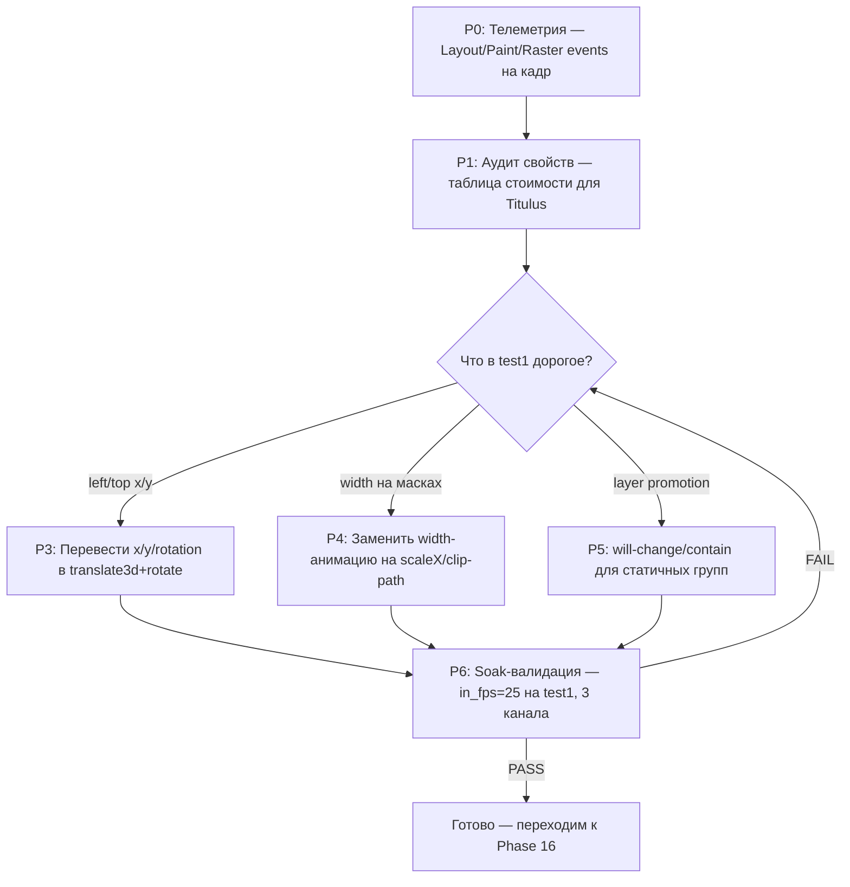

# Phase 15 — Детальный план повышения производительности (Вопрос A: 50 FPS на сложном шаблоне)

**Дата:** 7 июля 2026. **Цель:** поднять `in_fps` с ~24 на шаблоне `test1` до стабильных 50 (прогон 3 каналов одновременно, 1080 50i, DeckLink Quad 2). Подчинённый документ к [PERFORMANCE_INVESTIGATION_PLAN.md](PERFORMANCE_INVESTIGATION_PLAN.md); является логическим продолжением [PHASE_14_MICROFREEZE_PLAN.md](PHASE_14_MICROFREEZE_PLAN.md) (там — микрофризы, здесь — throughput).

---

## TL;DR — что мы нашли и что делаем

При изучении runtime обнаружена **главная, количественно объяснимая причина** низкой производительности на сложных шаблонах. Это не узкое место (bottleneck) движка и не map драйвера — это **способ записи координат в DOM**:

- [runtime/src/transform.ts:56-65](../../runtime/src/transform.ts) возвращает `left`, `top`, `width`, `height` + отдельное поле `transform` только для rotation/scale/perspective.
- [runtime/src/domRenderer.ts:601-602, 750-751](../../runtime/src/domRenderer.ts) пишет `el.style.left = "${at.left}px"; el.style.top = "${at.top}px"` на каждый кадр для каждого слоя.
- В `test1` анимируются **`x`, `y`, `rotation`, `width`** по timeline (`tests/templates/test1.json`, см. trackDirectors и keyframes). Поскольку `x/y` транслируются в `left/top` — **каждый кадр триггерит Layout** внутри Blink, что форсирует Paint + Raster всей повреждённой (invalidated) области. Это ~10-кратное удорожание кадра против transform-only.

Одно это объясняет и `in_fps ≈ 24` на `test1`, и `in_fps ≈ 49` на простом `test` (где тоже анимируется X/Y у одной группы — но только 1 слой,layout дешевле).

**План:** сделать **компонентный (layered) cost model + аудит трансляции свойств** так, чтобы `x/y/rotation/width` попадали в `transform: translate3d(...) rotate(...) scaleX(...)` (compositor-friendly, **не триггерит Layout**), а `width` (когда реально нужен) — изолировался в свой composited layer. Параллельно — улучшить телеметрию так, чтобы измерять **не только FPS**, но и **Layout/Paint/Raster event count + duration на кадр**, чтобы каждая оптимизация получала объективную оценку.

---

## Контекст и измеренные исходные точки

### Базовые (baseline) измерения (7 июля 2026, 3 канала DeckLink 1080i50)

| Шаблон | `in_fps` | CPU ядер | Замечание |
|---|---|---|---|
| `test` (1 группа: rect + clock, X/Y-loop) | **~49** | 10-20% | потолок упирается в `out_fps=25` (см. ниже) |
| `test1` (11 слоёв: 2 маски, 2 текста, 3 картинки, 2 rect, 1 clock + timeline с x/y/rotation/width) | **~24** | 50-60% | упирается в raster |

### Главная переинтерпретация проблемы: cap = 25, а не 50

При изучении живых логов обнаружен принципиальный момент, ранее нигде явно не зафиксированный:

```
telemetry5s in_fps=24.6 out_fps=25.0 queue=0 d_pairs=0-9 d_singles=110-120 d_starved=1-10 ...
```

`out_fps=25.0` — **DeckLink работает в режиме «25 прогрессивных кадров, отправляемых как 50i»**, то есть пара полей формируется из одного и того же bitmap (weave одинаковых полей). Это поведение зашито в [decklink_consumer.cpp](../../engine/src/consumers/decklink_consumer.cpp): пара полей строится из одного приходящего от CEF кадра; движок запрашивает у CEF **новый** кадр только когда `paint_seq` изменился, иначе пара берётся из старого.

Это означает, что **целевой потолок `in_fps` = 25, а не 50** — если мы формируем кадр прогрессивно. Чтобы получить реальное временное разрешение 50 (движение сдвигается между двумя полями одной пары), нужна отдельная архитектурная работа (Phase 18 — см. [PERFORMANCE_ROADMAP.md](PERFORMANCE_ROADMAP.md)). Это **не цель Phase 15**.

**Переформулированная цель Phase 15:** поднять `in_fps` со стабильных 24 до стабильных **25** на `test1` при 3 каналах (то есть догнать собственный потолок движка). Кажется скромным, но разница между 24 и 25 — это исчезновение постоянной нехватки (`d_pairs≈0`, `d_starved` каждый 5с window), и именно это даёт визуально плавную картинку без подёргиваний. **Дальнейший прирост до 50 — отдельная цель Phase 18.**

### Доказательство, что проблема в `left/top` (а не в чём-то ещё)

`development-proposals.md` уже содержит подтверждение от Linux perf и Chrome Trace: `~176 raster events/frame`, raster доминирует, dirty-check работает (статичных изменений нет). Но proposals **не идентифицировал точно, какие именно свойства вызывают invalidation** — это мы находим впервые. Доказательство по коду:

В `transform.ts` (часть `applyTransform`):

```typescript
return {
  left: t.x - originX,        // ← триггерит Layout при записи в style.left
  top: t.y - originY,         // ← триггерит Layout при записи в style.top
  width: t.width,             // ← триггерит Layout + Paint при изменении
  height: t.height,
  originX,
  originY,
  transform: parts.length ? parts.join(' ') : 'none',  // rotation/scale/perspective
};
```

В `domRenderer.ts` (applyTransform вызывается для каждого слоя и каждой маски):

```typescript
const at: AppliedTransform = applyTransform(/* base, anim */);
this.setStyle(el, cache, 'left', `${at.left}px`);   // ← КАЖДЫЙ КАДР
this.setStyle(el, cache, 'top', `${at.top}px`);     // ← КАЖДЫЙ КАДР
```

Это согласуется с Research 3 (`transform vs left/top`) и Recommendation 2 (`compositor-friendly`) из development-proposals, но теперь у нас есть **конкретная точка правки**, а не абстрактная рекомендация.

### Архитектурное ограничение, которое надо учитывать

Перевод `x/y` в `transform: translate3d()` **не тривиален**, потому что:

1. **Anchor pivot**. В схеме Titulus `x/y` — это позиция пивота в родительском пространстве, а не top-left элемента. `left = x - width*anchorX`. Чтобы перенести в transform, нужно либо сохранять `transform-origin: ${anchorX*width}px ${anchorY*height}px` и писать `transform: translate3d(${x}px, ${y}px, 0)`, либо учитывать anchor внутри самого translate. Это локальное изменение в `transform.ts`, но требует аккуратности.
2. **3D perspective**. Если есть `rotationX`/`rotationY`, в transform уже есть `perspective(...)`. Добавить translate3d нужно в правильном порядке (translate должен быть **после** perspective в CSS-строке, иначе perspective применится к уже смещённому элементу). Технически решаемо.
3. **Masks**. Маски вычисляют clip-path через `applyTransform` родителя и себя (см. [maskGeometry.ts](../../runtime/src/maskGeometry.ts)). При переходе на transform-based координаты геометрия маски тоже должна использовать transform pipeline, иначе рассинхрон.
4. **`width`**. `width` принципиально нельзя засунуть в transform — это layout-box свойство. Для масок в `test1`, где ширина анимируется (`210ee6a3: width: 566 → 0`), это означает, что либо LayerMask надо полностью перерисовывать (как сейчас), либо использовать `clip-path: inset(0 ${(1-w/origW)*100}% 0 0)` (compositor-friendly), либо `scaleX` на inner-элементе (если маска не зависит от содержимого).

**Вывод:** это **не «меняем `left` на `transform` в одной строке»**, это многошаговая работа, поэтому Phase 15 разбит на подэтапы с метриками после каждого.

---

## Структура Phase 15



---

## P0 — Расширение телеметрии: Layout/Paint/Raster events на кадр

**Цель:** сделать так, чтобы после любого изменения runtime мы могли сказать «вот столько Layout/Paint/Raster событий было, стало столько», а не «вроде быстрее». Сейчас такой телеметрии нет — `stats.h`/`Progress()` считает только кадры.

### Что измеряем

| Метрика | Где брать | Зачем |
|---|---|---|
| `Layout events / frame` | Chrome Trace (категория `blink,devtools.timeline`) | Количественный сигнал, что мы уменьшили Layout |
| `Paint events / frame` | там же | Что Paint уменьшился |
| `Raster events / frame` | там же (главный сигнал — было ~176 в Phase 12) | Финальная метрика стоимости кадра |
| `Layout duration ms / frame` | там же | Иногда events count не меняется, но duration падает |
| `Invalidation rect area px² / frame` | Chrome Trace, `disabled-by-default-devtools.timeline.invalidationTracking` | Сколько площади перерисовывается |
| `d_pairs` (существующая) | `telemetry5s` | Сколько раз движок успел дать 2 свежих поля подряд — должен расти к 25/окно |

### Как измеряем (без пересборки движка для каждого изменения)

**Уже существует** (Phase 12): [engine/src/engine_app.cpp](../../engine/src/engine_app.cpp) пишет `blink-trace.json` при старте движка, если есть `--remote-debugging-port=N` или `--blink-research=N`, длительность зашита 15с, категории зашиты в `kTraceStartupCategories` (см. [engine_app.cpp:23-28](../../engine/src/engine_app.cpp)).

**Phase 14 уже заложил правку** (E4.1 в [PHASE_14_MICROFREEZE_PLAN.md](PHASE_14_MICROFREEZE_PLAN.md)): env-переменные `BG_TRACE_SECONDS` и `BG_TRACE_CATEGORIES`. Они нужны и здесь. Если Phase 14 ещё не выполнен — делаем ту же правку здесь (она идентична).

### Новый скрипт `engine/research/analyze-blink-trace.mjs`

Считает per-frame статистику из `blink-trace.json`:

```javascript
#!/usr/bin/env node
// engine/research/analyze-blink-trace.mjs
// Из blink-trace.json считает Layout/Paint/Raster events/frame и duration.
// Usage: node analyze-blink-trace.mjs --trace=/tmp/blink-trace.json
import { readFileSync } from 'node:fs';

function arg(n, f) { const h = process.argv.find(a => a.startsWith(`--${n}=`)); return h ? h.split('=').slice(1).join('=') : f; }

const tracePath = arg('trace', '');
const json = JSON.parse(readFileSync(tracePath, 'utf8'));
const events = json.traceEvents || [];

// BeginFrame даёт нам «номер кадра» — привязываем события к ближайшему BeginFrame
const beginFrames = events
  .filter(e => e.name === 'BeginFrame' || e.name === 'BeginMainThreadFrame')
  .sort((a, b) => a.ts - b.ts);

// Группируем события по интервалам между BeginFrame
const buckets = beginFrames.map((bf, i) => {
  const next = beginFrames[i + 1];
  const endTs = next ? next.ts : bf.ts + 20000;  // 20мс — fallback на 50fps
  const frameEvents = events.filter(e => e.ts >= bf.ts && e.ts < endTs);
  return {
    frame: i,
    ts: bf.ts,
    layout: frameEvents.filter(e => /Layout/i.test(e.name)),
    paint: frameEvents.filter(e => /Paint/i.test(e.name) && !/PrePaint|PaintImage/.test(e.name)),
    raster: frameEvents.filter(e => /Raster|TileManager/.test(e.name)),
  };
});

function sum(arr, key = 'dur') { return arr.reduce((s, e) => s + (e[key] || 0), 0); }
function avg(arr, key) { return arr.length ? sum(arr, key) / arr.length : 0; }

console.log(`Всего BeginFrame: ${buckets.length} (~${(buckets.length/15).toFixed(1)} fps средн.)`);
console.log('');
console.log('Per-frame averages:');
console.log(`  Layout events : ${avg(buckets, b => b.layout.length).toFixed(1)}/frame   duration ${avg(buckets, b => sum(b.layout)/1000).toFixed(2)}ms`);
console.log(`  Paint events  : ${avg(buckets, b => b.paint.length).toFixed(1)}/frame   duration ${avg(buckets, b => sum(b.paint)/1000).toFixed(2)}ms`);
console.log(`  Raster events : ${avg(buckets, b => b.raster.length).toFixed(1)}/frame   duration ${avg(buckets, b => sum(b.raster)/1000).toFixed(2)}ms`);

// Тяжёлые кадры (>2× средней длительности raster)
const avgRasterDur = avg(buckets, b => sum(b.raster)/1000);
const heavy = buckets.filter(b => sum(b.raster)/1000 > 2 * avgRasterDur);
console.log('');
console.log(`Тяжёлых кадров (raster > 2× avg = ${avgRasterDur.toFixed(2)}ms): ${heavy.length} (${(100*heavy.length/buckets.length).toFixed(1)}%)`);
```

### Критерий успеха P0

Скрипт отрабатывает на текущем `test1` без ошибок и показывает числа (ожидаемо ~11 layout/frame, ~4 style/frame, ~8 paint/frame, ~176 raster/frame — из Phase 12). Это **baseline**, от которого считаем прирост после P3-P5.

---

## P1 — Аудит свойств: таблица стоимости

**Цель:** для каждого свойства, которое runtime пишет в DOM, измерить его стоимость в Layout/Paint/Raster. Это и есть «Performance Matrix» из development-proposals (Recommendation 3), но собранная **на нашем железе, нашем Chromium, нашем CPU-renderer** — общие таблицы Google не подходят.

### Как проводим

Для каждого свойства — отдельный минимальный bench-шаблон в `bench/`:

```
bench/
├── bench-left-top.html         (10 divs, анимация left/top)
├── bench-translate3d.html      (10 divs, анимация transform: translate3d)
├── bench-rotate.html           (10 divs, transform: rotate)
├── bench-width.html            (10 divs, изменение width)
├── bench-scale-x.html          (10 divs, transform: scaleX — эквивалент width)
├── bench-clip-path-inset.html  (10 divs, clip-path: inset)
├── bench-opacity.html          (10 divs, opacity)
├── bench-text-update.html      (10 текстовых блоков, обновление textContent)
└── run-all.sh
```

Каждый bench сам пишет статистику через `[runtime/src/stats.ts](../../runtime/src/stats.ts)` + `engine_app.cpp` trace-startup, так что прогон идентичен Phase 12 схеме. Все запускаем через `engine/run-channel.sh` с `BG_TRACE_SECONDS=30 BG_TRACE_CATEGORIES="blink,devtools.timeline,disabled-by-default-devtools.timeline.invalidationTracking"`, затем анализируем `analyze-blink-trace.mjs`.

### Сводим в таблицу `docs/development-phases/phase-15-cost-matrix.md`

| Свойство | Layout/frame | Paint/frame | Raster/frame | Raster ms | CPU % renderer | Invalidation px² | Примечание |
|---|---|---|---|---|---|---|---|
| `left`/`top` (baseline) | TBD | TBD | TBD | TBD | TBD | TBD | что сейчас в `transform.ts` |
| `translate3d` | TBD | TBD | TBD | TBD | TBD | TBD | ожидаемо ~0 Layout |
| `rotate` | TBD | TBD | TBD | TBD | TBD | TBD | уже в transform |
| `width` | TBD | TBD | TBD | TBD | TBD | TBD | что в масках test1 |
| `scaleX` (как width) | TBD | TBD | TBD | TBD | TBD | TBD | candidate fix |
| `clip-path: inset()` | TBD | TBD | TBD | TBD | TBD | TBD | candidate для масок |
| `opacity` | TBD | TBD | TBD | TBD | TBD | TBD | reference — должно быть дёшево |

### Критерий успеха P1

Таблица заполнена на нашем железе. Количественно показано (или опровергнуто), что `translate3d` дешевле `left/top` в CPU-renderer (Development-proposals предполагает это для GPU, но явно не измерено для нашего случая). Если гипотеза не подтверждается — **останавливаем Phase 15 и переходим к Plan B** (см. ниже).

---

## P2 — Решение по направлению оптимизации

По результатам P1 — выбор конкретных правок для `test1`. Ожидаемо (на основе development-proposals и здравого смысла):

| Что анимируется в test1 | Текущая запись | Целевая запись |
|---|---|---|
| `x` (clock, image e4367, image 30cae, group 66bbe0) | `style.left = ...px` | `transform: translate3d(x, y, 0)` |
| `y` (mask 4f4d7) | `style.top = ...px` | `transform: translate3d(x, y, 0)` |
| `rotation` (groups 66bbe0, 361760) | `transform: rotate(deg)` (уже OK) | оставить |
| `width` (mask 210ee6) | `style.width = ...px` | `clip-path: inset(0 right% 0 0)` или `transform: scaleX` на внутреннем слое |

**Plan B (если translate3d не даёт прироста):** это означало бы, что Blink в CPU-only OSR всё равно форсит raster на transform, и нужно идти в **layer promotion** (`will-change: transform`) + **`contain: layout style paint`** — это указывает Blink не инвалидировать внешний layout при изменении transform. Это следующий уровень оптимизации.

---

## P3 — Перевод `x/y/rotation` в `transform: translate3d(...) rotate(...)`

**Самая большая по риску правка.** Меняется «источник истины» для позиционирования слоя.

### 3.1. Меняем `applyTransform` в [runtime/src/transform.ts](../../runtime/src/transform.ts)

Текущий возврат `AppliedTransform` имеет `left/top/width/height/transform`. Новая схема:

```typescript
export interface AppliedTransform {
  /** transform-origin in px relative to the element box */
  originX: number;
  originY: number;
  /** element box size at rest (used for width/height CSS — fixed, не анимируется) */
  width: number;
  height: number;
  /** Полный CSS transform: translate3d + rotation + scale + perspective */
  transform: string;
}
```

Логика сборки `transform`:

```typescript
// Перевод x/y (pivot в parent space) в translate3d.
// transform-origin = anchor в px внутри border-box.
// translate3d указывает позицию top-left = pivot - origin.
const tx = t.x - originX;
const ty = t.y - originY;

const parts: string[] = [];
// perspective должен идти ПЕРВЫМ в transform-строке (CSS применяется справа налево,
// т.е. perspective применяется ко всем последующим трансформациям).
if (usePerspective) parts.push(`perspective(${t.perspective}px)`);
parts.push(`translate3d(${tx.toFixed(2)}px, ${ty.toFixed(2)}px, 0)`);
if (t.rotationX !== 0) parts.push(`rotateX(${t.rotationX}deg)`);
if (t.rotationY !== 0) parts.push(`rotateY(${t.rotationY}deg)`);
if (t.rotation !== 0) parts.push(`rotate(${t.rotation}deg)`);
if (t.scaleX !== 1 || t.scaleY !== 1) parts.push(`scale(${t.scaleX}, ${t.scaleY})`);
```

`width`/`height` теперь возвращаются как статичные (берутся из `base.transform`, а не из `anim`) — устанавливаются один раз при создании элемента, не пишутся на каждый кадр.

### 3.2. Меняем запись в [runtime/src/domRenderer.ts:596-602, 745-751](../../runtime/src/domRenderer.ts)

Было:

```typescript
this.setStyle(el, cache, 'left', `${at.left}px`);
this.setStyle(el, cache, 'top', `${at.top}px`);
this.setStyle(el, cache, 'transform', at.transform);
```

Стало:

```typescript
// width/height — только при первом применении или при реальном изменении
// (не в каждом кадре анимации):
this.setStyle(el, cache, 'width', `${at.width}px`);
this.setStyle(el, cache, 'height', `${at.height}px`);
this.setStyle(el, cache, 'transform-origin', `${at.originX}px ${at.originY}px`);
this.setStyle(el, cache, 'transform', at.transform);
```

### 3.3. Проверка регрессий в editor preview

[domRenderer.ts:1-19](../../runtime/src/domRenderer.ts) явно отмечает, что runtime используется **и в движке, и в editor canvas**. После перевода на transform-based позиционирование editor должен работать так же (визуально WYSIWYG). Проверить вручную:

1. Открыть editor, перетащить слой мышкой — должен двигаться.
2. Изменить anchor pivot — visual placement должен остаться неизменным (см. `anchorCompensatedUpdate` в transform.ts).
3. Запустить timeline preview в editor — анимация должна проигрываться корректно.

### 3.4. Метрика после P3

Прогнать `test1` через `analyze-blink-trace.mjs` и сравнить с P0 baseline:

- **Layout events/frame**: ожидаемо падение с ~11 до ~0-2.
- **Raster events/frame**: ожидаемо падение с ~176 до ~30-60 (в зависимости от того, как Blink перераспределит raster tasks).
- **Invalidation rect area**: ожидаемо значительное уменьшение (статичные слои больше не перерисовываются).

### Критерий успеха P3

`in_fps` на `test1` при 3 каналах вырос с ~24 минимум до 25 (достигнут потолок движка), либо до значения, при котором `d_pairs > 0` стабильно (не 0-9 как сейчас). Если Layout events не упали — гипотеза неверна, переходим к Plan B (layer promotion через `will-change`).

---

## P4 — Замена `width`-анимации на compositor-friendly эквивалент

В test1 маска `210ee6a3` анимирует `width: 566 → 0 → 566` (см. timeline keyframes 0, 100, 200). Это единственный layout-trigger, который не убирается переводом x/y.

### 4.1. Анализ маски

Маска в Titulus = clip-path на wrapper (см. [maskScopes.ts](../../runtime/src/maskScopes.ts) и [maskGeometry.ts](../../runtime/src/maskGeometry.ts)). Если маска задаёт видимую область контейнера через clip, то изменение её `width` меняет clip-area. Возможные замены:

- **`clip-path: inset(0 right% 0 0)`** — прямо в CSS, не триггерит Layout (compositor-friendly). `right%` = `100 * (1 - anim_width / base_width)`.
- **`transform: scaleX(w/base_w)` на inner-элементе маски** — если маска не зависит от содержимого.
- **Сохранить `width`, но изолировать маску в own composited layer** через `will-change: width` (Plan B для P4).

### 4.2. Реализация

В [maskGeometry.ts](../../runtime/src/maskGeometry.ts) — добавить поле `clipScale` вместо/в дополнение к `width` при трансляции анимации. В [domRenderer.ts](../../runtime/src/domRenderer.ts) — для типа слоя `mask`, при анимировании `width`, писать не `style.width`, а `style.clipPath = inset(0 ${rightPct}% 0 0)`.

### 4.3. Метрика после P4

Дополнительное снижение raster events/frame. Если P3 уже дал необходимый прирост — P4 можно отложить до Phase 16 (как часть cost-model работы).

---

## P5 — Layer promotion для статичных групп (Plan B / страховка)

Если P3-P4 недостаточны — принудительно продвигаем каждый group/layer в собственный composited layer. Это указание Blink не пересчитывать layout/paint для данного слоя при изменении его transform.

### 5.1. CSS-правка в [backend/public/channel.html](../../backend/public/channel.html) или в style renderer

Для каждого group element, который **может** анимироваться:

```css
.titulus-group, .titulus-layer {
  will-change: transform;
  contain: layout style paint;  /* hint Blink: не инвалидировать ничего снаружи при изменении внутри */
}
```

**Осторожно:** `will-change` без необходимости увеличивает потребление памяти (каждый слой сохраняется как отдельный bitmap). На test1 это 11 layers × ~1920×1080×4 байт = ~88 MB на канал — приемлемо. На сложных production-шаблонах с 50+ слоями может стать проблемой.

### 5.2. Валидация

Тот же `analyze-blink-trace.mjs`. Если layer promotion помог — оставить как опцию (по умолчанию on для слоёв в анимации, off для статичных).

---

## P6 — Soak-валидация

Длительный прогон (1+ час) после применения P3-P5 на 3 каналах с `test1`. Фиксируется по протоколу [PERFORMANCE_INVESTIGATION_PLAN.md Часть IV](PERFORMANCE_INVESTIGATION_PLAN.md).

**PASS-критерии:**

1. `in_fps` стабильно ≥ 24.5 на всех 3 каналах весь час (без просадок ниже 23).
2. `d_pairs > 0` в каждом 5с window (минимум 5-10 — движок регулярно даёт свежие пары полей).
3. `d_starved < 3/5с` (не как сейчас 5-10).
4. Визуальная проверка на SDI-мониторе: картинка плавная, без подёргиваний (но микрофризы из Phase 14 — отдельная история).
5. Layout events/frame < 3 (из `analyze-blink-trace.mjs`).
6. Raster events/frame < 50 (значительное снижение от baseline ~176).

**Если FAIL:** возвращаемся к P2, проверяем Plan B.

---

## Что НЕ делаем в Phase 15

1. **Не трогаем decklink pipeline** (weave, field-pairng, ScheduleVideoFrame) — development-proposals однозначно показал, что это не bottleneck.
2. **Не пытаемся поднять `in_fps` выше 25** — это отдельная архитектурная задача (Phase 18, requires real 50p progressive pipeline, а не 25p-as-50i).
3. **Не переписываем timeline engine** — он работает правильно, проблема в том, **куда** он пишет значения, а не как их интерполирует.
4. **Не вводим `will-change` вслепую** на всех слоях — это Plan B, не первое средство. Может ухудшить из-за роста memory footprint.
5. **Не оптимизируем memcpy / SIMD** — development-proposals Research и Phase 11 уже показали low impact.
6. **Не трогаем FrameRing / threading model / пулы буферов** — development-proposals явно подтвердил, что архитектура удачна.

---

## Риски и что может пойти не так

| Риск | Вероятность | Митигация |
|---|---|---|
| Перевод в translate3d ломает editor WYSIWYG | Средняя | P3.3 — ручная проверка editor до интеграции |
| Anchor pivot математика становится некорректной (визуальный сдвиг) | Средняя | Тест `anchorCompensatedUpdate` остаётся; визуальное сравнение до/после на статичном шаблоне |
| Маски рассинхронизируются с layer positions | Высокая | P4 — отдельный подэтап, не объединять с P3 |
| Layer promotion (Plan B) увеличивает memory так, что 3 канала не помещаются | Низкая (88MB × 3 = 264MB, есть запас) | Замерить memory до/после |
| Blink в CPU-only OSR всё равно форсит raster на transform | Низкая (но возможная) | P1 даёт ответ заранее; если да — Plan B |
| `contain: layout style paint` ломает mask clip-path (т.к. clip выходит за bounds) | Средняя | Тестировать маски отдельно; `contain: layout style` без `paint` как fallback |

---

## Что нужно от оператора

1. **Сохранить шаблоны test/test1 в репо** — уже сделано, лежат в `tests/templates/test.json` и `tests/templates/test1.json`. Это страховка от потери при перезапуске сервера (DB в `/tmp/titulus-dev` — tmpfs, исчезнет при ребуте).
2. **Не запускать Phase 14 и Phase 15 одновременно** на одних и тех же каналах — обе фазы требуют трейс-логирования, это дополнительная нагрузка, исказит измерения.
3. **После каждого подэтапа P3/P4/P5** — прогон по 5-10 минут на test1 с включенным `--frame-log` (из Phase 14) и `BG_TRACE_SECONDS=30 BG_TRACE_CATEGORIES="blink,devtools.timeline,disabled-by-default-devtools.timeline.invalidationTracking"`, затем анализ `analyze-blink-trace.mjs`.

---

## Сводка следующего шага

После утверждения плана — реализовать P0 (телеметрия + `analyze-blink-trace.mjs`), прогнать baseline на test1, затем P1 (cost-matrix на bench-шаблонах), затем принять решение P2. Сама правка `transform.ts`/`domRenderer.ts` (P3) делается только после того, как P0+P1 количественно подтвердят, что проблема именно в `left/top` (а не в чём-то ещё, чего мы пока не видим).
