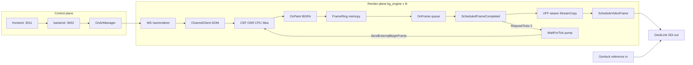
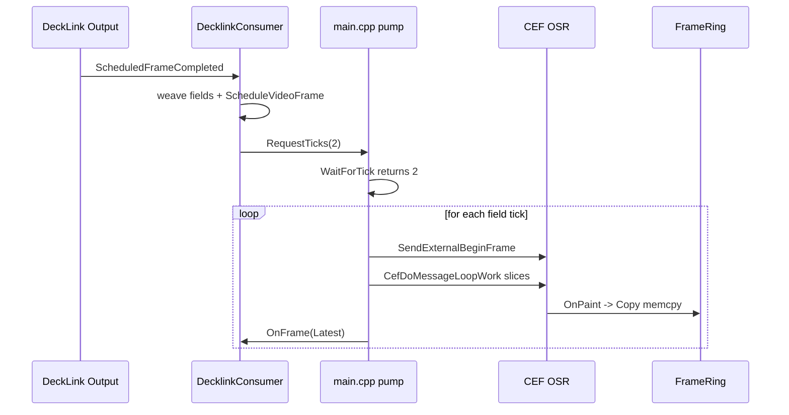
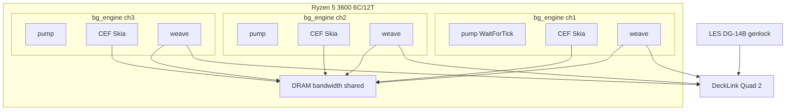

# 00 — Overview & Cost Model: программа достижения true 50p на 3× DeckLink 1080i50

> **Статус документа:** living overview для серии `docs/performance investigation/01`…`07`.
> **Язык:** русский narrative + English identifiers / CLI / metrics.
> **Аудитория:** engine + control-plane engineers, bench operators, reviewers gate criteria.
> **Дата снимка фактов кода:** 2026-07 (CEF 144.x, post Phase 18 on `main`).

---

## 0. Как читать этот документ

Этот файл — **точка входа** в программу снижения стоимости кадра (frame cost) до уровня,
при котором сложный HTML5 template на каждом из трёх DeckLink-каналов стабильно даёт
**≥50 unique paints per second**, что при 1080i50 и UFF weave выглядит как true 50p-as-50i
(два разных progressive field на каждый output frame).

Структура намеренно фиксирована:

1. Context / constraints / goal
2. Current state + diagnosis (что уже измерено, что считать гипотезой)
3. Pipeline + hardware + frame budget math
4. Cost model (µs / bandwidth)
5. Metrics glossary + measurement methodology
6. Map sister docs + scalability + success gates
7. Risks / anti-patterns / rollback
8. Appendix: paths

**Важная оговорка по истории фаз.** Документы `docs/development-phases/phase-*` и research
артефакты в `engine/research/results/` — **сырьё для гипотез**, не нормативная истина.
Любой вывод прошлых фаз (включая Phase 15–18) может оказаться неполным, устаревшим или
неверным на текущем дереве. Перепроверяйте измерениями на актуальном бинарнике
`engine/build/Release/bg_engine` (или явно указанном build dir). Не ссылайтесь на
архивные заметки как на authoritative source of truth.

### 0.1 Чеклист перед работой по этому overview

- [ ] Прочитаны non-negotiable constraints (§1)
- [ ] Понята цель 3ch / 1080i50 / ≥50 unique fps (§2)
- [ ] Понята диагностика root cause vs secondary (§4)
- [ ] Известен frame budget 20 ms / field (§7)
- [ ] Известны метрики `in_fps`, `d_pairs`, `d_singles`, `paint_latency_us` (§9)
- [ ] Выбран sister-doc для следующего шага (§11)
- [ ] Gate criteria согласованы до начала coding (§13)

---

## 1. Title, purpose, non-negotiable constraints

### 1.1 Title

**Titulus Performance Program — Overview & Frame Cost Model**

Краткое имя в PR / issue: `[perf] overview + cost model`.

### 1.2 Purpose

Цель документа — дать **единый cost model** и **операционную рамку** для серии работ,
которые снижают Blink/Skia + copy path стоимость кадра без нарушения архитектурных
non-negotiables Titulus.

Документ отвечает на вопросы:

| Вопрос | Где ответ |
|---|---|
| Что именно сломано / узко? | §3–§4 |
| Сколько µs у нас есть? | §7 |
| Куда уходят µs и GiB/s? | §8 |
| Как измерить прогресс? | §9–§10 |
| Когда программа считается успешной? | §13 |
| Что категорически нельзя делать? | §14 |

### 1.3 Non-negotiable constraints (обязательны во всех sister docs)

Эти ограничения **не обсуждаются** в рамках performance program без отдельного
gate-doc и явного product decision:

1. **CPU-only render.** CEF OSR, software raster (Skia CPU). Flags в
   `engine/src/engine_app.cpp`: `--disable-gpu`, `--disable-gpu-compositing`,
   `--disable-gpu-vsync=gpu`. GPU path запрещён без отдельного GPU Gate документа.
2. **HTML5 / DOM — единственный template runtime.** Нет PIXI / GSAP / WebGL-as-primary.
   Template = JSON + runtime (`@titulus/runtime`) в `channel.html`.
3. **DeckLink required** для целевого acceptance: scheduled playback,
   **reference input genlock** (стенд: DeckLink Quad 2 + LES DG-14B или эквивалент).
   Без genlock результаты pacing/weave могут выглядеть «здоровыми» локально и
   разваливаться на эфире — не путать lab без reference с production gate.
4. **CasparCG — только clean-room reimplementation by reference.** Читать
   `CasparCG/` / `server/` как reference допускается. **Запрещено:** копировать GPL
   код, линковать CasparCG, запускать `casparcg-server` как dependency subprocess.
5. **Hardware baseline = Ryzen 5 3600**, но **масштабирование пропорционально**
   числу physical cores / memory bandwidth. Не хардкодить «на 3600 хватает N ms»
   как абсолют — см. §12.
6. **1 process `bg_engine` = 1 channel.** Pinning: `taskset` на 2 physical cores
   (+ SMT siblings). Не объединять каналы в один browser process.
7. **BGRA end-to-end.** Pixel format DeckLink: `bmdFormat8BitBGRA`. Нет BGRA→ARGB.
8. **Git-first.** Ветка → commit → PR → merge commit в `main`. Force-push в `main`
   запрещён.

### 1.4 Что этот документ НЕ делает

- Не фиксирует конкретный патч Blink/Skia/runtime style guide (это sister docs).
- Не заменяет `docs/ARCHITECTURE.md` (topology / process model).
- Не является bench log / soak report (артефакты живут рядом с прогонами).
- Не разрешает GPU «временно для эксперимента» без gate.

### 1.5 Словарь уровней уверенности

| Метка | Значение |
|---|---|
| **FACT** | Наблюдаемо в текущем коде / воспроизводимо измерением |
| **MEASURED** | Есть численный результат на стенде; повторить перед решениями |
| **HYPOTHESIS** | Объяснение; требует A/B |
| **CONSTRAINT** | Нельзя нарушать |
| **OPEN** | Неизвестно / нужно измерить заново |

В тексте ниже используйте эти метки мысленно при чтении: если раздел опирается на
прошлую фазу — помечайте для себя как **MEASURED (re-verify)**.

---

## 2. Goal: 3× DeckLink 1080i50, ≥50 unique fps, complex templates

### 2.1 Product goal (одна фраза)

Три независимых `bg_engine` процесса, каждый на DeckLink output 1080i50 с genlock,
каждый показывает **сложный** HTML5 template (animations + masks + layers), и каждый
стабильно производит **≥50 unique OnPaint frames per second**, так что weave видит
два разных field на каждый scheduled output frame.

### 2.2 Operational definition of «true 50p-as-50i»

DeckLink mode — interlaced 1080i50. Output cadence:

- **Output frame period** = 40 ms (25 full interlaced frames per second on the wire
  in terms of *display mode frame rate*, but each frame carries two fields).
- **Field period** = 20 ms.
- Engine intentionally renders **progressive full frames** and consumer does
  **UFF weave** (upper-field-first line interleave) в `decklink_consumer.cpp`.

«True 50p-as-50i» значит:

```text
для каждого ScheduledFrameCompleted cycle:
  field_a = unique progressive paint N
  field_b = unique progressive paint N+1
  woven  = interleave(field_a, field_b)  // UFF
  ScheduleVideoFrame(woven)
```

Метрики-прокси (см. §9):

| Состояние | `in_fps` (approx) | `d_pairs` / 5s | `d_singles` / 5s | Визуально |
|---|---|---|---|---|
| Ideal true 50p-as-50i | ≈50 | ≈125 | ≈0 | motion 50 unique/s |
| Degraded 25p-as-50i | ≈25 | ≈0 | ≈125 | motion «кино» / judder |
| Mixed | 30–45 | 40–100 | 25–85 | частично |

Формула ожидания pairs при идеальном 50 unique fps на 1080i50:

```text
output_frames_per_sec ≈ 25
ideal_pairs_per_5s    ≈ 25 * 5 = 125
ideal_in_fps          ≈ 50     // unique paints into consumer queue
```

### 2.3 Content classes

| Class | Template | Ожидаемое поведение (наблюдения, re-verify) |
|---|---|---|
| Cheap | `tests/templates/test.json` | true 50p достижим: `in_fps≈50`, `d_pairs≈125` |
| Complex | `tests/templates/test1.json` | сегодня ~25 unique fps; root cost в Blink/Skia |
| Bench scenes | `bench/bench-*.html` | изоляция cost факторов (mask, blur, 2.5D, …) |

**CONSTRAINT (product):** canonical шаблоны производительности хранятся в
`tests/templates/`. Целевые показатели программы (3× DeckLink 1080i50,
≥50 unique fps) обязаны достигаться на **`tests/templates/test1.json`** —
именно этот файл является acceptance target для gates G1/G2/G3 (§13).
Везде в этой серии `test` = `tests/templates/test.json`,
`test1` = `tests/templates/test1.json`, если явно не указано иное.

Acceptance program **обязан** проходить на **complex** class, не только на cheap.
Cheap — sanity / regression canary, не proof of goal.

### 2.4 Scope boundaries of the goal

В scope:

- 3 channels concurrent
- 1920×1080, interlaced 50 fields/s semantics
- masks, CSS animations, layered DOM, alpha
- DeckLink + genlock
- CPU-only CEF

Вне scope (отдельные решения):

- 4K / 1080p60 progressive product modes
- GPU compositor
- multi-template-per-process
- audio embedding on SDI
- SaaS multi-tenant scheduling beyond pinning model

### 2.5 Success statement (program-level)

```text
PASS iff for each of 3 DeckLink channels during soak ≥ T minutes:
  in_fps_median_5s     ≥ 49.0
| d_pairs_per_5s_med    ≥ 120
| d_singles_per_5s_med  ≤ 10
| d_late + d_dropped    < 0.1% of completed
| genlock ref           = Locked (or equivalent healthy ref=)
| template              = complex (test1-class or agreed matrix)
```

Точные числа gate — §13; здесь — смысл.

---

## 3. Current state (as of investigation snapshot)

### 3.1 Headline numbers

**MEASURED 2026-07-13** (baseline re-verify, sha `0deff0c`, отчёт:
`reports/p19-00-baseline.md`):

| Scenario | Unique paints | DeckLink pairs | Comment |
|---|---|---|---|
| Complex (`test1`) **1ch** DeckLink | **41.7 in_fps** | pairs 82.5 / singles 43 per 5s | лучше исторических ~25; MIXED |
| Complex (`test1`) **3ch** DeckLink | **25.2–26.2 in_fps** | pairs 1–6 / singles ~120 per 5s | ceiling ~25 воспроизводится на 3ch |
| Complex (`test1`) null 1ch | **38.0–39.7 fps** | n/a | headless paint throughput |
| Cheap (`test`) DeckLink 1ch | **50.0 in_fps** | `d_pairs≈125.5` / 5s, singles 0 | true 50p works when paint cheap |
| Phase 18 dual BeginFrame probe | paint_seq_delta≈1 | n/a | pipeline не появляется (re-confirm: max delta 1) |

Важное отличие от исторических данных: потолок «~25» на актуальном дереве
наблюдается **только при 3 одновременных каналах**; 1ch complex вырос до ~42
(вероятно Class A из Phase 16 + 4 logical cores). Multi-channel contention
(copy ×1.65, weave ×1.33 на 3ch) — больший вклад, чем предполагалось.

Интерпретация: **output path (DeckLink/weave/pacing) способен** нести 50 unique/s,
когда CEF успевает их произвести. Узкое место — **стоимость уникального paint** на
complex DOM, а не «сломался weave».

### 3.2 Что выглядит здоровым (DeckLink side)

FACT из кода + telemetry:

- `HasExternalClock()` + `WaitForTick()` — DeckLink `ScheduledFrameCompleted`
  будит pump (`RequestTicks(2)` для interlaced).
- Pixel format `bmdFormat8BitBGRA`.
- Preroll base depth 3 (+1 если не low-latency).
- Weave использует `StreamCopy` (AVX2 non-temporal) + `StreamCopyFence()`.
- `stages5s` показывает copy/weave/schedule как долю budget — обычно **далеко**
  от 20 ms field budget, если нет memory thrash.

Пример здорового фрагмента лога (иллюстративный):

```text
telemetry5s in_fps=25.1 out_fps=25.0 queue=2
  d_pairs=0 d_singles=125 d_starved=0 d_late=0 d_dropped=0
  ref=Locked
stages5s budget_us=40000 copy_avg_us=800 weave_avg_us=1200 schedule_avg_us=40
```

Здесь `out_fps≈25` нормален для 1080i50 display frames; проблема в том, что
`in_fps≈25` и `d_singles` доминируют → один unique paint размазывается на оба field.

### 3.3 Что выглядит сломанным / узким (render side)

| Symptom | Typical value | Budget |
|---|---|---|
| Blink/Skia frame cost on complex | **13.5–20+ ms** | 20 ms / field |
| Unique paints per 40 ms output frame | **1** | need **2** |
| Resulting cadence | 25p-as-50i | want 50p-as-50i |

### 3.4 Cheap vs complex: decisive A/B

Если на том же бинарнике / pinning / DeckLink mode:

```bash
# Cheap canary (ожидание: pairs)
# Complex (ожидание сегодня: singles)
```

то разница объясняется **template cost**, не DeckLink driver.

Checklist для повторения A/B:

- [ ] Один и тот же `bg_engine` binary
- [ ] Одинаковый `--width/--height/--fps` и DeckLink mode
- [ ] Одинаковый `taskset` mask
- [ ] Genlock locked
- [ ] Нет конкурирующих live channels (`pgrep -af bg_engine|run-channel|run-engines`)
- [ ] Telemetry window ≥ 60 s после warmup

### 3.5 Phase 18 result (re-verify, not gospel)

MEASURED (исторически): dual in-flight `SendExternalBeginFrame` **не** даёт
`paint_seq_delta ≥ 2` в CEF OSR windowless path — compositor coalesces.
Fallback Phase 18 (убрать post-paint sleep внутри `WaitForTick` batch) —
sequential packing, не pipeline.

Следствие для cost model: **нельзя** планировать «перекроем 2×13.5 ms pipeline'ом».
Нужно либо укоротить paint < ~10–12 ms p95, либо найти другой механизм уникальных
raster (не dual-BF-as-is).

---

## 4. Diagnosis from investigation

### 4.1 Primary root cause

**Root cause (primary):** стоимость одного unique Blink/Skia software frame на
complex template ≈ **13.5–20 ms**. Field budget = **20 ms**. На один output frame
(40 ms) CEF успевает отдать **один** unique `OnPaint` → consumer получает singles →
25p-as-50i.

Цепочка причинности:

```text
complex DOM + masks + animations
  → high paint/raster CPU time in CEF renderer (software Skia)
  → BeginFrame → OnPaint round-trip often ≥ field budget
  → only 1 unique paint per 2 RequestTicks
  → field_a == field_b (or second field starved/repeated)
  → d_singles ↑, d_pairs ↓
  → perceived 25 unique fps on air
```

### 4.2 Secondary contributor: full-frame copies

**Secondary:** 3–4 полных memcpy/StreamCopy пути на ~8 MiB frame
(`1920*1080*4 = 8_294_400` bytes) × до 50/s × 3 channels.

Типичный путь копий (упрощённо):

| # | Stage | Where | Size | Notes |
|---|---|---|---|---|
| C1 | CEF buffer → FrameRing | `frame_ring.h::Copy` `memcpy` | 8 MiB | OnPaint lifetime |
| C2 | FrameRing → consumer queue buffer | `OnFrame` path | 8 MiB | queue ownership |
| C3 | field buffers → woven out | `StreamCopy` weave | ~8 MiB written | AVX2 NT stores |
| C4 | (optional) extra staging | depends on path | 8 MiB | avoid if present |

Secondary **не** объясняет ceiling 25 fps на complex сам по себе (cheap достигает 50),
но объясняет multi-channel contention на memory bandwidth / L3 и съедает запас
budget, когда paint уже на грани.

### 4.3 Healthy subsystems (do not «fix» first)

| Subsystem | Verdict | Evidence |
|---|---|---|
| DeckLink scheduled playback | healthy | `out_fps≈25`, low `d_late` when fed |
| Genlock path | healthy when ref locked | `ref=` in telemetry |
| UFF weave correctness | healthy | visual + pair/single counters |
| External clock pump | healthy | `WaitForTick` / `RequestTicks(2)` |
| Pixel format BGRA | healthy | `bmdFormat8BitBGRA` |

Anti-pattern: тратить недели на weave micro-optimizations, пока `paint_latency_us`
p50 > 15000 на complex.

### 4.4 Why dual BeginFrame does not help (Phase 18 lesson)

Pseudocode того, что пробовали концептуально:

```cpp
// HYPOTHESIS (rejected by probe): pipeline two rasters
host->SendExternalBeginFrame(); // BF0
host->SendExternalBeginFrame(); // BF1 in-flight
// pump until two OnPaint
// EXPECT paint_seq_delta >= 2
// OBSERVED paint_seq_delta ~= 1  (coalesce)
```

Актуальный decklink-driven loop (упрощённо, см. `main.cpp`):

```cpp
while (running) {
  int ticks = consumer->WaitForTick(timeout); // usually 2 for i50
  for (int t = 0; t < ticks; ++t) {
    host->SendExternalBeginFrame();
    // pump CefDoMessageLoopWork in <=4ms slices until paint_seq moves
    //   OR field deadline (~20ms) expires
    // deliver Latest FrameRing -> consumer->OnFrame
    // Phase 18 Fallback: if more sub-ticks remain, do NOT sleep out deadline
  }
}
```

CONSTRAINT для следующих экспериментов: любой «pipeline» claim обязан показать
`paint_seq_delta≥2` в `--frame-log` / probe, иначе это wishful thinking.

### 4.5 Diagnosis decision tree

```text
Start
  ├─ ref != Locked? → fix genlock / cable / DeckLink input first
  ├─ cheap template also ~25 fps? → investigate pump/BF/OSR (not style)
  ├─ cheap ~50, complex ~25?
  │    ├─ paint_latency_us p50 > 12000? → PRIMARY: reduce frame cost
  │    ├─ paint_latency low but in_fps low? → delivery/queue bug
  │    └─ in_fps high but d_singles high? → weave pairing / overwrite
  └─ stages5s weave/copy >> 5ms with 3ch? → secondary bandwidth work
```

### 4.6 Working hypotheses ranked

| Rank | Hypothesis | Expected leverage | Risk |
|---|---|---|---|
| H1 | Style/layer cost model: cut paint invalidation & raster work | High | Visual regressions |
| H2 | Reduce full-frame copies / pooling | Medium (headroom) | Correctness races |
| H3 | Raster thread / pinning tuning | Low–Medium | Contends with UI thread |
| H4 | CEF/Chromium flags beyond known set | Unknown | Stability |
| H5 | Dual-BF pipeline | Rejected (re-open only with new evidence) | Wasted effort |
| H6 | GPU | Forbidden without gate | Architecture break |

---

## 5. Full pipeline diagram

### 5.1 End-to-end narrative

1. Operator / automation делает `take` / `update` / `clear` через control plane.
2. Backend `OnAirManager` шлёт команду по WebSocket `/ws/renderer` в канал.
3. `ChannelClient` (runtime в CEF page) мутирует DOM template.
4. `channel.html` держит perpetual `requestAnimationFrame` + 1×1 damage beacon
   (без beacon OSR может «уснуть» на static take).
5. Engine pump (`main.cpp`) по `WaitForTick` (DeckLink) вызывает
   `SendExternalBeginFrame` (`external_begin_frame_enabled = 1`).
6. CEF compositor (CPU Skia, windowless) растеризует view.
7. `EngineClient::OnPaint` получает BGRA buffer (нет `OnAcceleratedPaint`).
8. Callback копирует в `FrameRing::Copy` (`memcpy`).
9. Pump читает `FrameRing::Latest` и вызывает `Consumer::OnFrame`.
10. `DecklinkConsumer` кладёт frame в queue / field buffers.
11. `ScheduledFrameCompleted` забирает fields, делает UFF weave,
    `ScheduleVideoFrame`, затем `RequestTicks(2)`.

### 5.2 Mermaid — control + render plane



### 5.3 Mermaid — timing / clock



### 5.4 Text ASCII pipeline (for logs / grep-friendly docs)

```text
WS command
  -> ChannelClient (DOM mutate)
  -> rAF + damage beacon
  -> CEF BeginFrame (external)
  -> Blink layout/paint + Skia CPU raster
  -> OnPaint(BGRA)                    // engine_client.cpp
  -> FrameRing.Copy memcpy            // frame_ring.h
  -> Consumer::OnFrame                // queue / fields
  -> ScheduledFrameCompleted
  -> UFF weave StreamCopy             // simd_copy.h
  -> ScheduleVideoFrame
  -> RequestTicks(2) -> WaitForTick   // clock closes
```

### 5.5 Process topology reminder

```text
frontend :3011
backend  :3002
bg_engine ch1 (taskset phys0+SMT) -> DeckLink out A
bg_engine ch2 (taskset phys1+SMT) -> DeckLink out B
bg_engine ch3 (taskset phys2+SMT) -> DeckLink out C
```

CONSTRAINT: browser/stream/null consumers используют self-timer path в `main.cpp`
(`HasExternalClock()==false`). **Не ломать** browser path при decklink-only
экспериментах.

### 5.6 Key code anchors (FACT)

| Concern | File | Symbol / note |
|---|---|---|
| External BF + WaitForTick pump | `engine/src/main.cpp` | `external_begin_frame_enabled`, `WaitForTick`, pump slices |
| OnPaint only | `engine/src/engine_client.cpp` | `OnPaint`; no `OnAcceleratedPaint` |
| Frame ring copy | `engine/src/frame_ring.h` | `memcpy` in `Copy` |
| DeckLink format / weave / ticks | `engine/src/consumers/decklink_consumer.cpp` | `bmdFormat8BitBGRA`, weave, `RequestTicks(2)`, preroll 3 |
| AVX2 weave copy | `engine/src/simd_copy.h` | `StreamCopy` / `StreamCopyFence` (weave only) |
| CPU-only flags / traces / raster threads | `engine/src/engine_app.cpp` | `--disable-gpu*`, `enable-begin-frame-scheduling`, `BG_NUM_RASTER_THREADS`, `BG_TRACE_*` |
| Frame CSV | `engine/src/frame_log.*` | `paint_latency_us`, `pump_active_us` |

---

## 6. Hardware profile: Ryzen 5 3600 reference stand

### 6.1 CPU

| Property | Value |
|---|---|
| Model | AMD Ryzen 5 3600 |
| Architecture | Zen 2 |
| Cores / Threads | 6C / 12T |
| CCX | 2× (3 cores + 16 MiB L3 each, typical Zen2 3600) |
| L3 effective | 2×16 MiB domains — **NUMA-like for cache** |
| SIMD | AVX2 (required for `StreamCopy` fast path) |

Implication: pinning трёх каналов по 2 physical cores занимает **все** 6 cores.
SMT siblings помогают CEF worker threads, но не удваивают compute.

### 6.2 Memory

| Property | Typical stand |
|---|---|
| RAM | ~15 GiB usable |
| Frame size | 8 MiB BGRA |
| Working set risk | multiple 8 MiB buffers × stages × channels |

### 6.3 I/O / SDI

| Component | Role |
|---|---|
| Blackmagic DeckLink Quad 2 | multi-channel SDI I/O |
| LES DG-14B (or equiv.) | reference / genlock source |
| Genlock in | master timing for outputs |

### 6.4 Pinning model on 3600

Пример логической раскладки (уточнять по `/sys/devices/system/cpu` topology):

```text
Channel 1: phys cores A,B + SMT  -> taskset e.g. 0,6,1,7
Channel 2: phys cores C,D + SMT  -> ...
Channel 3: phys cores E,F + SMT  -> ...
```

`run-channel.sh` при `--cores=...` может выставить `BG_NUM_RASTER_THREADS=N-1`
(Phase 17 defaulting logic) — **перепроверять** актуальное поведение скрипта.

### 6.5 Why CCX matters

Если два тяжёлых канала делят один CCX L3, а третий сидит на другом — latency
и bandwidth contention асимметричны. Для fair A/B:

- [ ] Зафиксировать topology map в отчёте
- [ ] Не менять pinning mid-series
- [ ] При сравнении 1ch vs 3ch явно писать, какие CCX заняты

### 6.6 Host sanity commands

```bash
lscpu
lscpu -e
grep -E 'avx2|model name' /proc/cpuinfo | sort -u
free -h
cat /proc/meminfo | head
# DeckLink tools / driver status — per stand runbook
pgrep -af 'bg_engine|run-channel|run-engines'
```

### 6.7 Proportional scaling note (preview of §12)

На 8C/16T CPU ожидайте больше headroom **примерно пропорционально** свободному
paint compute / bandwidth, но не линейно 1:1 из-за CEF single-browser-UI-thread
limits и memory bus. Всегда измеряйте, не экстраполируйте из воздуха.

---

## 7. Exact frame budget math (1080i50)

### 7.1 Timing constants

```text
FIELD_HZ          = 50
FIELD_PERIOD_MS   = 1000 / 50 = 20 ms
FIELD_PERIOD_US   = 20000

OUTPUT_FRAME_HZ   = 25          // interlaced frames on wire cadence
OUTPUT_FRAME_MS   = 40
OUTPUT_FRAME_US   = 40000

UNIQUE_TARGET_HZ  = 50          // unique progressive paints
UNIQUE_PERIOD_MS  = 20
```

### 7.2 What «budget» means

Для true 50p-as-50i нужно **два unique paints** в каждом 40 ms окне:

```text
paint_0 start .. complete  ≤ ~20 ms  (field A slot)
paint_1 start .. complete  ≤ ~20 ms  (field B slot)
```

Если `paint_cost ≈ 18 ms`, теоретически «влезает» в 20 ms, но:

- IPC / scheduling jitter
- copy C1/C2
- CEF message loop slice granularity (4 ms sleeps)
- 3ch memory contention

съедают запас → practically нужен **p95 paint ≪ 20 ms**, цель-ориентир:

```text
TARGET paint_latency_us p50  ≤ 10000
TARGET paint_latency_us p95  ≤ 16000
HARD   paint_latency_us p95  < 20000   // else field miss cascade
```

(Числа — program targets; refine после baseline на актуальном дереве.)

### 7.3 Thread sharing model

```text
Host threads (3600)     = 12 logical
Channels                = 3
Pinned logical / ch     ≈ 4  (2 phys + 2 SMT)   // typical
Exclusive phys / ch     = 2
```

Per-channel «core budget» (грубая модель):

```text
paint_work_ms_available ≈ 20 ms * effective_parallelism

где effective_parallelism ≤ 2 phys cores worth of useful work,
но Blink main + raster workers конкурируют внутри маски.
```

### 7.4 Multi-channel aggregate bandwidth budget

```text
frame_bytes           = 1920 * 1080 * 4 = 8_294_400 ≈ 7.91 MiB

If each channel does K full-frame copies per unique paint,
and U unique paints/s/ch, and C channels:

bytes_per_sec ≈ frame_bytes * K * U * C

Example K=3.5, U=50, C=3:
  ≈ 8.294e6 * 3.5 * 50 * 3
  ≈ 4.35e9 bytes/s ≈ 4.05 GiB/s
```

Это уже ощутимо для DDR4 dual-channel desktop — secondary cost становится primary
под нагрузкой.

### 7.5 Budget table per stage (planning template)

| Stage | Soft budget (µs) | Hard ceiling (µs) | Notes |
|---|---|---|---|
| Blink+Skia paint/raster | 9000 | 16000 | primary |
| BeginFrame IPC overhead | 500 | 2000 | in paint_latency |
| C1 FrameRing memcpy | 300–800 | 2000 | bandwidth |
| C2 queue copy | 300–800 | 2000 | bandwidth |
| Weave StreamCopy | 500–1500 | 4000 | 3ch contention historically higher |
| ScheduleVideoFrame | <100 | 500 | usually tiny |
| Slack / jitter | ≥2000 | — | mandatory |
| **Sum field** | **≤20000** | **20000** | |

### 7.6 Worked example: why 13.5–20 ms paint collapses to 25 fps

```text
Case A: paint=10ms, copies=2ms, slack ok
  -> 2 paints / 40ms window possible -> ~50 unique fps

Case B: paint=16ms, copies=2ms
  -> first paint eats most of field 0
  -> field 1 starts late / misses
  -> ~1 paint / 40ms -> ~25 unique fps

Case C: paint=19ms on 1ch, paint=22ms under 3ch bandwidth
  -> systematic singles
```

### 7.7 Formula pack (copy/paste for notes)

```text
unique_fps ≈ 1e6 / median_interval_us_between_unique_paints

pair_ratio = d_pairs / (d_pairs + d_singles)
ideal_pair_ratio ≈ 1.0

fields_needed = 2 * output_frames
unique_needed = fields_needed   // for true 50p-as-50i

headroom_us = 20000 - paint_latency_us_p95
```

---

## 8. Full cost model of pipeline stages

### 8.1 Stage catalog

| ID | Stage | Location | Est. cost (µs) cheap | Est. cost (µs) complex | Scalable with cores? |
|---|---|---|---|---|---|
| S0 | WS + DOM apply | runtime / Blink | 100–1000 | 500–5000 | partial |
| S1 | Style/layout | Blink | low | high if thrash | mostly single-thread |
| S2 | Paint recording | Blink | low–med | high with layers/masks | limited |
| S3 | Raster (Skia CPU) | cc raster workers | med | **dominant** | yes (workers) |
| S4 | OSR publish + OnPaint cb | CEF | 50–200 | 50–200 | no |
| S5 | C1 memcpy FrameRing | `frame_ring.h` | 400–1200 | 400–2000 | bandwidth |
| S6 | C2 queue copy | decklink consumer | 400–1200 | 400–2000 | bandwidth |
| S7 | Weave StreamCopy | `simd_copy.h` | 600–2000 | 800–4000 (3ch) | bandwidth |
| S8 | ScheduleVideoFrame | DeckLink API | 20–100 | 20–200 | no |
| S9 | Pump idle/sleep slices | `main.cpp` | rest of field | rest of field | n/a |

Оценки — **order-of-magnitude planning**, не calibration certificate.
Калибруйте через `telemetry5s stages5s`, `--frame-log`, Chrome tracing.

### 8.2 Memory bandwidth math (detailed)

```text
B = 1920 * 1080 * 4 = 8294400 bytes

# Read+write amplification:
# memcpy typically reads B and writes B => ~2B traffic per copy
# StreamCopy NT stores: still reads B from src; dst write bypasses RFO
#   => closer to ~1B read + 1B write without dest RFO (still ~2B bus-ish)

Traffic_approx_per_unique_paint ≈
  2B * (C1 + C2) + (B_read + B_write_NT) * weave_lines

# Numeric illustration for 3 copies-equivalent:
Traffic_per_paint ≈ 3 * 2 * 8.294e6 ≈ 49.8e6 bytes ≈ 47.5 MiB

At U=50, C=3:
  47.5 MiB * 50 * 3 ≈ 7125 MiB/s ≈ 7.0 GiB/s  (upper-ish estimate)
```

Даже если реальные цифры ниже из-за cache hits, порядок GiB/s реален.

### 8.3 Cost model equations

```text
T_paint   = T_style + T_layout + T_paint_record + T_raster + T_ipc
T_deliver = T_C1 + T_C2
T_output  = T_weave + T_schedule

T_field_critical_path ≈ T_paint + T_deliver   // must fit 20ms for dual paints

T_output can overlap next paints if queue healthy,
but still steals bandwidth from T_paint on shared DRAM.
```

### 8.4 Coupling terms (почему суммы лгут)

Наивная сумма stage averages **занижает** риск:

- Simultaneous weave on 3 channels while channel 1 rasters → cache thrash
- CEF GC / code cache spikes
- Backend/frontend on same machine stealing cores (avoid during soak)
- Disk logging (`--frame-log` flush) — держать на tmpfs если возможно

### 8.5 Instrumentation mapping

| Cost term | Instrument |
|---|---|
| T_paint + IPC | `--frame-log` `paint_latency_us`, Chrome `BG_TRACE_*` |
| pump wait vs work | `pump_active_us` / interval |
| T_C2 / weave / schedule | `stages5s copy_* weave_* schedule_*` |
| unique cadence | `in_fps`, frame-log intervals, SUMMARY fps |
| pairing quality | `d_pairs`, `d_singles`, `d_starved` |
| deadline health | `d_late`, `d_dropped` |

### 8.6 Pseudocode cost logger (conceptual)

```cpp
// conceptual — actual code already has pieces in decklink_consumer / frame_log
struct StageAccum {
  uint64_t sum_us, max_us, count;
};

void record(StageAccum& a, uint64_t dt) {
  a.sum_us += dt; a.count++; if (dt > a.max_us) a.max_us = dt;
}

// every 5s:
// print avg/max and pct of budget_us (40000 for output frame or 20000 field)
```

### 8.7 Reduction levers mapped to stages

| Lever | Hits stages | Sister doc (planned) |
|---|---|---|
| Style guide / contain / layer promotion | S1–S3 | 01 / 02 |
| Mask strategy | S2–S3 | 02 |
| Animation budgeting | S0–S3 | 01 |
| Copy elision / pool | S5–S6 | 03 |
| Weave/bandwidth | S7 | 03 |
| Pinning / raster threads | S3 | 04 |
| Measurement harness | all | 05 |
| Gate / soak | all | 06 |
| Rollback / risk | — | 07 |

(Точные имена 01–07 — §11; нумерация programmatic.)

### 8.8 Example spreadsheet columns (for operators)

```text
run_id, date, git_sha, binary, template, channels,
taskset_masks, BG_NUM_RASTER_THREADS, consumer,
in_fps_p50, in_fps_p05, d_pairs_5s_med, d_singles_5s_med,
paint_lat_p50, paint_lat_p95, pump_active_ratio_p50,
copy_avg_us, weave_avg_us, schedule_avg_us,
d_late, d_dropped, ref_status, notes
```

---

## 9. Metrics glossary

### 9.1 DeckLink telemetry5s (`decklink_consumer.cpp`)

| Metric | Meaning | Good (true 50p) | Bad (25p-as-50i) |
|---|---|---|---|
| `in_fps` | unique frames entering consumer / s | ≈50 | ≈25 |
| `out_fps` | completed scheduled output frames / s | ≈25 | ≈25 (can look fine!) |
| `queue` | queue depth snapshot | small stable | growing / zero thrash |
| `d_pairs` | output frames woven from 2 distinct fields (delta window) | ≈125 / 5s | ≈0 |
| `d_singles` | woven with only one fresh field | ≈0 | ≈125 / 5s |
| `d_starved` | missing field data | ≈0 | >0 problem |
| `d_late` | late completions | ≈0 | rising |
| `d_dropped` | failed schedule / drop path | ≈0 | rising |
| `d_flushed` / `d_overwritten` | queue stress indicators | low | investigate |
| `ref=` | reference/genlock status string | Locked | not locked |

**Ловушка:** `out_fps≈25` **не** доказывает true 50p. Смотрите `in_fps` + pairs.

### 9.2 stages5s

| Metric | Meaning |
|---|---|
| `budget_us` | normalization base for percentages |
| `copy_avg_us` / `copy_max_us` / `copy_pct` | queue/field copy stage |
| `weave_avg_us` / `weave_max_us` / `weave_pct` | UFF weave |
| `schedule_avg_us` / … | ScheduleVideoFrame |

### 9.3 Frame-log (`--frame-log` / `BG_ENGINE_FRAME_LOG`)

| Column | Meaning |
|---|---|
| `wall_clock_us` | timestamp |
| `interval_us` | since previous delivered paint |
| `paint_seq` | monotonic paint sequence |
| `pump_active_us` | time inside `CefDoMessageLoopWork` this tick |
| `paint_latency_us` | tick_start → delivery |
| `waited_deadline` | 1 if field deadline hit without new paint |
| `inflight_depth` | probe: BFs sent before wait |
| `paint_seq_delta` | probe: unique paints in tick window |

Derived:

```text
pumpActiveRatio = pump_active_us / field_interval_us
High ratio  → CPU busy in CEF work (throughput-ish)
Low ratio + high paint_latency → waiting on round-trip / coalescing
```

### 9.4 SUMMARY fps (stats / bench)

`stats` Progress / SUMMARY lines — cadence of delivered frames на pump side.
Для null consumer bench это главный fps. Для DeckLink — дополняйте telemetry5s.

### 9.5 Chrome tracing (`BG_TRACE_*`)

| Env | Role |
|---|---|
| `BG_TRACE_SECONDS` | startup trace duration |
| `BG_TRACE_CATEGORIES` | override category list |

Default categories include `blink,cc,devtools.timeline,...` (см. `engine_app.cpp`).
Output: `cache_dir/blink-trace.json` when tracing armed.

### 9.6 Metric interpretation cheatsheet

```text
in_fps~50 + pairs~125          => GOAL neighborhood
in_fps~25 + singles~125        => paint cost / miss second field
in_fps~50 + singles high       => pairing bug / overwrite / queue
in_fps low + paint_lat low     => delivery bug / clock / BF not firing
weave_ms high only on 3ch      => bandwidth secondary
ref not Locked                 => timing invalid for acceptance
```

### 9.7 Glossary extras

| Term | Definition |
|---|---|
| unique fps | count of distinct `OnPaint` / `paint_seq` advances per second |
| field | one progressive full-frame used as interlaced field source |
| pair | output frame from two distinct fields |
| single | output frame repeating/missing second unique field |
| UFF | upper field first weave |
| OSR | off-screen rendering (windowless CEF) |
| external begin frame | host-driven compositor clock |

---

## 10. Measurement methodology

### 10.1 Golden rules

1. Один фактор за прогон (template XOR flags XOR pinning).
2. Warmup ≥ 10–15 s, measure window ≥ 60 s (soak отдельно).
3. Перед DeckLink: `pgrep -af 'bg_engine|run-channel|run-engines'` — убить лишнее.
4. Убивать listener PID по порту (`ss -ltnp`), не `pkill -f PORT=`.
5. Не запускать backend из subshell `( )` (CWD reset).
6. Фиксировать `git rev-parse HEAD`, binary path, env, taskset в отчёте.
7. null consumer ≠ DeckLink acceptance (но полезен для paint isolation).

### 10.2 Pre-flight checklist

```bash
cd /home/requestin/Titulus
git rev-parse HEAD
pgrep -af 'bg_engine|run-channel|run-engines' || true
lscpu | egrep 'Model name|CPU\(s\)|Thread|Core|Socket'
# ensure genlock reference is present for DeckLink gates
```

- [ ] No stray engines
- [ ] Correct binary rebuilt
- [ ] Unique `--cache-dir` per channel
- [ ] Disk space for logs/traces
- [ ] Time sync / timezone noted

### 10.3 Frame-log protocol

```bash
OUT=/tmp/titulus-perf/$(date -u +%Y%m%dT%H%M%SZ)-ch1
mkdir -p "$OUT"

taskset -c 0,6,1,7 \
  ./engine/build/Release/bg_engine \
  --url="URL" \
  --width=1920 --height=1080 --fps=50 \
  --consumer=decklink \
  --cache-dir="$OUT/cache" \
  --frame-log="$OUT/frame-log.csv" \
  --stats-interval=5 \
  --duration=60 \
  --name=perf-ch1 \
  2>&1 | tee "$OUT/engine.log"
```

Анализ (если доступен research parser):

```bash
node engine/research/lib/analyze-frame-log.mjs "$OUT/frame-log.csv" \
  | tee "$OUT/framelog-summary.txt"
```

### 10.4 Chrome tracing protocol

```bash
export BG_TRACE_SECONDS=15
export BG_TRACE_CATEGORIES='blink,cc,benchmark,disabled-by-default-devtools.timeline'
# remote debugging / blink_research / BG_TRACE_SECONDS path arming — see engine_app.cpp
# trace lands under cache_dir/blink-trace.json when enabled
```

Parse:

```bash
node engine/research/lib/parse-chrome-trace.mjs "$OUT/cache/blink-trace.json" \
  | tee "$OUT/trace-summary.txt"
```

### 10.5 `perf` protocol (host CPU)

```bash
# example — adjust privileges / paranoid level on stand
perf top -p $(pgrep -n bg_engine)
# or record:
perf record -g -p $(pgrep -n bg_engine) -- sleep 20
perf report
```

Ищите доминирование Skia/Blink raster symbols vs copy/weave.

### 10.6 telemetry5s harvest

```bash
grep 'telemetry5s' "$OUT/engine.log" | tee "$OUT/telemetry.tsv"
grep 'stages5s' "$OUT/engine.log" | tee "$OUT/stages.tsv"
```

Quick awk sketch:

```bash
grep telemetry5s "$OUT/engine.log" | awk '{
  for(i=1;i<=NF;i++){
    if($i ~ /^in_fps=/){split($i,a,"="); s+=a[2]; n++}
  }
} END { if(n) printf("avg_in_fps=%.2f n=%d\n", s/n, n) }'
```

### 10.7 bench/run-bench.sh (null multi-channel)

```bash
cd /home/requestin/Titulus
./bench/run-bench.sh 3 60 5
# parses SUMMARY fps across channels; pins 2 phys cores each
```

Use for:

- relative CPU paint capacity
- regressions without DeckLink hardware

Do **not** treat null SUMMARY fps alone as DeckLink true-50p gate.

### 10.8 null vs DeckLink matrix

| Consumer | Clock | Proves | Does not prove |
|---|---|---|---|
| `null` | self-timer ~50Hz | paint throughput / CPU | pairs, genlock, weave BW under SDI |
| `decklink` | hardware ScheduledFrameCompleted | full path acceptance | — |
| `pipe`/`preview`/`stream` | self-timer | integration | SDI gate |

Recommended sequence:

1. null cheap / complex paint latency
2. DeckLink 1ch complex
3. DeckLink 3ch complex
4. soak

### 10.9 Template commands (cheap vs complex)

Точный URL зависит от того, как control plane хостит templates. Для engine-direct
research часто используют file URL на bench HTML или channel.html + take через API.

Sanity files:

```text
tests/templates/test.json     # cheap
tests/templates/test1.json    # complex
bench/bench-mask-stack.html   # mask cost isolation
bench/bench-25d.html          # 2.5D isolation
```

### 10.10 Measurement report template

```markdown
## Run
- sha:
- binary:
- host:
- template:
- channels:
- consumer:
- masks/taskset:
- env:

## Results
- in_fps / pairs / singles:
- paint_latency p50/p95:
- stages:
- ref=

## Verdict
- supports H?:
- next experiment:
```

### 10.11 Anti-flaky practices

- [ ] Repeat N=3 for any claim entering a gate
- [ ] Discard first window after take
- [ ] Note if frontend browser open on same cores
- [ ] Disable unnecessary tracing on final soak (trace overhead)
- [ ] Keep `TITULUS_DATA=/tmp/...` for backend tests to avoid SSD jitter on data/

---

## 11. Document map: sister docs 01–07

### 11.1 Intended series

| Doc | Working title | Role | Depends on |
|---|---|---|---|
| **00** | Overview & cost model (этот файл) | frame budget + diagnosis + gates | — |
| **01** | Style guide & template cost rules | reduce S1–S3 via authoring rules | 00 |
| **02** | Masks, layers, animation budgets | deep dive complex DOM costs | 00, 01 |
| **03** | Copy path & memory bandwidth | C1–C3 elision / pools | 00 |
| **04** | Pinning, raster threads, CEF flags | host packing experiments | 00 |
| **05** | Measurement harness & dashboards | unify scripts/parsers | 00, 10§ |
| **06** | Acceptance gates & soak protocol | formal PASS/FAIL | 00–05 |
| **07** | Risks, rollback, decision log | operational safety | all |

### 11.2 Dependency order (implementation)

```text
00 (you are here)
  ├─> 05 harness early (measure anything)
  ├─> 01 style guide ────────┐
  │                           ├─> 02 masks/layers
  ├─> 03 copies (parallel) ──┤
  ├─> 04 pinning (parallel) ─┘
  └─> 06 gates ← requires evidence from 01–05
       └─> 07 continuously updated
```

### 11.3 What each doc must contain (contract)

Каждый sister doc обязан иметь:

- constraints restatement (CPU-only, HTML5, DeckLink+genlock, clean-room)
- hypotheses + disconfirming tests
- commands / code pointers
- metrics + gate deltas
- risks / rollback
- «how this scales beyond 3600» paragraph

### 11.4 Naming / paths

```text
docs/performance investigation/00-overview-and-cost-model.md
docs/performance investigation/01-....md
docs/performance investigation/02-....md
docs/performance investigation/03-....md
docs/performance investigation/04-....md
docs/performance investigation/05-....md
docs/performance investigation/06-....md
docs/performance investigation/07-....md
```

Не кладите authoritative content в случайные archive folders. Research raw logs
могут жить в `engine/research/results/`, но **решения** — в этой серии.

### 11.5 Reading order for new engineers

1. `docs/GETTING_STARTED.md`
2. `docs/ARCHITECTURE.md` (topology)
3. **This 00 doc**
4. `06` gates (знать definition of done)
5. Then dive `01`/`02` as needed

---

## 12. Scalability principle

### 12.1 Statement

**CONSTRAINT:** целевой стенд — Ryzen 5 3600, но cost model и gates должны
масштабироваться **пропорционально** доступным physical cores и memory bandwidth.
Запрещено зашивать магические константы вида «на 3600 всегда 3 канала» без
формулы.

### 12.2 Scaling model (first-order)

```text
Let P = physical cores usable for engines
Let cores_per_channel = 2  (baseline policy)
max_channels_pinning ≈ floor(P / cores_per_channel)

Let paint_cost_ms = measured p95 on complex template at 1ch
unique_fps_est ≈ 1000 / paint_cost_ms     // crude, single-thread limited

// multi-channel penalty:
unique_fps_3ch ≈ unique_fps_1ch * bandwidth_factor * cache_factor
// where factors ≤ 1 under contention
```

### 12.3 What scales vs what does not

| Factor | Scales with more CPU? | Notes |
|---|---|---|
| Skia raster workers | Partially | `BG_NUM_RASTER_THREADS` |
| Blink main thread work | Poorly | often serial |
| Frame memcpy | With bandwidth, not cores | DDR channels matter |
| DeckLink schedule | Mostly independent | HW |
| Dual-BF pipeline | No (coalesce) | don't assume |

### 12.4 Normalization for cross-machine comparison

Репортите всегда:

```text
unique_fps
paint_latency_us_p95
GiB/s estimate or weave_avg_us @ Nch
cores_per_channel / total_phys
```

Нормализованный score (пример):

```text
score = unique_fps / 50 * (paint_budget_ms / paint_p95_ms)
PASS aim: score ≥ 1.0 on target host for 3ch complex
```

### 12.5 Policy when hardware is stronger/weaker

- Stronger CPU: можно поднять concurrent channels **или** template complexity,
  но gate на 3×1080i50 complex всё равно должен проходить с запасом.
- Weaker CPU: снижать channels или complexity; не объявлять PASS переносом gate.
- Always re-baseline; never copy fps numbers across hosts without re-measure.

### 12.6 Checklist for portable experiments

- [ ] Document CPU model + `lscpu`
- [ ] Document memory config if known
- [ ] Document DeckLink + genlock gear
- [ ] No hardcoded core indices in engine code (pinning belongs to scripts)
- [ ] Env knobs (`BG_NUM_RASTER_THREADS`) remain optional overrides

---

## 13. Success gates for the whole program

### 13.1 Gate G0 — Methodology ready

PASS if:

- [ ] 00 doc reviewed
- [ ] harness can capture telemetry5s + frame-log + (optional) trace
- [ ] cheap vs complex A/B reproducible

### 13.2 Gate G1 — 1 channel DeckLink complex ≥50 unique

```text
template: test1-class
channels: 1
duration: ≥ 60s steady (plus warmup)
in_fps median ≥ 49
d_pairs /5s median ≥ 120
d_singles /5s median ≤ 10
d_late+d_dropped rate < 0.1%
ref locked
```

### 13.3 Gate G2 — 3 channel DeckLink complex ≥50 unique

Same metrics **simultaneously** on ch1..ch3 for ≥ 60s steady.

### 13.4 Gate G3 — Soak

```text
duration: ≥ 30 min (prefer longer for release)
no progressive degradation of in_fps / pairs
no memory growth runaway
no restart loops from run-channel supervisor
```

### 13.5 Gate G4 — Non-regression cheap + bench

- cheap `test.json` still ≈50 with pairs
- `bench/run-bench.sh 3 60` no catastrophic fps drop vs recorded baseline
- browser/null path smoke still works (no decklink-only breakage)

### 13.6 Gate G5 — Constraints intact

- [ ] Still `--disable-gpu*`
- [ ] Still HTML5 templates
- [ ] Still BGRA
- [ ] No CasparCG code copied/linked
- [ ] Docs updated in this series

### 13.7 Program PASS

```text
PROGRAM PASS = G0 ∧ G1 ∧ G2 ∧ G3 ∧ G4 ∧ G5
```

Partial credit (например G1 only) — milestone, не закрытие программы.

### 13.8 Explicit FAIL patterns

| Observation | Gate fail reason |
|---|---|
| GPU enabled «just to check» | G5 |
| 50 fps only on null, not DeckLink | G1/G2 |
| 50 fps only on cheap | G1 |
| pairs high but visual wrong | investigate; not auto-PASS |
| one of three channels singles | G2 |

---

## 14. Risks, anti-patterns, what NOT to do

### 14.1 Architecture anti-patterns

| Anti-pattern | Why forbidden |
|---|---|
| Enable GPU / OpenGL / Vulkan compositor | breaks CPU-only non-negotiable |
| WebGL-as-primary renderer | breaks HTML5 DOM runtime rule |
| PIXI/GSAP primary | same |
| Copy CasparCG GPL sources into tree | license + policy |
| Link/run casparcg-server as dependency | policy |
| Merge channels into one CEF process | process model / isolation |
| BGRA→ARGB conversion | wasted BW + format bugs |
| Per-tick Invalidate flood | known flicker regression class |
| Dual in-flight BF without paint_seq proof | Phase 18 rejected path |

### 14.2 Process / git anti-patterns

| Anti-pattern | Why |
|---|---|
| Force-push to `main` | workflow forbidden |
| Squash-merge by default against policy | prefer merge commit unless decided |
| Giant PR mixing style+copy+flags | review risk; split |
| Commit DeckLink SDK / CEF blobs / `data/` | gitignore policy |
| Leave uncommitted > 1 step at session end | workflow |

### 14.3 Measurement anti-patterns

- Declaring PASS from `out_fps` alone
- Comparing different binaries without saying so
- Running soak with startup tracing left on
- Pinning overlapping cores across channels
- Ignoring genlock unlock
- Using archive phase notes as proof without re-run

### 14.4 Operational hazards

```text
- renice/SCHED_FIFO mistakes (only decklink-driven HasExternalClock path;
  soft-fail without cap; irreversible renice without sudo)
- killing wrong PID / pkill -f PORT=
- stopping only bg_engine but leaving run-engines.sh supervisor respawning
- backend started from subshell
```

### 14.5 Rollback strategy

Для каждого изменения:

1. Отдельный PR / logical commit
2. Feature flag / env knob where possible (`BG_*`)
3. Document revert:

```bash
git revert <merge-commit-sha>
# or disable env flag without revert if gated
```

4. Keep null+DeckLink smoke scripts green on `main`

### 14.6 Risk register (initial)

| ID | Risk | Likelihood | Impact | Mitigation |
|---|---|---|---|---|
| R1 | Style changes alter on-air look | Med | High | visual golden frames |
| R2 | Copy elision races / tearing | Med | High | seq locks / tests |
| R3 | Raster thread steal UI thread | Med | Med | A/B + frame-log |
| R4 | Memory BW wall even after paint cut | Med | High | pool + fewer copies |
| R5 | False confidence from null bench | High | High | DeckLink gates mandatory |
| R6 | Relitigating dual-BF | Med | Low/waste | require paint_seq_delta≥2 |
| R7 | GPU temptation | Med | Critical | refuse without gate doc |

### 14.7 Decision log template

```text
DATE:
DECISION:
EVIDENCE RUNS:
ALTERNATIVES REJECTED:
ROLLBACK:
OWNER:
```

Записи:

```text
DATE: 2026-07-13
DECISION: G0 PASS; next workstream = doc 01 (raster cost reduction),
  затем 03 (память, C1-инструментация) и 04 (pinning/CCX) параллельно.
  Required speedup raster: ≥1.36x (dual-pack), цель ≥1.82x (p95 ≤ 12ms).
EVIDENCE RUNS: engine/research/results/p19/baseline-20260713/
  (null cheap/complex N=3; DL cheap 1ch, complex 1ch, complex 3ch; trace 15s)
ALTERNATIVES REJECTED: pump-трюки (re-confirm paint_seq_delta max=1);
  weave micro-opt как first step (weave 0.8-1.2ms avg — не блокер).
ROLLBACK: n/a (measurement-only milestone)
OWNER: agent / user review

DATE: 2026-07-14
DECISION: doc 01 gate PASS. Главный рычаг — inverted axis-aligned rect mask
  без скругления теперь рендерится через clip-path polygon(evenodd) вместо
  полноэкранной SVG luminance mask-image (runtime/src/maskScopes.ts).
  Runtime-only, pixel-exact (md5 preview кадров идентичны), test1.json не тронут.
EVIDENCE RUNS: engine/research/results/p19/doc01-20260714/
  (ablation N=2; warm-cache isolation baseline-runtime 40-41 vs patched 50;
   raster threads A/B; gate x3 49.78 median; DeckLink 1ch/3ch sanity)
ALTERNATIVES REJECTED: правки самого test1.json (не понадобились — fix в
  rendering-path); clock throttle / Class A (уже дёшево: text/f=0, writes/f=10).
ROLLBACK: git revert -m 1 <merge-commit>; runtime — пересборка maskScopes.ts.
OWNER: agent / user review
```

---

## 15. Appendix A — Key file paths

### 15.1 Engine

```text
engine/src/main.cpp                 # pump, external BF, WaitForTick loop
engine/src/engine_client.cpp        # OnPaint only
engine/src/engine_client.h
engine/src/engine_app.cpp           # CEF switches, BG_TRACE_*, BG_NUM_RASTER_THREADS
engine/src/engine_app.h
engine/src/frame_ring.h             # memcpy latest-frame ring
engine/src/frame_log.h / .cpp       # per-tick CSV
engine/src/simd_copy.h              # AVX2 StreamCopy for weave
engine/src/message_pump.h
engine/src/stats.cpp / .h
engine/src/config.cpp / .h
engine/src/consumers/consumer.h
engine/src/consumers/decklink_consumer.cpp / .h
engine/src/consumers/ffmpeg_consumer.h
engine/run-channel.sh               # per-channel supervisor + taskset
engine/run-engines.sh               # multi-channel supervisor
engine/THIRD_PARTY_NOTICES.md
engine/research/lib/analyze-frame-log.mjs
engine/research/lib/parse-chrome-trace.mjs
```

### 15.2 Runtime / templates

```text
runtime/                            # @titulus/runtime source
runtime/src/
tests/templates/test.json           # cheap ~50fps class
tests/templates/test1.json          # complex ~25fps class
# channel.html lives with engine/runtime packaging — see ARCHITECTURE
```

### 15.3 Backend / frontend

```text
backend/src/index.js
backend/src/onair.js
backend/src/routes/
frontend/                           # editor + control UI
shared/
```

### 15.4 Bench

```text
bench/run-bench.sh
bench/bench.html
bench/bench-*.html                  # factor isolation scenes
bench/README.md
bench/run-casparcg-baseline.sh      # reference comparison harness (external)
```

### 15.5 CasparCG reference only (read-only)

```text
CasparCG/                           # if present locally — REFERENCE ONLY
server/                             # historical checkout naming — REFERENCE ONLY
docs/CASPARRCG_PORTING.md           # porting map / decisions
```

**Never** treat these as build dependencies.

### 15.6 Docs entrypoints

```text
docs/GETTING_STARTED.md
docs/ARCHITECTURE.md
docs/RUNBOOK.md
docs/PRODUCT.md
docs/DESIGN.md
docs/performance investigation/00-overview-and-cost-model.md  # this file
docs/development-phases/            # historical phase notes — RE-VERIFY
```

---

## Appendix B — Command cookbook (expanded)

### B.1 Build engine

```bash
cd /home/requestin/Titulus/engine
cmake -B build -DCMAKE_BUILD_TYPE=Release
cmake --build build -j"$(nproc)"
test -x build/Release/bg_engine || test -x build/bg_engine
```

### B.2 Stop live channels safely

```bash
pgrep -af 'run-engines.sh|run-channel.sh|bg_engine'
# kill supervisors first, then engines
# identify PIDs carefully; do not pkill -f PORT=
```

### B.3 Backend with isolated data

```bash
cd /home/requestin/Titulus/backend
PORT=3002 TITULUS_DATA=/tmp/titulus-data-perf node src/index.js
```

### B.4 Three-channel DeckLink sketch

```bash
# Prefer run-engines.sh reading API channel config in real stands.
# Direct sketch for research only:
OUT=/tmp/titulus-perf/3ch
mkdir -p "$OUT"
# ch1/ch2/ch3 with disjoint taskset masks and unique cache dirs
```

### B.5 Env knobs quick ref

```text
BG_ENGINE_FRAME_LOG=/path.csv     # alt to --frame-log
BG_TRACE_SECONDS=15
BG_TRACE_CATEGORIES=...
BG_NUM_RASTER_THREADS=3
BG_P18_PIPELINE_PROBE=1          # self-timer dual-BF probe only
```

---

## Appendix C — Mathematical appendix (extra worked forms)

### C.1 Field miss probability (toy model)

```text
Assume paint duration X ~ distribution with cdf F
P(miss field) ≈ P(X > 20ms - copies_ms - slack_ms)

If second field systematically misses, unique_fps → ~25
```

### C.2 Required speedup

```text
Let c = current paint_p95_ms
Need c' such that 2 * (c' + copies + slack) ≤ 40
=> c' ≤ 20 - copies - slack

Example copies+slack=4ms => c' ≤ 16ms
If c=20ms, required speedup ≥ 20/16 = 1.25x
If want p95 headroom to 12ms, speedup ≥ 20/12 ≈ 1.67x
```

### C.3 Pairs expectation

```text
E[d_pairs_5s] ≈ 5 * out_fps * P(pair)
P(pair) ≈ max(0, min(1, in_fps / 50))   // crude if out_fps pinned ~25
```

---

## Appendix D — Detailed diagnosis narrative (expanded)

Ниже — развёрнутое объяснение «почему именно paint, а не DeckLink», чтобы
sister docs не переоткрывали этот спор без новых данных.

### D.1 Observation set that isolates paint

1. На cheap template тот же DeckLink path даёт `in_fps≈50` и pairs.
2. На complex template `stages5s` weave/copy остаются миллисекундными, не 20ms.
3. `paint_latency_us` на complex подходит к field period.
4. Dual-BF не увеличивает `paint_seq_delta`.
5. 1ch complex уже упирается — значит, дело не только в 3ch bandwidth.

Если любой из пунктов 1–5 перестанет воспроизводиться — **пересмотрите root cause**.

### D.2 What «25–30 fps» physically means on i50

Pump получает `RequestTicks(2)` раз в ~40 ms. Если только один `OnPaint` успевает,
оба field берут один buffer (single) или второй starved. Wire всё ещё показывает
interlaced frames at 25 Hz, но temporal resolution motion = unique paints ≈25.

### D.3 Why 13.5 ms is already dangerous

13.5 ms average не оставляет достаточно хвоста для p95/jitter/3ch. Systems with
mean 13.5 often have p95 > 20 under contention. Gate must use percentiles.

### D.4 Secondary copies still matter

Когда H1 снизит paint до ~10 ms, secondary GiB/s может стать новым limiter на 3ch.
Поэтому 03 идёт параллельно, не «после победы».

---

## Appendix E — CEF / Chromium configuration facts

### E.1 Windowless + external begin frame

```cpp
// main.cpp (conceptual citation)
window_info.SetAsWindowless(0);
window_info.external_begin_frame_enabled = 1;
browser_settings.windowless_frame_rate = cfg.fps; // 50
```

### E.2 CPU-only switches

```cpp
// engine_app.cpp browser process
cmd->AppendSwitch("disable-gpu");
cmd->AppendSwitch("disable-gpu-compositing");
cmd->AppendSwitchWithValue("disable-gpu-vsync", "gpu");
cmd->AppendSwitch("enable-begin-frame-scheduling");
```

Also: `disable-renderer-backgrounding`, `disable-backgrounding-occluded-windows`,
`disable-background-timer-throttling`.

### E.3 OnPaint path

```cpp
// engine_client.cpp
void EngineClient::OnPaint(..., const void* buffer, int width, int height) {
  if (type != PET_VIEW) return;
  on_paint_(static_cast<const uint8_t*>(buffer), width, height);
}
// No OnAcceleratedPaint implementation — software buffer path only.
```

### E.4 FrameRing memcpy

```cpp
// frame_ring.h
std::memcpy(buffer_.data(), bgra, bytes); // bytes = width*height*4
```

### E.5 Weave + ticks

```cpp
// decklink_consumer.cpp (conceptual)
RequestTicks(interlaced_ ? 2 : 1);
// preroll_frames = 3 + (low_latency ? 0 : 1)
// pixel format bmdFormat8BitBGRA
// weave uses StreamCopy per scanline + StreamCopyFence
```

---

## Appendix F — Worked telemetry examples

### F.1 Complex template failure-ish profile

```text
telemetry5s in_fps=25.2 out_fps=25.0 queue=2
  d_pairs=2 d_singles=123 d_starved=0 d_late=0 d_dropped=0 ref=Locked
stages5s budget_us=40000 copy_avg_us=900 weave_avg_us=1400 schedule_avg_us=50
frame-log: paint_latency_us p50=17000 p95=21000 pumpActiveRatio p50=0.55
```

Interpretation: DeckLink fine; paint eats field; singles dominate.

### F.2 Cheap template success profile

```text
telemetry5s in_fps=50.0 out_fps=25.0 queue=2
  d_pairs=125 d_singles=0 d_starved=0 d_late=0 d_dropped=0 ref=Locked
stages5s copy_avg_us=700 weave_avg_us=1100 schedule_avg_us=40
frame-log: paint_latency_us p50=6000 p95=9000
```

### F.3 Bandwidth stress profile (hypothetical after paint fixed)

```text
in_fps=48..50 but weave_avg_us climbs 3000+ on 3ch
d_late starts non-zero
=> prioritize copy/weave path (doc 03)
```

---

## Appendix G — Program roadmap (non-binding)

| Step | Action | Exit criteria |
|---|---|---|
| 1 | Freeze measurement harness (05) | G0 |
| 2 | Style guide MVP (01) | paint_p95 down on test1 1ch |
| 3 | Masks/layers (02) | further paint cut |
| 4 | Copies (03) | 3ch weave/copy headroom |
| 5 | Pinning flags (04) | confirm/reject knobs |
| 6 | G1 then G2 | metrics |
| 7 | Soak G3 | stability |
| 8 | Close program docs | G5 |

Roadmap может меняться по evidence; gates не должны тихо смягчаться.

---

## Appendix H — FAQ

**Q: Почему не перейти на progressive 1080p50 output?**
A: Product/stand target сейчас 1080i50 DeckLink mode; weave path is intentional.
Отдельное решение — вне этой программы.

**Q: Почему external begin frame, а не только rAF?**
A: Damage-driven painting coalesces; external BF makes pump the clock.

**Q: Можно ли увеличить windowless_frame_rate > 50?**
A: Не cure для 20ms field pairing model; measure before changing.

**Q: Нужен ли SCHED_FIFO всегда?**
A: Только decklink-driven path; soft-fail without capabilities.

**Q: Где правда — phase docs или этот файл?**
A: Этот файл + свежие измерения. Phase docs = hypotheses to re-verify.

**Q: Что делать, если genlock нельзя включить в lab?**
A: Можно делать paint research на null/DeckLink without lock, но **G1/G2/G3**
требуют locked reference на acceptance stand.

---

## Appendix I — Long-form checklists

### I.1 Daily perf engineer checklist

- [ ] `git status` / branch named per workflow
- [ ] Rebuild if src changed
- [ ] Clear stray engines
- [ ] Pick ONE hypothesis
- [ ] Run cheap canary
- [ ] Run complex experiment
- [ ] Save logs under dated directory
- [ ] Update decision log
- [ ] Commit if asked / session-end policy

### I.2 PR checklist for perf changes

- [ ] Summary explains cost model impact (which stage µs)
- [ ] Test plan includes DeckLink metrics, not only null
- [ ] Rollback via revert documented
- [ ] No GPU flags
- [ ] No GPL paste
- [ ] Benchmark numbers attached or linked

### I.3 Reviewer checklist

- [ ] Claims matched to metrics definitions in §9
- [ ] Gates not redefined silently
- [ ] Browser path untouched unless intended
- [ ] Pinning scripts sane / non-overlapping
- [ ] Trace/log overhead not left enabled by default

---

## Appendix J — Glossary collision notes

| Word | In broadcast | In Chromium | In Titulus metrics |
|---|---|---|---|
| frame | often 1 interlaced picture | compositor frame | depends on context — disambiguate |
| fps | fields or frames ambiguous | rAF/compositor | prefer `in_fps` / unique fps / out_fps |
| latency | glass-to-glass | event latency | `paint_latency_us` = BF tick→paint delivery |
| drop | on-air frame drop | dropped frame | `d_dropped` specific |

Всегда уточняйте термин в отчётах.

---

## Appendix K — Extended mermaid: multi-channel



---

## Appendix L — Pseudocode: classifying a run

```python
# pseudocode classifier

def classify(in_fps, pairs, singles, paint_p95_us, ref_locked):
    if not ref_locked:
        return "INVALID_TIMING"
    if in_fps >= 49 and pairs >= 120 and singles <= 10 and paint_p95_us < 16000:
        return "TRUE_50P_AS_50I"
    if in_fps < 35 and singles > pairs and paint_p95_us > 14000:
        return "PAINT_BOUND_25P"
    if in_fps >= 45 and singles > pairs:
        return "PAIRING_OR_QUEUE_BUG"
    if paint_p95_us < 10000 and in_fps < 40:
        return "DELIVERY_OR_CLOCK_BUG"
    return "MIXED_INVESTIGATE"
```

---

## Appendix M — Relationship to prior phases (non-authoritative)

Исторический контекст (перепроверять!):

| Phase | Claim (historical) | Treat as |
|---|---|---|
| 11 | DeckLink clock via WaitForTick; weave NT copy | likely still relevant FACT in code |
| 15 | transform optimization / tracing knobs | re-verify impact on test1 |
| 16 | performance matrix / layer promotion | input to style guide 01/02 |
| 17 | raster threads vs latency; frame-log | methodology still useful |
| 18 | dual BF does not pipeline; ceiling ~25 on test1 | re-verify; strong prior |

Не цитируйте archive folders как единственный источник. Если phase doc
противоречит свежему измерению — побеждает измерение + этот overview update.

---

## Appendix N — Operator run sheet (printable)

```text
[ ] Date / operator / sha
[ ] Hardware confirmed (3600 or note deviation)
[ ] Genlock locked
[ ] Engines cleared
[ ] Binary path
[ ] Template identity (test / test1 / other)
[ ] Channel count + masks
[ ] Duration
[ ] Artifacts directory
[ ] Cheap canary result
[ ] Complex result metrics table filled
[ ] Verdict classifier
[ ] Next action / owner
```

---

## Appendix O — Definitions of done for sister docs (preview)

| Doc | DoD sketch |
|---|---|
| 01 | Published rules that cut paint on test1 without GPU |
| 02 | Mask/layer recipes + before/after traces |
| 03 | Fewer full-frame copies or proven BW savings on 3ch |
| 04 | Documented pinning/raster matrix with verdicts |
| 05 | One-command capture+summarize |
| 06 | Executable gate scripts / checklists matching §13 |
| 07 | Living risk+rollback register |

---

## Appendix P — Expanded cost tables for planning workshops

### P.1 1-channel complex (planning)

| Stage | µs low | µs typ | µs high |
|---|---|---|---|
| S1 style/layout | 500 | 2000 | 6000 |
| S2 paint record | 500 | 2000 | 5000 |
| S3 raster | 5000 | 10000 | 16000 |
| S4 OnPaint cb | 50 | 100 | 300 |
| S5 C1 | 400 | 800 | 2000 |
| S6 C2 | 400 | 800 | 2000 |
| S7 weave | 600 | 1200 | 3000 |
| S8 schedule | 20 | 50 | 200 |

### P.2 3-channel contention multipliers (planning)

```text
mult_raster ≈ 1.0 .. 1.3
mult_copy   ≈ 1.2 .. 2.0
mult_weave  ≈ 1.3 .. 2.5
Apply to typ/high columns when forecasting G2.
```

### P.3 Headroom chart (text)

```text
20.0 ms | FIELD BUDGET
18.0 ms | danger zone for p95 paint
16.0 ms | minimum plausible dual-pack paint+copy
12.0 ms | healthy paint target zone
 8.0 ms | comfortable
 4.0 ms | cheap template territory
```

---

## Appendix Q — Security / safety notes for perf stands

- Remote debugging ports: only on research runs; do not leave open on air.
- `--disable-web-security` exists for template-host convenience — not a product
  internet browser hardening story.
- `no_sandbox` CEF setting is intentional for this host model; do not «fix» casually.
- Keep proprietary templates / credentials out of uploaded traces.

---

## Appendix R — Change log of this document

| Date | Change |
|---|---|
| 2026-07-13 | Initial comprehensive overview & cost model |
| 2026-07-13 | Baseline re-verify (P19): §3.1 → MEASURED; G0 PASS; калибровка §8/App P числами из `reports/p19-00-baseline.md`; вердикт §4.5 = PRIMARY H1 (raster cost), secondary H2 видим на 3ch |
| 2026-07-14 | Doc 01 executed (H1): inverted rect mask → clip-path (runtime, pixel-exact); null test1 41→50, gate PASS (median 49.78≥45); 1ch DeckLink 41.7→47.6, 3ch 25→~30. Отчёт `reports/p19-01-raster-cost.md`, style guide `style-guide.md`. Next: H2 (doc 03 память ∥ doc 04 pinning) для 3ch true-50p |

При существенном изменении root cause / gates — bump запись сюда и notify sister docs.

---

## Appendix S — Final recapitulation (executive)

1. **Goal:** 3× DeckLink 1080i50, complex templates, ≥50 unique fps (true 50p-as-50i).
2. **Now:** complex ≈25–30 unique fps; cheap already true 50p.
3. **Primary cause:** Blink/Skia frame cost ~13.5–20 ms vs 20 ms field budget;
   one unique paint per 40 ms → singles.
4. **Secondary:** multiple 8 MiB copies ×50 ×3ch memory bandwidth.
5. **Not primary:** weave/DeckLink pacing (healthy when fed).
6. **Rejected shortcut:** dual BeginFrame pipeline (coalesce).
7. **Constraints:** CPU-only, HTML5, genlocked DeckLink, clean-room vs CasparCG,
   scale beyond 3600 proportionally.
8. **Next:** sister docs 01–07; measure with §10; pass gates §13.

---

## Appendix T — Line-anchor quick index

Используйте этот индекс при навигации:

```text
§1  constraints
§2  goal
§3  current state
§4  diagnosis
§5  pipeline
§6  hardware
§7  budget math
§8  cost model
§9  metrics
§10 measurement
§11 doc map
§12 scalability
§13 gates
§14 risks
§15 paths
App B cookbook
App F telemetry examples
App S executive recap
```

---

## Appendix U — Explicit non-goals (again)

- Rewriting renderer in non-DOM tech
- Shipping GPU path without gate
- Claiming victory from null consumer alone
- Treating CasparCG performance as copy-paste target numbers without method parity
- Hardcoding Ryzen 5 3600 core indices into C++

---

## Appendix V — Sign-off block

```text
Author:
Reviewer:
Date:
Baseline runs attached: yes/no
G0 methodology acknowledged: yes/no
Constraints acknowledged: yes/no
```

---

*End of 00 — Overview & Cost Model.*
*Next: create/fill `01` style guide & template cost rules using this cost model.*

