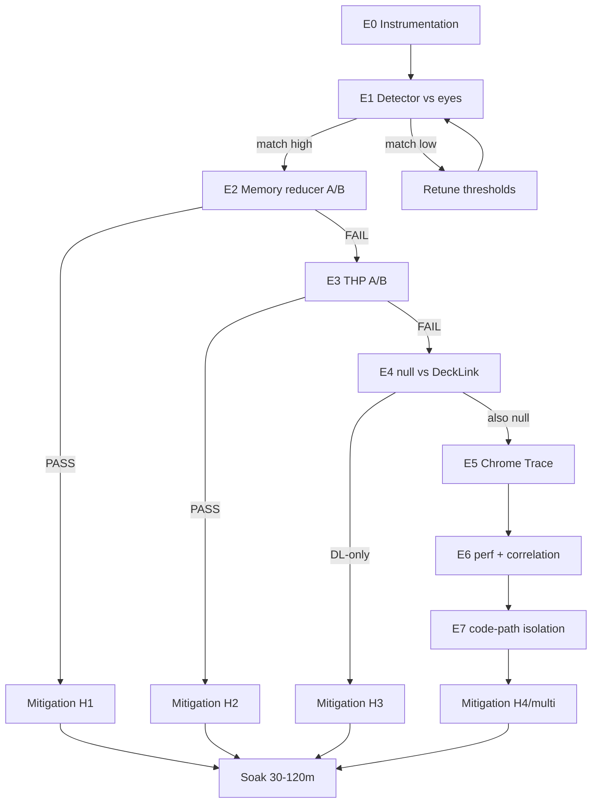

# 06 — Устранение хаотичных микрофризов (SDI microfreeze elimination)

**Серия:** `docs/performance investigation/`  
**Документ:** `06-microfreeze-elimination.md`  
**Дата:** 13 июля 2026  
**Статус:** evidence-first redesign (не копия устаревшего Phase 14 plan)  
**Связанные документы:** [00-overview-and-cost-model.md](00-overview-and-cost-model.md) · [04-scheduling-os-and-genlock.md](04-scheduling-os-and-genlock.md) · [05-cef-pipeline-and-upgrade.md](05-cef-pipeline-and-upgrade.md) · [07-execution-roadmap-and-verification.md](07-execution-roadmap-and-verification.md)

> **Язык:** русский narrative + English technical terms (`frame-log`, `khugepaged`, `SCHED_FIFO`, `WaitForTick`, …).  
> **Constraints:** CPU-only CEF OSR, HTML5/DOM runtime, DeckLink + reference/genlock, no CasparCG copy, scalable beyond Ryzen 5 3600.  
> **Templates:** `test` = `tests/templates/test.json` (простой, для изоляции фризов от контента), `test1` = `tests/templates/test1.json` (сложный — **acceptance target**; финальный soak без фризов на нём).

---

## 0. Executive summary

На SDI-выходе Titulus (DeckLink Quad 2 → монитор TV Logic) наблюдаются **хаотичные микрофризы** с интервалом примерно **5–11 секунд**. Это **не** primary bottleneck программы (потолок ~25 unique fps на сложном `test1`), но **обязательный** acceptance gate: без него даже true-50p будет субъективно «дёргаться».

### 0.1 Что уже известно (evidence)

- Симптом воспроизводится на **двух стендах**: Ryzen 5 3600 (Ubuntu 22.04) и Xeon (Ubuntu 24.04).
- Виден даже на простом шаблоне `test` (rect + clock, X/Y-loop) — **content-independent**.
- Не привязан к фазе timeline / mask / конкретному DOM event.
- Тепловой троттлинг исключён (многочасовой soak без дрейфа частоты).
- `irqbalance` не является общей причиной (на Xeon-стенде inactive, фризы есть).
- В `bg_engine` / `channel.html` / backend не найдено явного таймера 5–11 с.
- `telemetry5s` слишком грубая, чтобы поймать sub-second hitch.
- Инструменты Phase 17/18 уже дают `--frame-log` с `pump_active_us` / `paint_latency_us` — их нужно **переиспользовать**, не изобретать заново.

### 0.2 Гипотезы (ранжированы)

| # | Hypothesis | Почему кандидат | Isolation |
|---|---|---|---|
| H1 | V8 **memory reducer** / Mark-Compact GC | квази-период по allocation rate | `--js-flags=--no-memory-reducer`, `--trace-gc` |
| H2 | OS **THP** / `khugepaged` (~10 s scan) | Ubuntu default `scan_sleep_millisecs=10000` | `thp=never`, defer khugepaged |
| H3 | **DeckLink Quad 2** driver/SDK | единственное общее железо двух стендов | null consumer A/B + late-log |
| H4 | Собственный код (`pump`, ring, weave, WS) | резерв | Chrome Trace + `perf sched` + E7 toggles |

### 0.3 Non-negotiables

| Constraint | Правило |
|---|---|
| CPU-only | `--disable-gpu*`, CEF OSR; GPU path запрещён без отдельного gate |
| HTML5/DOM | единственный template runtime |
| DeckLink + reference | production path; SDI = master clock через `WaitForTick` |
| No CasparCG copy | clean-room reimplement by reference only |
| Scalable | решения не hardcode под 6C/12T |
| Safety | не ломать `SCHED_FIFO` / genlock во время тестов (§11) |

### 0.4 Definition of Done

1. Объективный detector freeze (не «на глаз»).
2. Хотя бы одна H1–H4 подтверждена или опровергнута корреляцией timestamps.
3. Mitigation внедрён без регрессии SCHED_FIFO/genlock.
4. Soak 30–120 мин × 3ch × complex templates: **zero freezes > N ms** (§9).
5. Результат связан с gate в документе 07.

---

## 1. Symptom definition vs content-bound 25fps

### 1.1 Наблюдаемый феномен

Оператор на TV Logic видит кратковременную остановку или рывок движения. Типично:

- длительность субъективно 1–3 поля (≈20–60 ms) до ~100–200 ms;
- интервал между событиями **нерегулярный**, кластер **5–11 с** (мода часто ~7–10 с);
- после рывка motion продолжается без rewind;
- на пустом канале (только damage beacon) глазом слабее — detector всё равно может видеть spikes.

### 1.2 Операциональное определение

Для 1080i50 / field period ≈ **20000 µs**:

| Класс | Условие | Интерпретация |
|---|---|---|
| soft hitch | `interval_us ≥ 1.5 × expected` (≥30000) | лёгкий джиттер |
| **microfreeze** | `interval_us ≥ 2.5 × expected` (≥50000) | кандидат под visual freeze |
| hard freeze | `interval_us ≥ 5 × expected` (≥100000) или gap `paint_seq` ≥ 3 | однозначно заметен |
| cluster | ≥2 microfreeze в окне 200 ms | один event для operator marks |

`expected` = 20000 µs на DeckLink-driven 50i и на self-timer ~50 Hz.

### 1.3 Дискриминатор: microfreeze vs content-bound 25p / singles

**Content-bound ceiling** (docs 00/01/05) — стабильное плато:

```
in_fps ≈ 24–25, out_fps ≈ 25
d_singles высокий, d_pairs низкий/умеренный
paint_latency_us p50 ≈ field budget (~20 ms)
нет редких выбросов с периодом 5–11 с
```

**Microfreeze** (этот документ) — редкий outlier поверх любого плато:

```
между событиями: interval_us ≈ expected (или стабильный content-bound)
на событии: spike interval_us / late / GC pause
гистограмма межсобытийных интервалов пикует около 5–11 с
```

| Признак | Content-bound 25p | Microfreeze |
|---|---|---|
| Средний `in_fps` | ~25 | любой (25 или ~49) |
| Зависит от сложности шаблона | да (`test` vs `test1`) | нет (есть на `test`) |
| Паттерн | постоянный дефицит | норма → spike |
| Визуально на TV Logic | «мыло»/ступенчатость | резкий hitch |
| Лечится cheaper CSS / Class A | частично/да | обычно нет |
| Лечится `--no-memory-reducer` / THP | нет | возможно |

### 1.4 Ловушки frame-log

1. `interval_us=0` — tick без нового paint; это не freeze само по себе.
2. `waited_deadline=1` на DeckLink path нормален при saturation — смотрите **хвост**, не mean.
3. `pump_active_us` — wall time в `CefDoMessageLoopWork`; spike без spike interval = «успели вписаться в field».
4. Flush CSV ~1 с — timestamps валидны, но I/O на медленном диске может добавить jitter → **tmpfs**.
5. Не путать `paint_seq` stall с DeckLink `late`.

### 1.5 Severity

| Sev | Detector | Operator | Action |
|---|---|---|---|
| S0 | soft hitch <0.1%/min | незаметно | ignore |
| S1 | microfreeze 1–3/min | иногда | investigate |
| S2 | период 5–11 s | стабильно видно | **этот документ** |
| S3 | hard freeze / drop bursts | эфирно плохо | stop + rollback |

Текущий observed symptom — **S2**.

---

## 2. Instrumentation plan

Цель: общая шкала `CLOCK_REALTIME` / Unix epoch µs для engine, DeckLink late, V8 GC, OS THP/sched, operator marks.

### 2.1 `--frame-log` (уже в коде, Phase 17+)

Реализация: `engine/src/frame_log.{h,cpp}`, CLI `--frame-log=PATH` / `BG_ENGINE_FRAME_LOG`.

```
wall_clock_us,interval_us,paint_seq,pump_active_us,paint_latency_us,waited_deadline,inflight_depth,paint_seq_delta
```

| Column | Meaning | Freeze relevance |
|---|---|---|
| `wall_clock_us` | Unix epoch µs | join key |
| `interval_us` | между delivered frames; 0 если нет delivery | primary spike detector |
| `paint_seq` | OnPaint sequence | gaps = missed paints |
| `pump_active_us` | Σ CefDoMessageLoopWork | GC/pump stall proxy |
| `paint_latency_us` | BeginFrame → ready | latency spike |
| `waited_deadline` | ждали field deadline | saturation vs freeze |
| `inflight_depth` | Phase 18 probe | dual-BF diagnostics |
| `paint_seq_delta` | unique paints за tick | coalescing vs stall |

#### Запуск

```bash
OUT=/mnt/titulus-tmpfs/mf-$(date +%Y%m%d-%H%M%S)
mkdir -p "$OUT"
FRAME_LOG="$OUT/frame-ch1.csv" \
  engine/run-channel.sh --id=<Ch1-UUID> --name=Ch1 \
    --output-mode=decklink --device-index=0 --cores=0,6,1,7
```

#### tmpfs

```bash
sudo mkdir -p /mnt/titulus-tmpfs
sudo mount -t tmpfs -o size=2G tmpfs /mnt/titulus-tmpfs
```

### 2.2 late-log

5-секундные `d_late`/`d_dropped` недостаточны. Нужен CSV на каждое `ScheduledFrameCompleted` ≠ OK:

```
wall_clock_us,event
1710000000123456,late
```

Env: `BG_ENGINE_LATE_LOG=/path/late.csv`. Точка: `DecklinkConsumer::Impl::OnScheduledFrameCompleted`. Events: `late|dropped|flushed|other`.

**E0 pass для late-log:** при искусственной нагрузке появляются строки; без нагрузки — только header.

### 2.3 `mark-freeze.sh`

Калибровка detector глазами (E1).

Требования: Enter = mark; `date +%s%6N`; типы `freeze` / `control`; append-only CSV; без root.

```bash
./engine/research/mark-freeze.sh /tmp/operator_marks.csv
# Enter → freeze; c+Enter → control; Ctrl-C → exit
```

Оператор: 1 канал, шаблон `test`, 10–15 мин TV Logic, Enter только на hitch, control каждые 2–3 мин, не смотреть логи (bias).

### 2.4 Chrome Trace

После E0–E3, если нет smoking gun:

```bash
engine/run-channel.sh ... --remote-debugging-port=9222
# chrome://tracing / DevTools Performance, 90–120 s (≥8 expected periods)
```

Искать: `V8.GC*`, `MemoryReducer`, `cc::TileManager`, PartitionAlloc reclaim, long `RunTask`. Align с frame-log ±50–200 ms. Caveat: tracing overhead — не first instrument.

### 2.5 `--trace-gc` / V8 flags

```bash
BG_JS_FLAGS='--trace-gc,--no-memory-reducer' \
  engine/run-channel.sh ...
```

V8 часто печатает relative ms since start → sidecar JSON с `start_wall_us`:

```json
{
  "engine_pid": 12345,
  "start_wall_us": 1710000000000000,
  "template": "test",
  "consumer": "decklink",
  "flags": ["--trace-gc", "--no-memory-reducer"]
}
```

### 2.6 `perf sched`

```bash
sudo perf sched record -e sched:sched_switch -p $(pgrep -n bg_engine) -- sleep 120
sudo perf sched latency -s max | head -50
cat /sys/kernel/mm/transparent_hugepage/enabled
cat /sys/kernel/mm/transparent_hugepage/khugepaged/scan_sleep_millisecs
```

Сохранять simultaneous: frame/late/marks/gc/perf/dmesg/THP snapshot.

### 2.7 `analyze-microfreeze.mjs`

Существующий `analyze-frame-log.mjs` — latency percentiles (Phase 17). Нужен freeze-oriented analyzer:

- inputs: `--frame`, `--late`, `--marks`, `--gc`, `--expected-us`, `--threshold-mult`, `--cluster-ms`, `--join-window-ms`;
- outputs: spike list, inter-spike histogram, ACF lags 0.5–15 s, join table, JSON summary.

```
spikes = rows where interval_us >= expected * thr
clusters = merge spikes within cluster_ms
for each cluster: attach late/GC/marks in ±join window
```

### 2.8 Checklist инструментации

- [ ] `--frame-log` на decklink path
- [ ] `--frame-log` на null path
- [ ] late-log env работает
- [ ] mark-freeze.sh пишет µs epoch
- [ ] analyze-microfreeze dry-run на synthetic CSV
- [ ] tmpfs documented
- [ ] tracing flags не включают GPU

---

## 3. Experiment matrix E0–E7

### 3.0 Правила

1. Сначала detector, потом A/B.
2. Один фактор за прогон.
3. Fixed template + cores + device.
4. Минимум 3 прогона на условие.
5. Pass/fail заранее.
6. Manifest JSON на каждый run (Appendix A).
7. Не трогать genlock wiring mid-campaign.

### 3.1 Flowchart



### 3.2 E0 — Instrumentation readiness

**Goal:** сопоставимые timestamps.

**Procedure:** 60 s decklink + 60 s null + analyze dry-run + clock skew check (`date +%s%6N` vs last frame-log row ±2 s).

**Pass:** CSV растёт; header полный; wall_clock non-decreasing; analyze OK; skew OK.
**Fail:** чинить tools, не идти в E1.

### 3.3 E1 — Detector calibration

**Setup:** 1ch DeckLink, template `test`, TV Logic, 15 min, mark-freeze.sh.

| Metric | Pass | Fail |
|---|---|---|
| freeze marks ↔ spike ±700 ms | ≥70% | <50% |
| control marks ↔ spike ±700 ms | ≤20% | >40% |
| inter-spike median | 5–11 s | <3 s или >20 s |

Ambiguous 50–70%: retune threshold / protocol, повторить.

### 3.4 E2 — V8 memory reducer A/B

| ID | Flags |
|---|---|
| E2-A | baseline + `--trace-gc` |
| E2-B | `--no-memory-reducer` + `--trace-gc` |
| E2-C | B + `--max-old-space-size=512` |
| E2-D | B + `--max-old-space-size=256` (stress) |

3×10 min, template `test`, 1ch DeckLink.

**Pass (H1):** E2-B rate ≤20% от E2-A **и** GC↔spike match ≥60% на A **и** на B корреляция пропадает.
**Fail:** изменение в пределах шума (±30% relative).

### 3.5 E3 — THP / khugepaged A/B

| ID | Host config |
|---|---|
| E3-A | default madvise, scan 10000 |
| E3-B | enabled=never, defrag=never |
| E3-C | madvise + scan_sleep=600000 |
| E3-D | E3-B + reboot persistence |

**Pass (H2):** E3-B или E3-C → rate ≤20% baseline.

### 3.6 E4 — null vs DeckLink

| ID | Consumer | Observation |
|---|---|---|
| E4-A | decklink | TV Logic + frame-log + late |
| E4-B | null | frame-log only |

| Result | Conclusion |
|---|---|
| spikes only E4-A | H3 strong |
| spikes E4-A and E4-B | H1/H2/H4 shared stack |
| spikes only E4-B | artifact / self-timer; recheck E1 |

Сначала E1 на DeckLink — на null нет TV Logic.

### 3.7 E5 — Chrome Trace 90–120 s

**Pass:** named slice(s) align с ≥60% clusters. **Fail:** → E6.

### 3.8 E6 — Correlation pack

**Pass:** один signal class объясняет ≥60% clusters, |median lag| < 100 ms (для GC/late).

### 3.9 E7 — Own-code isolation

| ID | Change | Isolates |
|---|---|---|
| E7-a | no WS after take | backend/WS |
| E7-b | static pose, beacon only | runtime animation |
| E7-c | empty + beacon | DOM complexity |
| E7-d | FrameRing depth↑ | ring stalls |
| E7-e | frame-log off | logger jitter |
| E7-f | SCHED_FIFO on/off | RT interaction |

**Pass:** один toggle убирает spikes.

### 3.10 Summary card

| Exp | Question | Pass means | Next |
|---|---|---|---|
| E0 | tools OK? | clocks+CSV | E1 |
| E1 | detector≈eyes? | match≥70% | E2 |
| E2 | H1? | freeze↓ | mitigate / E3 |
| E3 | H2? | freeze↓ | mitigate / E4 |
| E4 | H3? | DL-only | driver / E5 |
| E5 | mechanism name? | trace align | mitigate |
| E6 | best correlator? | ≥60% join | mitigate |
| E7 | our bug? | toggle removes | fix |

---

## 4. A/B: V8 memory reducer / GC

### 4.1 Почему H1 правдоподобна

V8 **MemoryReducer** при стабильном allocation rate периодически запускает GC, чтобы вернуть память OS. Период — функция heap growth, не wall timer → на стабильной анимации выглядит как квази-период секундного порядка (хорошо ложится на 5–11 s). Titulus runtime + rAF + style writes создают непрерывный churn даже на `test`.

### 4.2 Флаги

| Flag | Effect | Risk |
|---|---|---|
| `--no-memory-reducer` | отключает reducer | RSS растёт дольше |
| `--max-old-space-size=N` | old-space limit MB | OOM / more major GC если низко |
| `--max-semi-space-size=N` | young gen | thrash если мало |
| `--trace-gc` | GC log | I/O overhead |
| `--trace-gc-verbose` | detailed | heavier |

Пропагация (проверить hook в `engine_app.cpp` / Cef command line):

```bash
if [[ -n "${BG_JS_FLAGS:-}" ]]; then
  cmd+=(--js-flags="$BG_JS_FLAGS")
fi
```

### 4.3 Protocol

```bash
BASE=/mnt/titulus-tmpfs/e2
for variant in A B C; do
  for r in 1 2 3; do
    OUT=$BASE/$variant-r$r; mkdir -p "$OUT"
    case $variant in
      A) export BG_JS_FLAGS="--trace-gc" ;;
      B) export BG_JS_FLAGS="--no-memory-reducer,--trace-gc" ;;
      C) export BG_JS_FLAGS="--no-memory-reducer,--max-old-space-size=512,--trace-gc" ;;
    esac
    # 10 min channel + artifacts
  done
done
```

### 4.4 Analysis metrics

1. clusters/min
2. major GC / min
3. join rate GC↔cluster
4. RSS max (`VmRSS`)
5. `in_fps` / `d_late` regression

### 4.5 Permanent mitigation gate

Включать `--no-memory-reducer` в default только если: soak pass; RSS slope за 2h 3ch приемлем; нет роста `d_late`; флаг задокументирован в 05.

Complementary: снижать JS allocation churn в `@titulus/runtime` (reuse objects, no per-frame `{}` / `JSON.parse` in hot path).

### 4.6 Rollback

Unset js-flags → restart engines. См. Appendix E.

---

## 5. A/B: THP / khugepaged

### 5.1 Почему H2 правдоподобна

Ubuntu default часто:

```
transparent_hugepage/enabled = madvise
khugepaged/scan_sleep_millisecs = 10000
```

`khugepaged` ~каждые 10 s может давать brief latency spikes. «Не ровно 10.000 s» не опровергает H2 (jitter scan work + operator lag + cluster t_ref).

### 5.2 Commands

```bash
# snapshot
cp -a /sys/kernel/mm/transparent_hugepage/enabled /tmp/thp-enabled.bak
cp -a /sys/kernel/mm/transparent_hugepage/khugepaged/scan_sleep_millisecs /tmp/thp-scan.bak
# E3-B never
echo never | sudo tee /sys/kernel/mm/transparent_hugepage/enabled
echo never | sudo tee /sys/kernel/mm/transparent_hugepage/defrag
# E3-C defer
echo 600000 | sudo tee /sys/kernel/mm/transparent_hugepage/khugepaged/scan_sleep_millisecs
# restore
echo madvise | sudo tee /sys/kernel/mm/transparent_hugepage/enabled
echo 10000 | sudo tee /sys/kernel/mm/transparent_hugepage/khugepaged/scan_sleep_millisecs
```

### 5.3 Persistence (только после soak pass)

```ini
# /etc/systemd/system/titulus-thp.service
[Unit]
Description=Titulus THP policy
After=multi-user.target
[Service]
Type=oneshot
ExecStart=/bin/bash -c 'echo never > /sys/kernel/mm/transparent_hugepage/enabled; echo never > /sys/kernel/mm/transparent_hugepage/defrag'
RemainAfterExit=yes
[Install]
WantedBy=multi-user.target
```

### 5.4 Interaction with doc 04

THP policy orthogonal к `isolcpus`/`taskset` в [04](04-scheduling-os-and-genlock.md). Не смешивать оба изменения в одном A/B без baseline.

Также мониторить: `AnonHugePages`, `grep compact /proc/vmstat`.

---

## 6. A/B: null consumer vs DeckLink

### 6.1 Зачем

DeckLink Quad 2 — единственное общее железо. Driver мог: poll reference, buffer reclaim, late bursts, PCIe/IOMMU interaction. Null убирает SDK, оставляя CEF+pump.

### 6.2 Methodology

1. E1 на DeckLink (глаза↔detector).
2. Тот же detector на null.
3. Не требовать visual confirm на null.

```bash
FRAME_LOG=$OUT/frame.csv BG_ENGINE_LATE_LOG=$OUT/late.csv \
  engine/run-channel.sh ... --output-mode=decklink --device-index=0
FRAME_LOG=$OUT/frame.csv \
  engine/run-channel.sh ... --output-mode=null
```

### 6.3 Genlock safety при переключении

- не горячо перетыкать reference;
- после возврата на decklink — дождаться reference locked;
- не менять device-index mapping mid-soak;
- stop cleanly: `run-engines` + `run-channel`, не только kill `bg_engine`.

### 6.4 Decision table

| DeckLink spikes | Null spikes | Next |
|---|---|---|
| yes | no | H3 driver/SDK |
| yes | yes | H1/H2/H4 |
| no | yes | artifact; recheck E1 |
| no | no | env changed; bisect |

---

## 7. Correlation analysis methods

### 7.1 Единая шкала времени

| Source | Native | Convert |
|---|---|---|
| frame-log | wall_clock_us | as-is |
| late-log | wall_clock_us | as-is |
| mark-freeze | date +%s%6N | as-is |
| V8 GC | ms since start | start_wall_us + ms*1000 |
| perf | sched/TSC | convert via capture start wall |
| Chrome Trace | tracing clock | align via marker |

Сохранять `capture_start_wall_us` в manifest **до** старта engine.

### 7.2 Cluster extraction

```
threshold = expected_us * 2.5
raw_spikes = { t | interval_us(t) >= threshold }
clusters = merge if Δt < 200ms
cluster.t_ref = t of max interval_us in cluster
```

### 7.3 Join windows

| Pair | Window | Why |
|---|---|---|
| cluster ↔ operator mark | ±700 ms | human reaction |
| cluster ↔ GC | ±100 ms | causal tight |
| cluster ↔ late | ±40 ms | same field neighborhood |
| cluster ↔ khugepaged | ±500 ms | coarse OS |
| cluster ↔ sched spike | ±50 ms | preemption |

### 7.4 Scores

```
match_rate = matched_clusters / total_clusters
spurious_rate = unmatched_H_events / total_H_events
median_lag_ms = median(t_cluster - t_H)
```

**Confirm H:** match≥0.60 AND spurious≤0.40 AND |median_lag| in window.
**Reject H:** match<0.30 across 3 runs.

### 7.5 Autocorrelation

Лаги 250–550 frames (~5–11 s @ 50 Hz). Пик ~500 frames — soft hint на H2, не proof.

### 7.6 Report template

```markdown
## Correlation report <run-id>
- clusters: N
- H1 GC match: xx% (median lag yy ms)
- H2 THP match: ...
- H3 late match: ...
- operator mark match: ...
- verdict: primary=H? / inconclusive
```

---

## 8. Mitigations per hypothesis branch

### 8.1 H1 — V8 / memory reducer

1. default `--js-flags=--no-memory-reducer` для decklink channels;
2. optional heap ceiling + RSS monitor;
3. reduce per-frame JS allocations in runtime;
4. document flags в 05;
5. **не** включать GPU «для лечения GC».

### 8.2 H2 — THP / khugepaged

1. host `thp=never` на broadcast nodes;
2. systemd oneshot persistence;
3. verify after reboot;
4. note в 04 host-hardening;
5. alternative: defer khugepaged на shared hosts.

### 8.3 H3 — DeckLink driver

1. freeze Desktop Video / SDK versions в manifest;
2. A/B upgrade/downgrade;
3. audit `GetReferenceStatus` polling;
4. preroll/buffer knobs только через существующие Titulus settings;
5. **не** ломать SDI master clock (Phase 11 decision);
6. pin known-good driver.

### 8.4 H4 — own code

| Sub | Mitigation |
|---|---|
| WS | coalesce / pause noisy publishers |
| timeline | fix alloc/layout thrash |
| beacon | **keep** (OSR sleep risk); minimize cost only |
| FrameRing | tune depth; avoid blocking copies on pump |
| logger | buffered; tmpfs; off in prod |
| SCHED_FIFO | only `HasExternalClock()`; soft-fail OK |

### 8.5 Multi-cause

Сильнейший single mitigation first → remeasure residual → stack second only with evidence. Не ship stacked undiagnosed flags.

---

## 9. Soak protocol 30–120 min (3ch)

### 9.1 Configuration

| Param | Value |
|---|---|
| Channels | 3 simultaneous |
| Format | 1080i50, DeckLink Quad 2 |
| Reference | genlock locked |
| Templates | complex (`test1` / production-like) |
| Pinning | production `run-engines.sh` |
| Tiers | 30 min smoke → 60 standard → 120 release |
| Logging | frame-log (ch1+), late-log all, telemetry5s |

### 9.2 Acceptance gates

Default `N_ms = 80`.

| Gate | Criterion |
|---|---|
| F1 | zero clusters with `interval_us ≥ N_ms*1000` |
| F2 | microfreeze (≥50 ms) rate ≤ 0.05/min **или** zero if claim elimination |
| F3 | operator: no S2 hitch в sampled 15 min |
| F4 | `d_late=0`, `d_dropped=0` (кроме documented startup) |
| F5 | genlock remains locked |
| F6 | FPS regression ≤2% vs pre-mitigation |

**Release bar:** F1–F6 на 120 min. **Dev bar:** F1–F5 на 30 min после candidate fix.

### 9.3 Manifest must include

git SHA, CEF version, Desktop Video version, THP sysfs, js-flags, core pins, template IDs + take timestamps, operator actions.

### 9.4 Failure handling

Не merge → save artifacts → reopen §7 на failing window → rollback.

---

## 10. Interaction with docs 00 / 04 / 05

### 10.1 Doc 00 — Overview & cost model

[00](00-overview-and-cost-model.md) разделяет throughput/cost (Вопрос A) и stability/hitch (Вопрос B = 06).

- cost-model wins **не засчитываются** как freeze fix без freeze-gate;
- `--no-memory-reducer` не маскирует плохой cost model;
- метрики 00 (`ms/frame`) + метрики 06 (`clusters/min`, match_rate);
- две независимые панели: FPS ceiling vs hitch rate.

### 10.2 Doc 04 — Scheduling / OS / genlock

[04](04-scheduling-os-and-genlock.md) владеет taskset, SCHED_FIFO, isolcpus, genlock ops.

- freeze A/B не ломает pinning map;
- THP experiments здесь, persistence policy может жить в 04;
- после isolcpus — повторить E1;
- genlock loss ≠ microfreeze.

### 10.3 Doc 05 — CEF pipeline

[05](05-cef-pipeline-and-upgrade.md) владеет CEF flags / BeginFrame / upgrades.

- подтверждённые js-flags → матрица флагов 05;
- GPU запрет остаётся;
- CEF upgrade → повторный freeze soak (GC behavior меняется);
- dual BeginFrame probes — не лечение hitch, но общие колонки frame-log.

### 10.4 Doc 07 — Roadmap

06 — параллельный workstream. Freeze gate обязателен для final subjective acceptance ≥50 fps.

---

## 11. Safety: SCHED_FIFO / genlock

### 11.1 SCHED_FIFO

Priority 2 только при `HasExternalClock()` (decklink-driven). Soft-fail без capabilities — OK.

1. не `chrt` на случайные PID;
2. не `renice` renderer без cmdline check;
3. E7-f отдельным run;
4. после тестов проверить FIFO soft-fail/success как раньше;
5. никогда FIFO на backend/frontend.

### 11.2 Genlock / reference

1. не перетыкать reference mid-run;
2. перед soak — confirm locked;
3. E4 null — clean stop;
4. не менять duplex/keyer без manifest;
5. late storms после unlock — отдельный инцидент, не S2.

### 11.3 Process hygiene

- не backend из subshell `( )`;
- kill по PID порта (`ss -ltnp`), не `pkill -f PORT=`;
- перед DeckLink: `pgrep -af "bg_engine|run-channel|run-engines"`;
- frame-log на tmpfs, не NFS.

### 11.4 Forbidden

| Action | Why |
|---|---|
| enable GPU to fix hitch | CPU-only |
| copy CasparCG scheduling | clean-room |
| disable damage beacon permanently | OSR sleep |
| force self-timer on decklink path | breaks SDI master |
| THP always «для скорости» | может ухудшить hitch |

---

## 12. Appendices

### Appendix A — Run manifest schema

```json
{
  "run_id": "20260713T161500Z-e2-B-r1",
  "doc": "06-microfreeze-elimination",
  "experiment": "E2",
  "variant": "B",
  "repetition": 1,
  "git_sha": "...",
  "host": {"cpu": "Ryzen 5 3600", "os": "Ubuntu 22.04", "thp_enabled": "never", "khugepaged_scan_ms": 10000},
  "engine": {"cef": "144", "js_flags": ["--no-memory-reducer"], "consumer": "decklink", "device_index": 0, "cores": "0,6,1,7", "sched_fifo": "soft-fail"},
  "template": "test",
  "duration_s": 600,
  "paths": {"frame_log": "...", "late_log": "...", "gc_log": "...", "marks": null},
  "start_wall_us": 0,
  "notes": ""
}
```

### Appendix B — Scripts

#### B.1 `mark-freeze.sh`

```bash
#!/usr/bin/env bash
set -euo pipefail
OUT="${1:-operator_marks.csv}"
echo "wall_clock_us,event,note" > "$OUT"
echo "[mark] Enter=freeze, c+Enter=control, Ctrl-C=exit → $OUT"
while IFS= read -r line; do
  ts=$(date +%s%6N)
  if [[ "$line" == "c" || "$line" == "C" ]]; then
    echo "${ts},control," >> "$OUT"
    echo "[mark] control @ $(date -Iseconds)"
  else
    echo "${ts},freeze," >> "$OUT"
    echo "[mark] freeze  @ $(date -Iseconds)"
  fi
done
```

#### B.2 `snap-thp.sh`

```bash
#!/usr/bin/env bash
set -euo pipefail
OUT=${1:-thp-snap.txt}
{
  date -Iseconds
  for f in enabled defrag shmem_enabled; do
    echo -n "$f="; cat /sys/kernel/mm/transparent_hugepage/$f
  done
  echo -n "scan_sleep_millisecs="; cat /sys/kernel/mm/transparent_hugepage/khugepaged/scan_sleep_millisecs
  grep -E 'AnonHugePages|HugePages_' /proc/meminfo
} | tee "$OUT"
```

#### B.3 `analyze-microfreeze.mjs` (skeleton)

```javascript
#!/usr/bin/env node
import { readFileSync } from 'node:fs';
function arg(name, fb) {
  const h = process.argv.find((a) => a.startsWith(`--${name}=`));
  return h ? h.split('=').slice(1).join('=') : fb;
}
const framePath = arg('frame', '');
const expectedUs = Number(arg('expected-us', '20000'));
const thrMult = Number(arg('threshold-mult', '2.5'));
const clusterMs = Number(arg('cluster-ms', '200'));
if (!framePath) { console.error('need --frame='); process.exit(1); }
const lines = readFileSync(framePath, 'utf8').trim().split('\n');
const header = lines[0].split(',');
const rows = lines.slice(1).filter(Boolean).map((line) => {
  const c = line.split(','); const o = {};
  header.forEach((h, i) => { o[h.trim()] = c[i]; });
  return o;
});
const thr = expectedUs * thrMult;
const spikes = rows
  .map((r) => ({ t: Number(r.wall_clock_us), interval: Number(r.interval_us) }))
  .filter((r) => r.interval >= thr);
const clusters = [];
for (const s of spikes) {
  const last = clusters[clusters.length - 1];
  if (!last || s.t - last.tEnd > clusterMs * 1000) {
    clusters.push({ tStart: s.t, tEnd: s.t, tRef: s.t, maxInterval: s.interval, n: 1 });
  } else {
    last.tEnd = s.t; last.n += 1;
    if (s.interval >= last.maxInterval) { last.maxInterval = s.interval; last.tRef = s.t; }
  }
}
console.log(JSON.stringify({ rows: rows.length, spikes: spikes.length, clusters: clusters.length, threshold_us: thr }, null, 2));
```

#### B.4 Quick capture recipe

```bash
OUT=/mnt/titulus-tmpfs/mf-quick-$(date +%Y%m%d-%H%M%S)
mkdir -p "$OUT"
date +%s%6N > "$OUT/start_wall_us.txt"
./engine/research/mf/snap-thp.sh "$OUT/thp.txt" || true
FRAME_LOG="$OUT/frame.csv" BG_ENGINE_LATE_LOG="$OUT/late.csv" \
  engine/run-channel.sh --id=<UUID> --name=Ch1 \
  --output-mode=decklink --device-index=0 --cores=0,6,1,7 &
sleep 600
# stop cleanly per runbook
node engine/research/lib/analyze-microfreeze.mjs --frame="$OUT/frame.csv" | tee "$OUT/analyze.json"
```

### Appendix C — Log formats

#### C.1 frame-log example

```
wall_clock_us,interval_us,paint_seq,pump_active_us,paint_latency_us,waited_deadline,inflight_depth,paint_seq_delta
1710000000123456,20112,1044,850,19880,1,1,1
```

#### C.2 late-log

```
wall_clock_us,event
1710000000124000,late
```

#### C.3 marks

```
wall_clock_us,event,note
1710000000125000,freeze,
1710000003500000,control,
```

#### C.4 GC (illustrative)

```
[12345:0x...]  4567 ms: Mark-Compact 32.1 (33.0) -> 20.0 (21.0) MB ...
```

Convert: `wall = start_wall_us + 4567 * 1000`.

### Appendix D — Decision tree

```
START
  → E0 tools? FAIL: fix tools
  → E1 eyes match? FAIL: retune
  → E2 no-memory-reducer helps?
        YES → mitigate H1 → soak → DONE/FAIL rollback
        NO  → E3 THP never helps?
               YES → mitigate H2 → soak
               NO  → E4 null vs DL
                      DL-only → H3 → mitigate → soak
                      both → E5 → E6 → E7 → mitigate → soak
soak PASS → update 04/05 → gate in 07
soak FAIL → rollback → new evidence pack
```

### Appendix E — Rollback

| Change | Rollback |
|---|---|
| js-flags | unset env / revert PR; restart engines |
| THP never | `echo madvise > enabled`; remove systemd unit |
| khugepaged defer | `echo 10000 > scan_sleep_millisecs` |
| late-log code | revert; env unset = no-op |
| driver upgrade | previous Desktop Video |
| runtime churn fix | `git revert <sha>`; rebuild runtime |

После rollback: 15 min smoke + confirm baseline.

### Appendix F — Phase 14 vs this doc

| Item | Phase 14 archive | Now |
|---|---|---|
| frame-log | proposed 3-col | 8-col FrameLog in tree |
| analyze | freeze sketch | need mf analyzer (P17 is latency) |
| irqbalance | early drafts | excluded as common cause |
| pass/fail | soft | hard E0–E7 + F1–F6 |
| soak | under-specified | 30/60/120 + N_ms |
| 00/04/05 | weak | explicit handoffs |

Archive Phase 14 = historical notes, **not** procedure.

### Appendix G — Glossary

| Term | Meaning |
|---|---|
| microfreeze | rare hitch ≳50 ms, period ~5–11 s |
| cluster | merged spikes within 200 ms |
| content-bound | stable low fps due to raster cost |
| memory reducer | V8 reclaim mechanism |
| THP | Transparent Huge Pages |
| khugepaged | kernel huge-page collapse thread |
| WaitForTick | DeckLink-driven pump wait |
| damage beacon | 1×1 px keep-alive for OSR |
| d_late | scheduled frame displayed late |
| SDI master clock | production timing domain |

### Appendix H — Operator card

```
MICROFREEZE E1 CARD
1. One channel, template test, TV Logic visible
2. Start mark-freeze.sh
3. 15 minutes eyes-on
4. Enter on hitch only
5. Every 2-3 min: c + Enter (control)
6. Stop; hand off CSV + notes
DO NOT: watch CPU graphs, change templates, unlock reference
```

### Appendix I — Artifact layout

```
/mnt/titulus-tmpfs/mf/<run_id>/
  manifest.json
  frame-ch1.csv
  late-ch1.csv
  marks.csv
  gc.log
  thp.txt
  threads.txt
  analyze.json
  operator-notes.md
```

### Appendix J — FAQ

**Q: Можно ли отложить 06 до после 50 fps?**

A: Технически да, но subjective sign-off 50p сорвётся. Держать parallel track.

**Q: Почему telemetry5s недостаточно?**

A: 5s bins smearing: hitch 80 ms тонет в среднем.

**Q: Почему E1 на `test`, не `test1`?**

A: Чтобы не путать content-bound judder с S2 hitch.

**Q: Нужен ли GPU trace?**

A: Нет. CPU-only.

**Q: steady_clock для marks?**

A: Нет. Только system_clock / Unix epoch для join с date(1).

**Q: frame-log сам даёт hitch?**

A: Возможно слабо → E7-e + tmpfs; prod default off.

**Q: Что с browser/OBS outputs?**

A: Те же CEF flags; visual confirm на DeckLink.

**Q: Период не ровно 10 s — это не THP?**

A: Не опровергает H2: scan jitter + mark lag + cluster t_ref.

**Q: Можно ли удалить damage beacon?**

A: Нет без отдельного gate — OSR может уснуть.

**Q: Как масштабировать на >6 ядер?**

A: Те же E0–E7 и thresholds в field periods; не hardcode core IDs.


### Appendix K — Field dictionary

1. **`wall_clock_us`** — Unix epoch µs; join key.

2. **`interval_us`** — Delta between delivered paints; 0 = no delivery.

3. **`paint_seq`** — Monotonic OnPaint counter.

4. **`pump_active_us`** — Wall time in CefDoMessageLoopWork.

5. **`paint_latency_us`** — BeginFrame → ready.

6. **`waited_deadline`** — 1 if waited until field deadline.

7. **`inflight_depth`** — BeginFrames in flight (probe).

8. **`paint_seq_delta`** — Unique paints in tick window.

9. **`clusters_per_min`** — Derived rate for A/B.

10. **`match_rate_gc`** — Fraction clusters joined to GC.

11. **`match_rate_late`** — Fraction clusters joined to late.

12. **`match_rate_mark`** — Fraction operator freezes joined.

13. **`in_fps`** — Unique input paints / s.

14. **`out_fps`** — Scheduled output frames / s.

15. **`d_late`** — Late completions (5s telemetry).

16. **`d_dropped`** — Dropped completions.

17. **`d_pairs`** — Woven pairs from two paints.

18. **`d_singles`** — Pairs from duplicated paint.

19. **`VmRSS`** — RSS for reducer A/B.

20. **`AnonHugePages`** — THP footprint.

21. **`reference_status`** — Genlock lock state.


### Appendix L — Lab readiness checklist

#### Hardware

- [ ] DeckLink Quad 2 visible to SDK
- [ ] Reference/genlock stable
- [ ] TV Logic on test channel output
- [ ] Known-good SDI cable
- [ ] No thermal throttle after 30 min load
- [ ] Second host available for cross-check when claiming universal cause

#### Software

- [ ] bg_engine built with DeckLink
- [ ] --frame-log writes CSV
- [ ] late-log env OK or ticket under E0
- [ ] mark-freeze.sh executable
- [ ] analyze-microfreeze runs on synthetic fixture
- [ ] tmpfs or /tmp ≥ 2 GiB free
- [ ] Control plane can take `test` and `test1`
- [ ] No stray bg_engine (`pgrep -af bg_engine`)

#### People

- [ ] Operator trained on Appendix H card
- [ ] Engineer collects artifacts without interrupting eyes-on
- [ ] N_ms and threshold_mult agreed
- [ ] Rollback owner if THP changed

### Appendix M — Synthetic fixtures

| Fixture | Content | Expect |
|---|---|---|
| F-clean | 2000 rows ±200 µs | clusters=0 |
| F-periodic-8s | spike every 400 frames | median gap≈8s |
| F-clustered | 3 spikes 10ms apart / 9s | one cluster per group |
| F-marks | marks at tRef±100ms + distant controls | high freeze match, low control |
| F-gc-join | GC 20ms before each cluster + 50% spurious | teach both scores |

### Appendix N — Work breakdown

| Step | Deliverable | Depends |
|---|---|---|
| W0 | late-log + mark-freeze + analyze-microfreeze | — |
| W1 | E0+E1 report | W0, HW |
| W2 | E2 A/B | W1, js-flags hook |
| W3 | E3 A/B | W1 |
| W4 | E4 null vs DL | W1 |
| W5 | E5–E7 as needed | W2–W4 |
| W6 | mitigation PR + 04/05 update | confirmed H |
| W7 | soak 30→120 | W6 |

### Appendix O — Sign-off checklist

- [ ] E0 pass
- [ ] E1 pass (match≥70%)
- [ ] Primary hypothesis named with correlation scores
- [ ] Mitigation behind documented flag/config
- [ ] Rollback tested
- [ ] Soak 30 min pass
- [ ] Soak 120 min pass
- [ ] Docs 04/05 updated if needed
- [ ] Gate linked from 07
- [ ] No SCHED_FIFO/genlock regression
- [ ] CPU-only retained

### Appendix P — Constraints compliance

| Constraint | Compliance |
|---|---|
| CPU-only | no GPU experiments |
| HTML5 | mitigations in flags/host/runtime |
| DeckLink+reference | E4/soak require locked reference |
| No CasparCG copy | methodology original |
| Scalable | E-matrix not bound to 6C/12T IDs |

### Appendix Q — Status update templates

```
MF E1: PASS/FAIL match_freeze=xx% match_control=yy% clusters/min=z median_gap=s
MF E2/E3/E4: rate_A=.. rate_B=.. relative=..% verdict=H?/inconclusive
MF SOAK 120m: PASS/FAIL F1-F6 mitigation=<flags>
```

### Appendix R — Cross-host confirmation

| Step | Action |
|---|---|
| C1 | Reproduce E1 on host B |
| C2 | Same mitigation |
| C3 | Compare relative rate drop |
| C4 | One host only → host-specific; reopen |

### Appendix S — E1 minute-by-minute

| t | Action |
|---|---|
| −10:00 | genlock OK, clear engines, tmpfs ready |
| −05:00 | start frame-log+late-log channel |
| −03:00 | take `test`, confirm motion |
| −01:00 | start mark-freeze.sh |
| 00:00 | eyes-on |
| 02/05/08/11/14:00 | control marks |
| 15:00 | stop |
| +05:00 | analyze match rates |
| +15:00 | e1-report.md |

### Appendix T — Statistical notes

```
clusters_per_min = clusters / (duration_s/60)
```

3 reps × 10 min при period ~8 s → десятки events. Для 30% relative change — OK. Compare medians across reps. Не single-run verdict.

### Appendix U — Relation to 25 fps ceiling

06 **не** поднимает average fps. Residual S2 провалит subjective acceptance даже при ≥50 unique fps. Gate 06 обязателен в final verification (07), но не заменяет raster cost work (01/02/05).

### Appendix V — Open questions

1. Точная пропагация `--js-flags` в CEF 144 — verify в `engine_app.cpp` before E2.
2. late-log уже в main? Если нет — часть E0.
3. frame-log на всех 3ch в 120m или sampling ch1?
4. N_ms=80 validate vs operator в E1.
5. Xeon vs Ryzen: identical inter-spike histogram?

### Appendix W — Deep dive H1 notes

MemoryReducer ≠ весь GC. Scavenger/minor останется. Смотреть major/mark-compact. Подозрительный churn: per-frame style strings, timeline objects, WS JSON, temporary arrays, DOM text strings, console in hot path.

| Signal | Healthy | Suspicious |
|---|---|---|
| Major GC period | rare/irregular | ~5–11 s quasi |
| Major GC duration | <5 ms | >20–50 ms |
| Join to clusters | low | ≥60% |
| RSS with reducer off | flat-ish | unbounded |

Если reducer off помогает, но RSS растёт: keep flag + recycle processes in maintenance **или** `--max-old-space-size` after measuring steady RSS **или** (лучше) fix churn.

### Appendix X — Deep dive H2 notes

THP 2 MiB: меньше TLB miss, но khugepaged/compaction stalls опасны для hitch-sensitive apps. Frame buffers ~8 MiB BGRA — TLB win сомнителен vs risk. Recommended broadcast policy: `never`/`never`. Proof: defer scan → freezes stretch/vanish; never → vanish.

### Appendix Y — Deep dive H3/H4 notes

H3 audit: `GetReferenceStatus` cadence, `ScheduledFrameCompleted`, `WaitForTick` batching, preroll depth, keyer idle, no mid-run format switches. Vendor vars: Desktop Video version, SDK headers, firmware, PCIe/IOMMU, other card holders.

| H4 suspect | Likelihood | Exclude via |
|---|---|---|
| Explicit 5–11s timer | low | code search + E7 |
| frame-log flush | low-medium | E7-e |
| WS keepalive | low-medium | E7-a |
| FrameRing overwrite | medium under load | E7-d |
| weave bandwidth spike | medium multi-ch | mem BW correlate |
| beacon+rAF | low | E7-b/c |

### Appendix Z — Document history & ownership

| Date | Change |
|---|---|
| 2026-07-13 | Initial redesign superseding Phase 14 archive |

| Area | Owner |
|---|---|
| Engine flags / late-log | engine |
| Runtime churn | runtime |
| Host THP/sched | ops / lab |
| DeckLink driver | lab + vendor |
| Gate in 07 | program lead |

---

## 13. Final reminder

Микрофризы — secondary к 25 fps ceiling, но mandatory для эфирной гладкости. Путь: symptom → instrumentation → E0–E7 isolation → mitigation → soak — без нарушения CPU-only, HTML5, DeckLink+genlock и clean-room constraints.

---

*END OF DOCUMENT 06 — microfreeze elimination*

