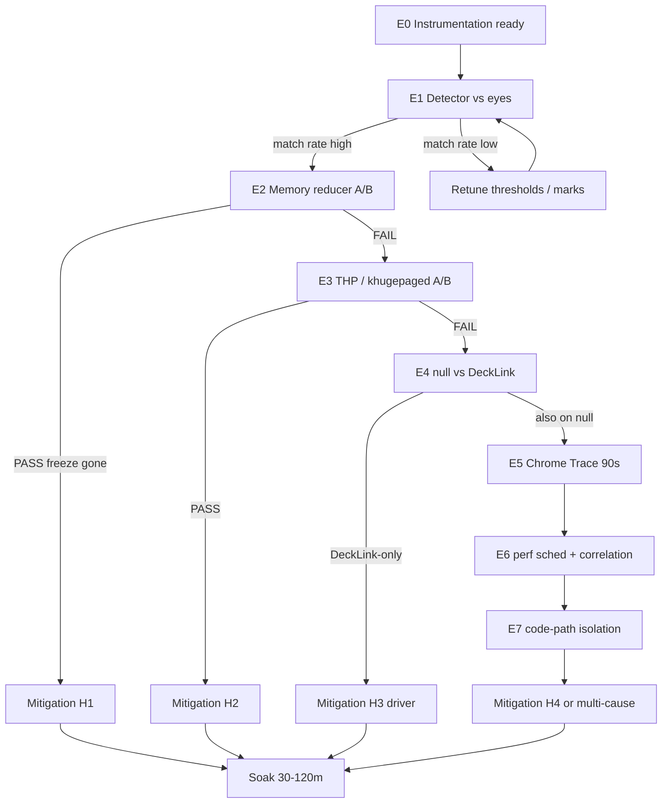

# 06 — Устранение хаотичных микрофризов (SDI microfreeze elimination)

**Серия:** `docs/performance investigation/`  
**Документ:** `06-microfreeze-elimination.md`  
**Дата:** 13 июля 2026  
**Статус:** redesign investigation plan (evidence-first); заменяет устаревший Phase 14 plan  
**Связанные документы:** [00](00-overview-and-cost-model.md) · [04](04-scheduling-os-and-genlock.md) · [05](05-cef-pipeline-and-upgrade.md) · [07](07-execution-roadmap-and-verification.md)

---

## 0. Executive summary

На SDI-выходе Titulus (DeckLink Quad 2 → TV Logic) наблюдаются **хаотичные микрофризы** с интервалом примерно **5–11 секунд**. Симптом:

- воспроизводится на **двух независимых стендах** (Ryzen 5 3600 / Ubuntu 22.04 и Xeon / Ubuntu 24.04);
- **не зависит от сложности шаблона** (виден даже на простом `test`: 1 rect + clock, X/Y-loop);
- **не привязан** к фазе timeline-анимации, маске или конкретному DOM-событию;
- **не является** primary bottleneck программы (потолок ~25 unique fps на `test1`) — но **обязан** быть закрыт как отдельный acceptance gate, иначе «плавная» 50p картинка всё равно будет субъективно «дёргаться».

Этот документ **не** копирует старый Phase 14 plan. Тот план:

1. предложил `--frame-log` до его реальной реализации;
2. смешал detector-валидацию с A/B без жёстких pass/fail;
3. частично устарел: `--frame-log` + `pump_active_us` / `paint_latency_us` уже есть (Phase 17/18);
4. не дал soak-протокола с числовым acceptance.

Здесь — **пересобранный** план: symptom → instrumentation → isolation matrix E0–E7 → mitigations per branch → soak → interaction with 00/04/05 → safety → appendices.

### 0.1 Non-negotiables (не нарушать)

| Constraint | Почему
|---|---|
| **CPU-only** (`--disable-gpu*`, CEF OSR) | GPU path запрещён без отдельного gate-doc |
| **HTML5/DOM** как единственный template runtime | Нет PIXI/GSAP/WebGL-as-primary |
| **DeckLink + reference/genlock** на production path | SDI = master clock через `WaitForTick` |
| **Не копировать CasparCG** | Clean-room reimplement by reference only |
| **Scalable** | Решения должны масштабироваться с числом ядер/каналов, не быть hardcode под 6C/12T |
| **Не ломать SCHED_FIFO / genlock** во время тестов | См. §11 |

### 0.2 Что уже известно (evidence), а что — гипотеза

**Evidence (подтверждено наблюдениями):**

- визуальный freeze на TV Logic с периодом ~5–11 с;
- воспроизводится на Ryzen и Xeon;
- воспроизводится на trivial content;
- тепловой троттлинг исключён (многочасовой soak без дрейфа частоты/температуры);
- `irqbalance` **не** является общей причиной (на Xeon-стенде inactive, фризы есть);
- в `bg_engine` / `channel.html` / backend **не найдено** явного `setInterval`/`sleep` с периодом 5–11 с;
- `telemetry5s` слишком грубая, чтобы поймать sub-second freeze.

**Гипотезы (ранжированы, не доказаны):**

| # | Hypothesis | Почему кандидат | Как изолировать |
|---|---|---|---|
| H1 | V8 **memory reducer** / Mark-Compact GC | квази-период по allocation rate, не wall timer | `--js-flags=--no-memory-reducer`, `--trace-gc` |
| H2 | OS **THP** / `khugepaged` (~10 s scan) | default Ubuntu `scan_sleep_millisecs=10000`, оба стенда `madvise` | `thp=never`, defer khugepaged |
| H3 | **DeckLink Quad 2** driver/SDK | единственное общее железо | null consumer A/B + late-log correlation |
| H4 | Собственный код (`pump`, ring, weave, WS) | резерв после H1–H3 | Chrome Trace + `perf sched` + code audit |

### 0.3 Definition of Done (документ + программа)

Документ считается исполненным, когда:

1. есть объективный detector freeze (не «на глаз»);
2. хотя бы одна гипотеза H1–H4 **подтверждена или опровергнута** корреляцией timestamps;
3. mitigation внедрён (config / flags / code) без регрессии SCHED_FIFO/genlock;
4. soak 30–120 мин × 3ch × complex templates: **zero freezes > N ms** (N фиксируется в §9);
5. результат задокументирован в research-notes и связан с gate в [07](07-execution-roadmap-and-verification.md).

---

## 1. Symptom definition: что считать микрофризом

### 1.1 Наблюдаемый феномен

Оператор на TV Logic видит кратковременную «остановку» или «рывк» движения шаблона. Типичные качественные признаки:

- длительность субъективно **1–3 поля** (≈20–60 ms) до «нескольких кадров» (до ~100–200 ms);
| интервал между событиями **нерегулярный**, но кластеризуется в диапазоне **5–11 с** (мода часто ~7–10 с);
- после рывка motion продолжается без rewind/rollback;
- на пустом канале (только damage beacon) симптом **слабее или незаметен** — глаз не видит motion; detector всё равно может видеть `interval_us` spikes.

### 1.2 Операциональное определение (для логов)

Для 1080i50 / field period ≈ **20000 µs** определяем:

| Класс | Условие | Интерпретация |
|---|---|---|
| **soft hitch** | `interval_us ≥ 1.5 × expected` (≥ 30000 µs) | лёгкий джиттер; может быть незаметен |
| **microfreeze** | `interval_us ≥ 2.5 × expected` (≥ 50000 µs) **или** `paint_latency_us ≥ 40000` при `waited_deadline=1` с пропуском delivery | кандидат под визуальный freeze |
| **hard freeze** | `interval_us ≥ 5 × expected` (≥ 100000 µs) или gap `paint_seq` ≥ 3 | однозначно заметен |
| **cluster** | ≥2 microfreeze в окне 200 ms | один «видимый» event для operator marks |

`expected` берётся из режима канала:

- DeckLink-driven 50i field clock: **20000 µs**;
- self-timer ~50 Hz: тоже ~20000 µs nominal;
- при true-50p path после Phase 18: expected остаётся field period, но `paint_seq_delta` интерпретируется отдельно (см. §1.4).

### 1.3 Как отличить от content-bound 25 fps / singles

**Content-bound ceiling** (Вопрос A / docs 00–01–05) — это **стабильное** плато:

```
in_fps ≈ 24–25
out_fps ≈ 25
d_singles высокий, d_pairs низкий или умеренный
paint_latency_us p50 ≈ field budget (~20 ms)
pump_active_us стабильно высокий
нет редких выбросов с периодом 5–11 с
```

**Microfreeze** (Вопрос B / этот документ) — это **редкий outlier** поверх любого плато:

```
между фризами: interval_us ≈ expected (или стабильный content-bound)
на фризе: одиночный/кластер spike interval_us / late / GC pause
межсобытийный интервал: гистограмма пикует около 5–11 с
autocorrelation: слабый пик на ~250–550 frames (5–11 с @ 50 Hz)
```

Таблица-дискриминатор:

| Признак | Content-bound 25p | Microfreeze |
|---|---|---|
| Средний `in_fps` | ~25 | любой (25 или 49) |
| Зависит от сложности шаблона | **да** (`test` vs `test1`) | **нет** (есть на `test`) |
| Стабильность между событиями | постоянный дефицит | норма, потом spike |
| Видно на TV Logic как «рывк» | скорее «мыло»/ступенчатость | да, резкий hitch |
| `d_late`/`d_dropped` 5s | могут быть 0 | могут всплыть в окне фриза |
| Лечится Class A / cheaper CSS | частично/да | обычно **нет** |
| Лечится `--no-memory-reducer` / THP | нет | возможно |

### 1.4 Ловушки интерпретации frame-log

1. **`interval_us=0`** — pump tick без delivery нового paint; это **не** freeze само по себе (особенно при content-bound).
2. **`waited_deadline=1`** на DeckLink path — нормальна при saturation; смотрите **хвост** распределения, не среднее.
3. **`pump_active_us`** измеряет wall time внутри `CefDoMessageLoopWork` за тик; spike pump без spike interval может быть «успели вписаться в field».
4. Flush frame-log раз в ~1 с (буфер) — timestamps строк валидны (пишутся при RecordTick), но I/O spike от flush теоретически может добавить jitter; при A/B держите log на tmpfs.
5. **Не путать** `paint_seq` stall (нет нового OnPaint) с DeckLink late (карта не успела показать scheduled frame).

### 1.5 Шкала severity для отчётности

| Severity | Detector | Operator | Action |
|---|---|---|---|
| S0 | soft hitch rate < 0.1%/min | незаметно | ignore |
| S1 | microfreeze 1–3 / min | иногда видно | investigate |
| S2 | microfreeze с периодом 5–11 s | стабильно видно | **этот документ** |
| S3 | hard freeze / drop bursts | эфирно неприемлемо | stop + rollback |

Текущий observed symptom — **S2**.

---

## 2. Instrumentation plan

Цель инструментации: получить **общую временну́ю шкалу** (`CLOCK_REALTIME` / Unix epoch µs), на которую накладываются:

- engine frame/pump events;
- DeckLink late/dropped;
- V8 GC;
- OS THP/khugepaged / sched;
- ручные operator marks.

### 2.1 `--frame-log` (уже в коде, Phase 17+)

Реализация: `engine/src/frame_log.{h,cpp}`, CLI `--frame-log=PATH` / env `BG_ENGINE_FRAME_LOG`.

CSV header (актуальный):

```
wall_clock_us,interval_us,paint_seq,pump_active_us,paint_latency_us,waited_deadline,inflight_depth,paint_seq_delta
```

| Column | Meaning | Freeze relevance |
|---|---|---|
| `wall_clock_us` | Unix epoch µs (`system_clock`) | join key |
| `interval_us` | время между delivered frames; 0 если нет delivery | primary spike detector |
| `paint_seq` | OnPaint sequence | gaps = missed paints |
| `pump_active_us` | Σ wall time в CefDoMessageLoopWork за tick | GC/pump stall proxy |
| `paint_latency_us` | BeginFrame → ready | latency spike |
| `waited_deadline` | 1 если ждали до field deadline | saturation vs freeze |
| `inflight_depth` | Phase 18 probe | dual-BF diagnostics |
| `paint_seq_delta` | unique paints за tick | coalescing vs stall |

**Важно:** Phase 14 предлагал минимальный CSV из 3 колонок. Актуальный формат **шире** — анализаторы freeze должны читать header dynamically (как `analyze-frame-log.mjs`).

#### 2.1.1 Рекомендуемый запуск

```bash
OUT=/tmp/titulus-mf/$(date +%Y%m%d-%H%M%S)
mkdir -p "$OUT"
FRAME_LOG="$OUT/frame-ch1.csv" \
  engine/run-channel.sh \
    --id=<Ch1-UUID> --name=Ch1 \
    --output-mode=decklink --device-index=0 \
    --cores=0,6,1,7
```

Для трёх каналов — три отдельных CSV (не смешивать).

#### 2.1.2 tmpfs recommendation

```bash
sudo mkdir -p /mnt/titulus-tmpfs
sudo mount -t tmpfs -o size=2G tmpfs /mnt/titulus-tmpfs
OUT=/mnt/titulus-tmpfs/mf-$(date +%Y%m%d-%H%M%S)
```

Снижает риск, что flush CSV на HDD/SSD сам станет источником hitch.

### 2.2 late-log (нужен, если ещё нет)

5-секундные агрегаты `d_late`/`d_dropped` **недостаточны** для корреляции с 5–11 s events.

Требование: CSV `wall_clock_us,event` на каждое `ScheduledFrameCompleted` ≠ `bmdOutputFrameCompleted`.

Env: `BG_ENGINE_LATE_LOG=/path/late-ch1.csv`

Точка: `DecklinkConsumer::Impl::OnScheduledFrameCompleted`.

Формат:

```
wall_clock_us,event
1710000000123456,late
1710000000456789,dropped
```

Events: `late` | `dropped` | `flushed` | `other`.

**Pass criterion для внедрения late-log:** на 60 s soak с искусственной нагрузкой появляются строки; без нагрузки файл содержит только header.

### 2.3 `mark-freeze.sh` — design

Назначение: калибровка detector глазами оператора (E1).

Требования к дизайну:

1. одна клавиша Enter = одна отметка;
2. wall clock = `date +%s%6N` (GNU date, µs);
3. типы отметок: `freeze` (default) и `control` (явное «фриза нет»);
4. low latency UI (echo confirmation);
5. не требует root;
6. пишет append-only CSV.

Спецификация CLI:

```bash
./engine/research/mark-freeze.sh [--out=PATH] [--mode=freeze|toggle]
# Enter → freeze mark
# 'c'+Enter → control mark (false-positive calibration)
# Ctrl-C → exit
```

CSV:

```
wall_clock_us,event,note
1710000001000000,freeze,
1710000003500000,control,
```

Операторская инструкция (кратко):

1. только **один** канал на TV Logic;
2. шаблон `test` (motion виден, content-bound отсутствует);
3. сидеть 10–15 мин;
4. жать Enter **только** на субъективный hitch;
5. раз в 2–3 мин делать control mark;
6. не смотреть в логи во время калибровки (bias).

### 2.4 Chrome Trace

Цель: если A/B H1–H3 не дали smoking gun — поймать имя механизма внутри Chromium.

Рекомендуемый путь (CPU-only safe):

```bash
# remote debugging уже поддерживается run-channel.sh
engine/run-channel.sh ... --remote-debugging-port=9222
# Затем chrome://tracing или DevTools Performance на target
# Duration: 90–120 s continuous capture covering ≥8 expected freeze periods
```

Искать в trace:

- `V8.GC*` / `MinorGC` / `MajorGC` / `MemoryReducer`;
- `cc::TileManager` / eviction;
- `PartitionAlloc` free lists / reclaim;
- long `RunTask` / `MessageLoop` stalls на UI/IO threads;
- редкие spikes, выровненные с frame-log timestamps (±50–200 ms).

**Caveat:** tracing сам вносит overhead. Использовать **после** E0–E3, не как first instrument.

### 2.5 `--trace-gc` / V8 flags

Через CEF/Chromium:

```bash
# пример пропагации (точный hook — engine_app / CefSettings / command_line)
BG_JS_FLAGS='--trace-gc --trace-gc-verbose' \
BG_CHROME_FLAGS='--js-flags=--trace-gc,--no-memory-reducer' \
  engine/run-channel.sh ...
```

GC log timestamps нужно **нормализовать** к Unix epoch (V8 часто печатает relative ms since start). Сохранять `engine_start_wall_us` в sidecar JSON.

Sidecar example:

```json
{
  "engine_pid": 12345,
  "start_wall_us": 1710000000000000,
  "template": "test",
  "consumer": "decklink",
  "device_index": 0,
  "flags": ["--trace-gc", "--no-memory-reducer"]
}
```

### 2.6 `perf sched` / OS visibility

Для H2/H4 и scheduler preemption:

```bash
# краткий snapshot runnable latency
sudo perf sched record -e sched:sched_switch -p $(pgrep -n bg_engine) -- sleep 120
sudo perf sched latency -s max | head -50

# отдельно: khugepaged activity
sudo perf record -e syscalls:sys_enter_madvise -a -- sleep 120
# или tracing_on для compaction
grep . /sys/kernel/mm/transparent_hugepage/*
cat /sys/kernel/mm/transparent_hugepage/khugepaged/scan_sleep_millisecs
```

Сохранять simultaneous:

- `frame-*.csv`
- `late-*.csv`
- `operator_marks.csv` (если E1)
- `gc.log`
- `perf.data` / exported text
- `dmesg` slice
- THP sysfs snapshot

### 2.7 Расширение `analyze-frame-log.mjs` → `analyze-microfreeze.mjs`

Существующий analyzer заточен под Phase 17 percentiles. Нужен **отдельный** инструмент freeze-oriented:

Inputs:

- `--frame=frame.csv`
- `--late=late.csv` (optional)
- `--marks=marks.csv` (optional)
- `--gc=gc.log` (optional)
- `--expected-us=20000`
- `--threshold-mult=2.5`
- `--cluster-ms=200`
- `--join-window-ms=700`

Outputs:

1. spike list with wall timestamps;
2. inter-spike histogram (seconds);
3. autocorrelation at lags 0.5–15 s;
4. join table: spike ↔ late ↔ GC ↔ mark;
5. JSON summary for CI/gate.

Pseudo-algorithm:

```
spikes = rows where interval_us >= expected * thr OR hard paint gap
clusters = merge spikes within cluster_ms
for each cluster C:
  attach late events in [C.t - W, C.t + W]
  attach GC pauses in [C.t - W, C.t + W]
  attach operator marks in [C.t - W, C.t + W]
report match rates + median lag
```

### 2.8 Checklist готовности инструментации

- [ ] `--frame-log` пишет строки на decklink path
- [ ] `--frame-log` пишет строки на null path
- [ ] late-log env работает
- [ ] mark-freeze.sh пишет µs epoch
- [ ] analyze-microfreeze.mjs dry-run на synthetic CSV
- [ ] tmpfs mount documented in runbook snippet
- [ ] tracing flags не включают GPU

---

## 3. Experiment matrix E0–E7 (redesign)

### 3.0 Методологические правила

1. **Сначала detector, потом A/B.** Без E0/E1 каждый A/B — угадайка.
2. **Один фактор за прогон.** Не менять THP и js-flags одновременно.
3. **Fixed template + fixed cores + fixed device.**
4. **Минимум 3 прогона** на условие для S2 (хаотичность).
5. **Pass/fail заранее.** Не «кажется лучше».
6. **Manifest JSON** на каждый run (см. Appendix A).
7. Не трогать production genlock wiring между прогонами.

### 3.1 Overview flowchart



### 3.2 E0 — Instrumentation readiness

**Goal:** все инструменты пишут сопоставимые timestamps.

**Procedure:**

1. собрать engine с актуальным frame-log;
2. 60 s decklink run template `test` + frame-log + late-log;
3. 60 s null run;
4. dry-run analyze-microfreeze;
5. проверить clock domain: сравнить `date +%s%6N` с последней строкой frame-log (±2 s).

**Pass:**

- frame CSV ≥ 2000 rows за 60 s (при ~50 Hz) **или** ожидаемо меньше при content-bound;
- header полный;
- wall_clock монотонен non-decreasing;
- analyze не падает;
- clock skew check OK.

**Fail → stop:** чинить tools, не идти в E1.

### 3.3 E1 — Detector calibration (eyes)

**Goal:** доказать, что automatic spikes ≈ visual freezes.

**Setup:**

- 1 channel, DeckLink, device 0;
- template `test` (simple X/Y loop);
- TV Logic only;
- duration **15 min**;
- mark-freeze.sh active.

**Metrics:**

| Metric | Pass | Fail |
|---|---|---|
| freeze marks matched to spike ±700 ms | ≥ 70% | < 50% |
| control marks matched to spike ±700 ms | ≤ 20% | > 40% |
| inter-spike median | 5–11 s | <3 s or >20 s (пересмотреть класс) |

**Ambiguous (50–70%):** ужесточить threshold или улучшить operator protocol; повторить.

**Artifacts:** `e1-*/frame.csv`, `marks.csv`, `report.json`, operator notes.

### 3.4 E2 — V8 memory reducer A/B

**Goal:** подтвердить/снять H1.

**Variants:**

| ID | Flags |
|---|---|
| E2-A | baseline (default Chromium) |
| E2-B | `--js-flags=--no-memory-reducer` |
| E2-C | `--no-memory-reducer` + `--max-old-space-size=512` |
| E2-D | `--no-memory-reducer` + `--max-old-space-size=256` (stress) |

Каждый: 3×10 min, template `test`, 1ch DeckLink.

**Pass (H1 confirmed):**

- E2-B microfreeze rate ≤ **20%** от E2-A **и**
- GC major pauses коррелируют с spikes на E2-A (match ≥ 60%) **и**
- на E2-B корреляция пропадает / spikes исчезают.

**Fail:** rate change within noise (±30% relative) → H1 not primary.

Подробности A/B — §4.

### 3.5 E3 — THP / khugepaged A/B

**Goal:** подтвердить/снять H2.

**Variants:**

| ID | Host config |
|---|---|
| E3-A | default (`madvise`, scan 10000) |
| E3-B | `enabled=never`, `defrag=never` |
| E3-C | `enabled=madvise`, `khugepaged/scan_sleep_millisecs=600000` (defer) |
| E3-D | E3-B + reboot persistence check |

**Pass (H2 confirmed):** E3-B (or E3-C) drop freeze rate ≤20% baseline.

**Fail:** no significant change.

Важно: менять THP **только** между runs; документировать sysfs до/после.

Подробности — §5.

### 3.6 E4 — null consumer vs DeckLink

**Goal:** изолировать H3 (driver) от browser/V8/OS.

**Variants:**

| ID | Consumer | Clock | Observation |
|---|---|---|---|
| E4-A | decklink | WaitForTick | TV Logic + frame-log |
| E4-B | null | self-timer | frame-log only (no SDI) |
| E4-C | preview/pipe if available | self-timer | optional |

**Interpretation:**

| Result | Conclusion |
|---|---|
| spikes only on E4-A | H3 strong / decklink path |
| spikes on E4-A and E4-B same period | H1/H2/H4 in CEF/OS/our pump |
| spikes on E4-B but not E4-A | measurement artifact / self-timer only |

**Pass isolation:** clear exclusive pattern reproduced 3×.

Подробности — §6.

### 3.7 E5 — Chrome Trace deep dive

**When:** E2–E4 inconclusive or need mechanism name.

**Duration:** 90–120 s continuous, cover ≥8 expected periods.

**Pass:** named slice(s) align with ≥60% frame-log clusters.

**Fail:** no align → E6.

### 3.8 E6 — Correlation pack (`perf sched` + multi-log join)

**Goal:** quantitative multi-signal join (§7).

**Pass:** one signal class explains ≥60% clusters with median |lag| < 100 ms.

### 3.9 E7 — Own-code isolation

**Goal:** H4 — исключить/подтвердить Titulus code.

Sub-experiments:

| ID | Change | Isolates |
|---|---|---|
| E7-a | disable WS traffic after take (no updates) | backend/WS |
| E7-b | freeze timeline JS (static pose, beacon only) | runtime animation |
| E7-c | empty template + beacon | DOM complexity |
| E7-d | increase FrameRing depth | ring overwrite stalls |
| E7-e | disable frame-log flush (or log off) | logger-induced jitter |
| E7-f | soft RT off vs on (if CAP_SYS_NICE) | SCHED_FIFO interaction |

**Pass:** single sub-experiment removes spikes.

**Fail all:** multi-cause or external; escalate with evidence pack.

### 3.10 Summary pass/fail card

| Exp | Primary question | Pass means | Next |
|---|---|---|---|
| E0 | tools OK? | clocks+CSV OK | E1 |
| E1 | detector≈eyes? | match≥70% | E2 |
| E2 | H1? | freeze↓ with no-memory-reducer | mitigate / else E3 |
| E3 | H2? | freeze↓ with THP never | mitigate / else E4 |
| E4 | H3? | decklink-only spikes | driver / else E5 |
| E5 | mechanism name? | trace align | mitigate |
| E6 | best correlator? | ≥60% join | mitigate |
| E7 | our bug? | code toggle removes | fix / else multi |

---

## 4. A/B: V8 memory reducer / heap limits

### 4.1 Почему H1 правдоподобна

V8 **MemoryReducer** при стабильном allocation rate периодически инициирует GC, чтобы вернуть память OS. Период **не** wall-clock timer, а функция от heap growth / allocation — на стабильной анимации это выглядит как **квази-период секундного порядка**, что хорошо ложится на 5–11 s.

Titulus runtime + channel.html + rAF + style writes создают непрерывный churn даже на `test`.

### 4.2 Флаги

| Flag | Effect | Risk |
|---|---|---|
| `--no-memory-reducer` | отключает memory reducer | RSS может расти дольше |
| `--max-old-space-size=N` | hard old-space limit (MB) | OOM / more major GC if too low |
| `--max-semi-space-size=N` | young gen tuning | thrash if too small |
| `--trace-gc` | log GC | I/O overhead |
| `--trace-gc-verbose` | detailed | heavier |

Пропагация в CEF (целевой design; точная точка в `engine_app.cpp` / Cef command line):

```cpp
// conceptual — do not treat as already-merged patch
// AppendSwitchWithValue("js-flags", "--no-memory-reducer,--trace-gc");
```

Или env-wrapper в `run-channel.sh`:

```bash
if [[ -n "${BG_JS_FLAGS:-}" ]]; then
  cmd+=(--js-flags="$BG_JS_FLAGS")
fi
```

(Проверить, что CEF принимает `--js-flags` на browser process command line.)

### 4.3 Protocol E2 detailed

```bash
BASE=/mnt/titulus-tmpfs/e2
for variant in A B C; do
  for r in 1 2 3; do
    OUT=$BASE/$variant-r$r
    mkdir -p "$OUT"
    case $variant in
      A) export BG_JS_FLAGS="--trace-gc" ;;
      B) export BG_JS_FLAGS="--no-memory-reducer,--trace-gc" ;;
      C) export BG_JS_FLAGS="--no-memory-reducer,--max-old-space-size=512,--trace-gc" ;;
    esac
    # start channel 10 min, save frame/late/gc/manifest
  done
done
```

### 4.4 Analysis

Для каждого run:

1. microfreeze clusters / minute;
2. GC major count / minute;
3. join rate GC↔cluster;
4. RSS max (`/proc/pid/status VmRSS`);
5. `in_fps` / `d_late` regression check.

### 4.5 Acceptance for permanent mitigation

Включать `--no-memory-reducer` в default **только если:**

- freeze gate pass на soak (§9);
- RSS за 2h 3ch не растёт unbounded (slope < threshold);
- нет роста `d_late`;
- documented in 05 CEF flags section.

Если reducer нужен, но GC тяжёлый — снижать **JS allocation churn** в runtime (избегать per-frame object alloc в hot path) как complementary fix.

### 4.6 Rollback

Убрать js-flags → restart engines. См. Appendix D.

---

## 5. A/B: THP never / madvise; khugepaged defer

### 5.1 Почему H2 правдоподобна

Ubuntu default:

```
/sys/kernel/mm/transparent_hugepage/enabled = [always] madvise never  # часто madvise
/sys/kernel/mm/transparent_hugepage/khugepaged/scan_sleep_millisecs = 10000
```

`khugepaged` просыпается ~каждые 10 s и может компактить/сканировать страницы → brief latency spikes. Совпадает с порядком 5–11 s **лучше**, чем строго 10.000 s wall (jitter + scan work).

Оба стенда имели `madvise` + 10000 — общий OS-фактор.

### 5.2 Safe toggle commands

```bash
# snapshot
mkdir -p /tmp/thp-snap
cp -a /sys/kernel/mm/transparent_hugepage/enabled /tmp/thp-snap/
cp -a /sys/kernel/mm/transparent_hugepage/defrag /tmp/thp-snap/
cp -a /sys/kernel/mm/transparent_hugepage/khugepaged/scan_sleep_millisecs /tmp/thp-snap/

# E3-B: never
echo never | sudo tee /sys/kernel/mm/transparent_hugepage/enabled
echo never | sudo tee /sys/kernel/mm/transparent_hugepage/defrag

# E3-C: defer khugepaged (10 min)
echo 600000 | sudo tee /sys/kernel/mm/transparent_hugepage/khugepaged/scan_sleep_millisecs

# restore
echo madvise | sudo tee /sys/kernel/mm/transparent_hugepage/enabled
echo 10000 | sudo tee /sys/kernel/mm/transparent_hugepage/khugepaged/scan_sleep_millisecs
```

### 5.3 Persistence (only after soak pass)

`/etc/sysctl.d/99-titulus-thp.conf` **не** всегда достаточно для THP enabled string — часто нужен systemd oneshot:

```ini
# /etc/systemd/system/titulus-thp.service
[Unit]
Description=Titulus THP policy
After=multi-user.target

[Service]
Type=oneshot
ExecStart=/bin/bash -c 'echo never > /sys/kernel/mm/transparent_hugepage/enabled; echo never > /sys/kernel/mm/transparent_hugepage/defrag'
RemainAfterExit=yes

[Install]
WantedBy=multi-user.target
```

### 5.4 Interaction with 04 (scheduling)

Документ [04](04-scheduling-os-and-genlock.md) может рекомендовать `isolcpus`/`nohz_full`. THP never **orthogonal** и обычно safe вместе. Не включать оба изменения в одном эксперименте без baseline.

### 5.5 Pass/fail

Как в E3. Дополнительно мониторить:

- anon huge pages (`/proc/meminfo AnonHugePages`);
- compaction stalls (`grep compact /proc/vmstat`).

---

## 6. A/B: null consumer vs DeckLink

### 6.1 Зачем

DeckLink Quad 2 — **единственное общее железо** двух стендов с фризами. Driver мог:

- периодически опрашивать reference (`GetReferenceStatus`);
- делать internal buffer reclaim;
- генерировать late completion bursts;
- взаимодействовать с PCIe/IOMMU.

Null consumer убирает SDK path, оставляя CEF+pump.

### 6.2 Critical methodology note

На null **нет TV Logic**. Detector — только frame-log spikes. Поэтому:

1. сначала E1 на DeckLink (глаза↔detector);
2. затем сравнивать **тот же detector** на null;
3. не требовать визуального подтверждения на null.

### 6.3 Commands

```bash
# E4-A decklink
FRAME_LOG=$OUT/frame.csv BG_ENGINE_LATE_LOG=$OUT/late.csv \
  engine/run-channel.sh ... --output-mode=decklink --device-index=0

# E4-B null
FRAME_LOG=$OUT/frame.csv \
  engine/run-channel.sh ... --output-mode=null
# (или consumer=null — сверить точный флаг run-channel)
```

### 6.4 Genlock safety

При переключении null↔decklink:

- не горячо перетыкать reference cable;
- после возврата на decklink дождаться `reference locked` телеметрии;
- не менять device-index mapping mid-soak.

См. §11.

### 6.5 Decision table

| DeckLink spikes | Null spikes | Next |
|---|---|---|
| yes | no | H3: driver/SDK/genlock path |
| yes | yes | H1/H2/H4 shared stack |
| no | yes | artifact / self-timer; recheck E1 |
| no | no | symptom gone? env changed; bisect |

---

## 7. Correlation analysis method

### 7.1 Единая шкала времени

Все источники → Unix epoch µs:

| Source | Native time | Convert |
|---|---|---|
| frame-log | wall_clock_us | as-is |
| late-log | wall_clock_us | as-is |
| mark-freeze | date +%s%6N | as-is |
| V8 GC log | ms since isolate start | start_wall_us + ms*1000 |
| perf | TSC/sched clock | `perf inject` / convert via capture start wall |
| Chrome Trace | tracing clock | align via known marker event |

Сохранять `capture_start_wall_us` в manifest **до** старта engine.

### 7.2 Cluster extraction

```
threshold = expected_us * 2.5
raw_spikes = { t | interval_us(t) >= threshold }
clusters = merge consecutive spikes if Δt < 200ms
cluster.t_ref = t of max interval_us inside cluster
```

### 7.3 Join windows

| Pair | Window | Why |
|---|---|---|
| cluster ↔ operator mark | ±700 ms | human reaction |
| cluster ↔ GC | ±100 ms | causal tight |
| cluster ↔ late | ±40 ms | same field neighborhood |
| cluster ↔ khugepaged wake | ±500 ms | coarse OS |
| cluster ↔ sched latency spike | ±50 ms | preemption |

### 7.4 Scores

Для гипотезы H:

```
match_rate = matched_clusters / total_clusters
spurious_rate = unmatched_H_events / total_H_events
median_lag_ms = median(t_cluster - t_H)
```

**Confirm H if:** match_rate ≥ 0.60 **and** spurious_rate ≤ 0.40 **and** |median_lag| within window.

**Reject H if:** match_rate < 0.30 across 3 runs.

### 7.5 Autocorrelation

На ряде `interval_us` (или binary spike train) считать ACF на лагах:

- 1–100 frames (short jitter);
- 250, 350, 400, 450, 500, 550 frames (~5–11 s @ 50 Hz).

Пик около 500 frames при THP 10 s — мягкий hint на H2 (не proof).

### 7.6 Reporting template

```markdown
## Correlation report <run-id>
- clusters: N
- H1 GC match: xx% (median lag yy ms)
- H2 THP/khu match: ...
- H3 late match: ...
- operator mark match: ...
- verdict: primary=H? / inconclusive
```

---

## 8. Mitigations per hypothesis branch

### 8.1 H1 confirmed — V8 / memory reducer

**Primary mitigation:**

1. default `--js-flags=--no-memory-reducer` for decklink channels;
2. optional heap ceiling с мониторингом RSS;
3. reduce per-frame JS allocations in `@titulus/runtime` (reuse objects, avoid `{}` in rAF);
4. avoid `JSON.parse`/`stringify` в hot path;
5. document flag в [05](05-cef-pipeline-and-upgrade.md).

**Secondary:**

- isolate GC noise: не делать take/update во время эфирного сегмента без необходимости;
- рассмотреть `IncrementalMarking` tuning только после trace proof.

**Do not:** включать GPU для «лечения GC».

### 8.2 H2 confirmed — THP / khugepaged

**Primary:**

1. host policy `thp=never` на broadcast nodes;
2. systemd oneshot persistence;
3. verify after reboot;
4. note in [04](04-scheduling-os-and-genlock.md) host hardening.

**Alternative:** defer khugepaged if never слишком влияет на другие сервисы на shared host.

**Do not:** менять THP глобально на dev laptop без документирования.

### 8.3 H3 confirmed — DeckLink driver

**Primary investigation steps:**

1. зафиксировать Desktop Video / SDK versions на обоих стендах;
2. A/B SDK upgrade/downgrade;
3. проверить reference mode / genlock settings;
4. увеличить preroll / buffer depth **только** через существующие Titulus knobs (не ломая clock model);
5. сравнить device index / duplex mode;
6. PCI ASPM / power management toggles (host), carefully.

**Mitigation candidates:**

- pin driver version known-good;
- reduce reference polling frequency **если** наш код poll'ит слишком агрессивно (audit `GetReferenceStatus` call sites);
- ensure late-log alarms escalate.

**Do not:** переносить browser clock на decklink path «наобум» — ломает Phase 11 decision (SDI master).

### 8.4 H4 confirmed — own code

Зависит от E7 sub-result:

| Sub | Mitigation |
|---|---|
| WS | pause noisy publishers; coalesce updates |
| timeline | fix allocation / layout thrash in runtime |
| beacon | keep beacon (OSR sleep otherwise!) but minimize cost |
| FrameRing | tune depth; avoid blocking copies on pump thread |
| logger | keep buffered frame-log; tmpfs; disable in prod |
| SCHED_FIFO | apply only with HasExternalClock; soft-fail OK |

**Beacon warning:** удаление 1×1 damage beacon «для perf» может усыпить OSR — регрессия эфира. Любое изменение beacon — отдельный gate.

### 8.5 Multi-cause

Если две гипотезы дают partial match:

1. apply strongest single mitigation first;
2. re-measure residual clusters;
3. only then stack second mitigation;
4. never ship stacked undiagnosed flags.

---

## 9. Soak protocol (30–120 min, 3ch, complex templates)

### 9.1 Purpose

Доказать, что mitigation держится под реалистичной нагрузкой, а не только на 10 min `test`.

### 9.2 Configuration

| Param | Value |
|---|---|
| Channels | 3 simultaneous |
| Format | 1080i50, DeckLink Quad 2 |
| Reference | genlock locked |
| Templates | complex (`test1` or production-like) on each |
| Pinning | production `run-engines.sh` mapping |
| Duration tiers | 30 min smoke → 60 min standard → 120 min release |
| Logging | frame-log on ch1 (or all if disk allows), late-log all, 5s telemetry |

### 9.3 Acceptance — freeze gate

Пусть `N_ms` = **80 ms** hard freeze threshold (configurable; default).

| Gate | Criterion |
|---|---|
| **F1** | zero clusters with `interval_us ≥ N_ms*1000` over full soak |
| **F2** | microfreeze (≥50 ms) rate ≤ 0.05 / min **or** zero if mitigation claims elimination |
| **F3** | operator visual: no S2 hitch on TV Logic during sampled 15 min window |
| **F4** | `d_late=0`, `d_dropped=0` per 5s windows except documented startup |
| **F5** | genlock remains locked; no reference loss bursts |
| **F6** | no FPS regression vs pre-mitigation baseline beyond 2% |

**Release bar:** F1–F6 pass on **120 min** tier.

**Dev bar:** F1–F5 on **30 min** after each candidate fix.

### 9.4 Manifest must include

- git SHA;
- CEF version;
- Desktop Video version;
- THP sysfs;
- js-flags;
- core pins;
- template IDs + take timestamps;
- operator actions log.

### 9.5 Failure handling

Если soak fail:

1. не merge mitigation;
2. сохранить full artifact pack;
3. re-open correlation (§7) on failing window;
4. rollback (§12 / Appendix D).

---

## 10. Interaction with docs 00 / 04 / 05

### 10.1 Doc 00 — Overview & cost model

[00-overview-and-cost-model.md](00-overview-and-cost-model.md) определяет **бюджет кадра** и разделяет:

- throughput / content cost (Вопрос A);
- stability / hitch (Вопрос B — этот документ).

**Правила взаимодействия:**

1. cost-model оптимизации (дешевле raster) **не засчитываются** как fix микрофризов без freeze-gate;
2. наоборот, `--no-memory-reducer` не должен маскировать плохой cost model;
3. метрики 00 (`ms/frame`, layer costs) дополняются метриками 06 (`clusters/min`, match_rate);
4. в сводном dashboard (если будет) две независимые панели: FPS ceiling vs hitch rate.

### 10.2 Doc 04 — Scheduling, OS, genlock

[04-scheduling-os-and-genlock.md](04-scheduling-os-and-genlock.md) владеет:

- `taskset` / CCX packing;
- `SCHED_FIFO`;
- isolcpus / cpuset;
- genlock / reference operational rules.

**06 зависит от 04 так:**

- freeze A/B не должен ломать pinning map;
- THP policy может жить в 04 host-hardening, но **эксперименты** описываются здесь;
- если 04 вводит isolcpus, повторить E1 (detector calibration) — latency profile меняется;
- genlock loss ≠ microfreeze; 04 даёт детект reference, 06 не подменяет.

### 10.3 Doc 05 — CEF pipeline & upgrade

[05-cef-pipeline-and-upgrade.md](05-cef-pipeline-and-upgrade.md) владеет:

- CEF flags;
- BeginFrame / OSR;
- upgrade strategy.

**06 → 05 handoff:**

- подтверждённые js-flags (`--no-memory-reducer`, heap limits) вносятся в матрицу флагов 05;
- запрет GPU остаётся;
- любые CEF upgrades требуют повторного freeze soak (GC поведение меняется между версиями);
- dual BeginFrame / pipeline probes (Phase 18) — не лечение hitch, но колонки frame-log общие.

### 10.4 Doc 07 — Execution roadmap

07 включает 06 как **параллельный workstream**:

```
00 cost baseline → 01 raster → (|| 03 mem + 04 sched) → 06 instrumentation+AB → ...
```

Freeze gate — necessary for final ≥50 fps acceptance (субъективно «Smooth»), даже если throughput gate уже green.

---

## 11. Safety: не сломать SCHED_FIFO / genlock

### 11.1 SCHED_FIFO

В Titulus `SCHED_FIFO` priority 2 ставится **только** когда `HasExternalClock()` (decklink-driven). Soft-fail без capabilities — OK.

**Правила тестов:**

1. не `chrt` вручную на случайные PID;
2. не `renice` renderer процессов «для эксперимента» без cmdline check;
3. E7-f (RT on/off) — отдельный run, не смешивать с THP/js-flags;
4. после теста проверить, что decklink path снова пытается FIFO и логирует soft-fail/success как раньше;
5. никогда не ставить FIFO на backend/frontend.

### 11.2 Genlock / reference

1. reference cable/signal не перетыкать mid-run;
2. перед soak: confirm locked;
3. при E4 null test — остановить decklink channel cleanly (`run-engines` + `run-channel`, не только kill `bg_engine`);
4. не менять duplex/keyer settings между A/B без записи в manifest;
5. late storms после unlock — **отдельный** инцидент, не записывать как microfreeze S2.

### 11.3 Process hygiene

Из architecture pitfalls:

- не запускать backend из subshell `( )`;
- kill по PID порта (`ss -ltnp`), не `pkill -f PORT=`;
- перед DeckLink: `pgrep -af "bg_engine|run-channel|run-engines"`;
- frame-log на tmpfs, не на NFS.

### 11.4 Forbidden experiments

| Action | Why forbidden |
|---|---|
| enable GPU to «fix hitch» | violates CPU-only |
| copy CasparCG scheduling code | license/clean-room |
| disable damage beacon permanently without gate | OSR sleep risk |
| force 50 Hz self-timer on decklink path | breaks SDI master clock |
| THP always on production «для скорости» | может ухудшить hitch |

---

## 12. Appendices

### Appendix A — Run manifest schema

```json
{
  "run_id": "20260713T161500Z-e2-B-r1",
  "doc": "06-microfreeze-elimination",
  "experiment": "E2",
  "variant": "B",
  "repetition": 1,
  "git_sha": "...",
  "host": {
    "cpu": "Ryzen 5 3600",
    "os": "Ubuntu 22.04.5",
    "thp_enabled": "never",
    "khugepaged_scan_ms": 10000
  },
  "engine": {
    "cef": "144",
    "js_flags": ["--no-memory-reducer", "--trace-gc"],
    "consumer": "decklink",
    "device_index": 0,
    "cores": "0,6,1,7",
    "sched_fifo": "soft-fail|ok"
  },
  "template": "test",
  "duration_s": 600,
  "paths": {
    "frame_log": "...",
    "late_log": "...",
    "gc_log": "...",
    "marks": null
  },
  "start_wall_us": 0,
  "notes": ""
}
```

### Appendix B — Scripts (reference implementations)

#### B.1 `mark-freeze.sh`

```bash
#!/usr/bin/env bash
# engine/research/mark-freeze.sh
set -euo pipefail
OUT="${1:-operator_marks.csv}"
echo "wall_clock_us,event,note" > "$OUT"
echo "[mark] Enter=freeze, c+Enter=control, Ctrl-C=exit → $OUT"
while IFS= read -r line; do
  ts=$(date +%s%6N)
  if [[ "$line" == "c" || "$line" == "C" ]]; then
    echo "${ts},control," >> "$OUT"
    echo "[mark] control @ $(date -Iseconds)"
  else
    echo "${ts},freeze," >> "$OUT"
    echo "[mark] freeze  @ $(date -Iseconds)"
  fi
done
```

#### B.2 `snap-thp.sh`

```bash
#!/usr/bin/env bash
set -euo pipefail
OUT=${1:-thp-snap.txt}
{
  date -Iseconds
  for f in enabled defrag shmem_enabled; do
    echo -n "$f="; cat /sys/kernel/mm/transparent_hugepage/$f
  done
  echo -n "scan_sleep_millisecs="; cat /sys/kernel/mm/transparent_hugepage/khugepaged/scan_sleep_millisecs
  grep -E 'AnonHugePages|HugePages_' /proc/meminfo
} | tee "$OUT"
```

#### B.3 `run-mf-e2.sh` (skeleton)

```bash
#!/usr/bin/env bash
# engine/research/mf/run-mf-e2.sh
set -euo pipefail
VARIANT=${1:?A|B|C}
REP=${2:-1}
DUR=${3:-600}
OUT=${OUT:-/mnt/titulus-tmpfs/mf-e2-$VARIANT-r$REP}
mkdir -p "$OUT"
case $VARIANT in
  A) export BG_JS_FLAGS="--trace-gc" ;;
  B) export BG_JS_FLAGS="--no-memory-reducer,--trace-gc" ;;
  C) export BG_JS_FLAGS="--no-memory-reducer,--max-old-space-size=512,--trace-gc" ;;
  *) echo bad variant; exit 2 ;;
esac
./engine/research/mf/snap-thp.sh "$OUT/thp.txt"
# write manifest start_wall_us, launch run-channel with FRAME_LOG, etc.
echo "TODO: wire channel UUID / take template test / sleep $DUR"
```

#### B.4 `analyze-microfreeze.mjs` skeleton

```javascript
#!/usr/bin/env node
// engine/research/lib/analyze-microfreeze.mjs
import { readFileSync, writeFileSync } from 'node:fs';

function arg(name, fb) {
  const h = process.argv.find((a) => a.startsWith(`--${name}=`));
  return h ? h.split('=').slice(1).join('=') : fb;
}

const framePath = arg('frame', '');
const marksPath = arg('marks', '');
const latePath = arg('late', '');
const expectedUs = Number(arg('expected-us', '20000'));
const thrMult = Number(arg('threshold-mult', '2.5'));
const joinMs = Number(arg('join-window-ms', '700'));
const clusterMs = Number(arg('cluster-ms', '200'));

if (!framePath) {
  console.error('Usage: --frame=CSV [--marks=CSV] [--late=CSV]');
  process.exit(1);
}

function loadCsv(path) {
  const lines = readFileSync(path, 'utf8').trim().split('\n');
  const header = lines[0].split(',');
  return lines.slice(1).filter(Boolean).map((line) => {
    const cells = line.split(',');
    const row = {};
    header.forEach((h, i) => { row[h.trim()] = cells[i]; });
    return row;
  });
}

const rows = loadCsv(framePath);
const thr = expectedUs * thrMult;
const spikes = rows
  .map((r) => ({ t: Number(r.wall_clock_us), interval: Number(r.interval_us) }))
  .filter((r) => r.interval >= thr);

// cluster
const clusters = [];
for (const s of spikes) {
  const last = clusters[clusters.length - 1];
  if (!last || s.t - last.tEnd > clusterMs * 1000) {
    clusters.push({ tStart: s.t, tEnd: s.t, tRef: s.t, maxInterval: s.interval, n: 1 });
  } else {
    last.tEnd = s.t;
    last.n += 1;
    if (s.interval >= last.maxInterval) { last.maxInterval = s.interval; last.tRef = s.t; }
  }
}

console.log(JSON.stringify({
  rows: rows.length,
  spikes: spikes.length,
  clusters: clusters.length,
  threshold_us: thr,
  inter_cluster_s: clusters.slice(1).map((c, i) => (c.tRef - clusters[i].tRef) / 1e6),
}, null, 2));

if (marksPath) {
  const marks = loadCsv(marksPath);
  let matched = 0;
  for (const m of marks) {
    const t = Number(m.wall_clock_us);
    if (m.event !== 'freeze') continue;
    if (clusters.some((c) => Math.abs(c.tRef - t) <= joinMs * 1000)) matched++;
  }
  console.log('mark_match', matched);
}
```

### Appendix C — Log formats

#### C.1 frame-log

See §2.1. Example row:

```
1710000000123456,20112,1044,850,19880,1,1,1
```

#### C.2 late-log

```
wall_clock_us,event
1710000000124000,late
```

#### C.3 marks

```
wall_clock_us,event,note
1710000000125000,freeze,
```

#### C.4 GC (illustrative V8)

```
[12345:0x...]  4567 ms: Mark-Compact 32.1 (33.0) -> 20.0 (21.0) MB ...
```

Convert: `wall = start_wall_us + 4567 * 1000`.

### Appendix D — Decision tree

```
START
  → E0 tools? FAIL: fix tools
  → E1 eyes match? FAIL: retune / retrain operator
  → E2 no-memory-reducer helps?
        YES → mitigate H1 → soak → DONE/FAIL rollback
        NO  → E3 THP never helps?
               YES → mitigate H2 → soak
               NO  → E4 null vs DL
                      DL-only → H3 driver path → mitigate → soak
                      both → E5 trace → E6 corr → E7 code
                              → mitigate → soak
soak PASS → document flags in 05/04 → link gate in 07
soak FAIL → rollback → new evidence pack
```

### Appendix E — Rollback procedures

| Change | Rollback |
|---|---|
| js-flags in run-channel | unset env / revert PR; restart engines |
| THP never | `echo madvise > enabled`; remove systemd unit |
| khugepaged defer | `echo 10000 > scan_sleep_millisecs` |
| late-log code | revert commit; no prod impact if env unset |
| driver upgrade | install previous Desktop Video; reboot if required |
| runtime churn fix | `git revert <sha>`; rebuild runtime; restart |

После rollback: 15 min smoke E1-class run + confirm symptom baseline returned (or improved residual documented).

### Appendix F — What Phase 14 got wrong / incomplete

| Item | Phase 14 | Now |
|---|---|---|
| frame-log | proposed 3-col, line-buffered fprintf | implemented 8-col buffered FrameLog |
| analyze | sketched freeze analyzer | Phase17 analyzer is latency-oriented; need mf analyzer |
| irqbalance | still in early drafts | excluded as common cause |
| pass/fail | soft | hard gates E0–E7 + soak F1–F6 |
| soak | under-specified | 30/60/120 + N_ms |
| interaction | standalone | explicit 00/04/05/07 |
| safety | light | SCHED_FIFO/genlock section |

Treat archive Phase 14 as **historical notes**, not procedure.

### Appendix G — Glossary

| Term | Meaning |
|---|---|
| microfreeze | rare hitch ≳50 ms, period ~5–11 s |
| cluster | merged spikes within 200 ms |
| content-bound | stable low fps due to raster cost |
| memory reducer | V8 mechanism reclaiming heap |
| THP | Transparent Huge Pages |
| khugepaged | kernel thread collapsing pages |
| WaitForTick | DeckLink-driven pump wait |
| damage beacon | 1×1 px paint to keep OSR awake |
| d_late | scheduled frame displayed late |
| SDI master clock | production timing domain |

### Appendix H — Minimal operator card (print)

```
MICROFREEZE E1 CARD
1. One channel, template test, TV Logic visible
2. Start mark-freeze.sh
3. 15 minutes eyes-on
4. Enter on hitch only
5. Every 2-3 min: type c + Enter (control)
6. Stop; hand off CSV + notes
DO NOT: watch CPU graphs, change templates, unlock reference
```

### Appendix I — Artifact directory layout

```
/mnt/titulus-tmpfs/mf/<run_id>/
  manifest.json
  frame-ch1.csv
  late-ch1.csv
  marks.csv
  gc.log
  thp.txt
  threads.txt
  analyze.json
  operator-notes.md
```

### Appendix J — Relation to 25 fps ceiling

Даже после достижения ≥50 unique fps (docs 01/02/05/07):

- residual S2 freezes **провалят** subjective acceptance;
- поэтому 06 gate обязателен в final verification;
- но 06 **не** поднимает average fps и не заменяет raster cost work.

### Appendix K — Open questions (explicit)

1. Точная пропагация `--js-flags` в текущем CEF 144 hook — verify in `engine_app.cpp` before E2.
2. late-log: реализован ли в main на момент исполнения 06? If not — E0 includes patch.
3. Нужен ли frame-log на всех 3ch в 120m soak или sampling ch1 sufficient?
4. N_ms default 80 — validate vs operator severity in E1.
5. Xeon vs Ryzen: identical inter-spike histogram? (cross-host compare).

---

## 13. Work breakdown (implementation order)

| Step | Deliverable | Est. | Depends |
|---|---|---|---|
| W0 | late-log + mark-freeze + analyze-microfreeze | 0.5–1 d | — |
| W1 | E0+E1 calibration report | 0.5 d | W0, HW |
| W2 | E2 memory reducer A/B | 0.5 d | W1, js-flags hook |
| W3 | E3 THP A/B | 0.5 d | W1 |
| W4 | E4 null vs DL | 0.5 d | W1 |
| W5 | E5–E7 as needed | 1–2 d | W2–W4 |
| W6 | mitigation PR + docs 04/05 update | 0.5 d | confirmed H |
| W7 | soak 30→120 | 0.5–1 d wall | W6 |

Parallelism: W2/W3 можно частично параллелить на двух стендах, если факторы не конфликтуют.

---

## 14. Measurement recipes (copy-paste)

### 14.1 Quick 10-min DeckLink capture

```bash
OUT=/mnt/titulus-tmpfs/mf-quick-$(date +%Y%m%d-%H%M%S)
mkdir -p "$OUT"
date +%s%6N > "$OUT/start_wall_us.txt"
./engine/research/mf/snap-thp.sh "$OUT/thp.txt" || true
FRAME_LOG="$OUT/frame.csv" BG_ENGINE_LATE_LOG="$OUT/late.csv" \
  engine/run-channel.sh --id=<UUID> --name=Ch1 \
  --output-mode=decklink --device-index=0 --cores=0,6,1,7 &
echo $! > "$OUT/run-channel.pid"
# take template test via control plane
sleep 600
# stop cleanly per runbook
node engine/research/lib/analyze-microfreeze.mjs --frame="$OUT/frame.csv" | tee "$OUT/analyze.json"
```

### 14.2 Null isolation capture

```bash
OUT=/mnt/titulus-tmpfs/mf-null-$(date +%Y%m%d-%H%M%S)
mkdir -p "$OUT"
FRAME_LOG="$OUT/frame.csv" \
  engine/run-channel.sh --id=<UUID> --name=Ch1 \
  --output-mode=null --cores=0,6,1,7 &
sleep 600
node engine/research/lib/analyze-microfreeze.mjs --frame="$OUT/frame.csv"
```

### 14.3 THP never apply/restore

```bash
# apply
echo never | sudo tee /sys/kernel/mm/transparent_hugepage/enabled
echo never | sudo tee /sys/kernel/mm/transparent_hugepage/defrag
# restore
echo madvise | sudo tee /sys/kernel/mm/transparent_hugepage/enabled
echo madvise | sudo tee /sys/kernel/mm/transparent_hugepage/defrag
```

---

## 15. Risks & anti-patterns

| Risk | Anti-pattern | Better |
|---|---|---|
| Confirmation bias | «фризы пропали» на глаз без CSV | E1 match rates |
| Confounded A/B | THP+js-flags together | one factor |
| Logger hitch | frame-log on slow disk | tmpfs + buffered writer |
| Killing OSR | remove beacon | keep beacon; measure cost |
| Fake fix | lower expected fps so spikes hide | fixed thresholds |
| Scope bleed | treating 25fps ceiling as freeze | §1.3 discriminator |
| Unsafe RT | chrt -f -p 99 ... | only engine soft FIFO prio 2 |

---

## 16. CI / automation (optional later)

Не блокер для первого fix, но scalable path:

1. synthetic spike injector unit-test for analyze-microfreeze;
2. nightly null-consumer 30 min on build agent (no DeckLink) — catch CEF/V8 regressions;
3. on HW lab: weekly 60 min 3ch soak with freeze gate;
4. publish `clusters_per_min` alongside fps in bench summary.

DeckLink soak остаётся **lab-gated**, не pure CI.

---

## 17. Sign-off checklist

- [ ] E0 pass
- [ ] E1 pass (match≥70%)
- [ ] Primary hypothesis named with correlation scores
- [ ] Mitigation implemented behind documented flag/config
- [ ] Rollback tested
- [ ] Soak 30 min pass
- [ ] Soak 120 min pass
- [ ] Docs 04/05 updated if host/CEF flags changed
- [ ] Gate linked from 07
- [ ] No SCHED_FIFO/genlock regression
- [ ] CPU-only retained

---

## 18. Extended notes for investigators

### 18.1 Why period is not exactly 10.000 s

Даже если root cause — khugepaged 10 s:

- scan work зависит от footprint;
- freeze видим только если spike совпал с motion phase;
- operator marks jitter ±0.5–1 s;
- coalescing clusters смещает t_ref;
- concurrent GC может модулировать видимость.

Поэтому «не ровно 10 с» **не** опровергает H2.

Аналогично H1: allocation-driven period дрейфует с шаблоном/нагрузкой.

### 18.2 Multi-channel coupling

На 3ch фризы могут:

- синхронизироваться (общий OS/driver) → смотреть cross-channel t_ref align;
- быть независимыми (per-process V8) → разные фазы;
- усиливаться (memory bandwidth) — тогда rate↑ vs 1ch, но period similar.

Cross-channel correlation — дополнительный дискриминатор H2/H3 (shared) vs H1 (per isolate).

### 18.3 Interaction with true-50p

При `d_pairs` high / unique 50 fps hitch **заметнее** (больше motion samples). Поэтому закрывать 06 лучше **до** финального subjective sign-off 50p, иначе investigators будут путать ceiling artifacts с freezes.

### 18.4 Scalable policy

На машинах >6C:

- те же E0–E7;
- те же thresholds в field periods;
- THP policy per broadcast node class;
- js-flags per channel process, not global Chrome;
- не привязывать mitigation к «магическим» core IDs Ryzen 3600.

---

## 19. Document history

| Date | Change |
|---|---|
| 2026-07-13 | Initial redesign superseding Phase 14 archive plan |

---

## 20. Quick reference — hypothesis card

```
H1 V8 memory reducer/GC
  test: --no-memory-reducer + --trace-gc join
  fix:  js-flags + reduce churn

H2 THP/khugepaged
  test: thp=never / defer scan
  fix:  host systemd oneshot

H3 DeckLink Quad 2
  test: null vs decklink detector
  fix:  driver pin / ref polling / buffers

H4 Own code
  test: E7 toggles
  fix:  targeted patch + soak
```

---

## 21. Detailed E1 session script (minute-by-minute)

| t | Action |
|---|---|
| −10:00 | verify genlock, clear old engines, tmpfs ready |
| −05:00 | start frame-log+late-log channel |
| −03:00 | take `test`, confirm motion on TV Logic |
| −01:00 | start mark-freeze.sh; sync verbal «go» |
| 00:00 | eyes-on begins |
| 02:00 | first control mark |
| 05:00 | control mark |
| 08:00 | control mark |
| 11:00 | control mark |
| 14:00 | control mark |
| 15:00 | stop marks, stop channel cleanly |
| +05:00 | run analyze; compute match rates |
| +15:00 | write e1-report.md pass/fail |

If match <50%: review whether operator marked content judder (25p) — switch strictly to `test` with high fps.

---

## 22. Statistical notes (lightweight)

При хаотичном S2:

- не использовать single run verdict;
- 3 repetitions × 10 min ≈ dozens of events if period ~8 s (≈75 events) — достаточно для coarse rate compare;
- для 30% relative change detection — OK; for 10% — need longer;
- bootstrap optional; not required for first confirm.

Rate metric:

```
clusters_per_min = clusters / (duration_s/60)
```

Compare variants with median across reps.

---

## 23. Ownership

| Area | Owner role |
|---|---|
| Engine flags / late-log | engine |
| Runtime churn | runtime |
| Host THP/sched | ops / lab |
| DeckLink driver | lab + vendor |
| Gate in 07 | program lead |

---

## 24. Final reminder

Микрофризы — **не** primary 25 fps ceiling. Но эфирная «гладкость» без закрытия S2 невозможна. Этот документ — evidence-first путь от симптома к mitigation без нарушения CPU-only, HTML5, DeckLink+genlock и clean-room constraints.

---

END OF DOCUMENT

## 25. Field dictionary for freeze forensics

Ниже — расширенный словарь полей и производных метрик, которыми должен владеть investigator при разборе любого `mf-*` артефакта. Цель — чтобы два инженера, глядя в один CSV, одинаково называли одно и то же.

1. **`wall_clock_us`** — Unix epoch microseconds; join key across all logs.

2. **`interval_us`** — Delta between consecutive delivered paints; 0 = no delivery this tick.

3. **`paint_seq`** — Monotonic OnPaint counter from browser host.

4. **`pump_active_us`** — Wall time spent in CefDoMessageLoopWork for the tick.

5. **`paint_latency_us`** — BeginFrame send → frame ready for consumer.

6. **`waited_deadline`** — 1 if pump waited until DeckLink field deadline.

7. **`inflight_depth`** — BeginFrames in flight when probe enabled.

8. **`paint_seq_delta`** — Unique paints observed in tick window.

9. **`cluster_id`** — Derived: merged spike group identifier.

10. **`cluster_duration_us`** — Derived: tEnd-tStart of cluster.

11. **`clusters_per_min`** — Derived: rate metric for A/B.

12. **`match_rate_gc`** — Derived: fraction clusters joined to GC.

13. **`match_rate_late`** — Derived: fraction clusters joined to late.

14. **`match_rate_mark`** — Derived: fraction operator freezes joined.

15. **`spurious_gc`** — Derived: GC events without nearby cluster.

16. **`acf_lag_500`** — Derived: autocorrelation at ~10s lag.

17. **`in_fps`** — Telemetry: unique input paints / s.

18. **`out_fps`** — Telemetry: scheduled output frames / s.

19. **`d_late`** — Telemetry 5s: late completions.

20. **`d_dropped`** — Telemetry 5s: dropped completions.

21. **`d_pairs`** — Telemetry: woven field pairs from two paints.

22. **`d_singles`** — Telemetry: pairs from duplicated paint.

23. **`d_starved`** — Telemetry: underruns.

24. **`VmRSS`** — Process resident memory for reducer A/B.

25. **`AnonHugePages`** — THP footprint signal.

26. **`reference_status`** — DeckLink genlock lock state.

### 25.1 Derived metric formulas

```
expected_us          = 1e6 / field_hz          # 20000 for 50i fields
is_spike(row)        = interval_us >= expected_us * threshold_mult
is_hard(row)         = interval_us >= expected_us * 5
clusters_per_min      = count(clusters) / (duration_s / 60)
match_rate(H)        = matched(H) / count(clusters)
spurious_rate(H)     = unmatched_events(H) / count(events_H)
pump_active_ratio    = mean(pump_active_us) / mean(interval_us_delivered)
```

Эти формулы должны быть реализованы **идентично** в `analyze-microfreeze.mjs` и в любом notebook, иначе A/B несравнимы.

## 26. Lab readiness checklist (before first E1)

### 26.1 Hardware

- [ ] DeckLink Quad 2 installed and visible to SDK
- [ ] Reference/genlock signal present and stable
- [ ] TV Logic (or equivalent SDI monitor) on the same output as test channel
- [ ] Known-good SDI cable; no adapter flakiness
- [ ] Thermal OK: after 30 min load, no throttling
- [ ] Second host available for cross-check (Ryzen/Xeon) when claiming universal cause

### 26.2 Software

- [ ] bg_engine built with DeckLink enabled
- [ ] --frame-log verified writing CSV
- [ ] late-log env verified or ticket filed under E0
- [ ] mark-freeze.sh executable (`chmod +x`)
- [ ] analyze-microfreeze.mjs runs on synthetic fixture
- [ ] tmpfs mounted or /tmp free ≥ 2 GiB
- [ ] Control plane can take template `test` and `test1`
- [ ] No stray bg_engine from previous sessions (`pgrep -af bg_engine`)

### 26.3 People

- [ ] Operator trained on E1 card (Appendix H)
- [ ] Engineer ready to collect artifacts without interrupting eyes-on
- [ ] Agreement on N_ms and threshold_mult before session
- [ ] Rollback owner identified if host THP changed

## 27. Synthetic fixtures for analyzer unit tests

До HW-сессии analyzer обязан пройти synthetic fixtures. Это предотвращает ситуацию «скрипт молча врет».

### 27.1 Fixture F-clean

2000 rows, `interval_us=20000±200`, zero spikes.

**Expect:** clusters=0.

### 27.2 Fixture F-periodic-8s

Every 400 frames insert `interval_us=80000`.

**Expect:** clusters≈duration/8s; inter-cluster median≈8s.

### 27.3 Fixture F-clustered

Three spikes 10 ms apart every 9 s.

**Expect:** one cluster per group (not three).

### 27.4 Fixture F-marks

Marks at cluster.tRef±100 ms and controls far away.

**Expect:** freeze match high, control match low.

### 27.5 Fixture F-gc-join

GC events 20 ms before every cluster; plus 50% spurious GC.

**Expect:** match_rate≈1.0, spurious_rate≈0.5 → H borderline confirm (match ok, spurious high) — teaches reading both scores.

## 28. Deep dive H1 — V8 MemoryReducer mechanics (practical)

### 28.1 What we need to know (without upstream essay)

1. MemoryReducer наблюдает за heap after GC и allocation rate.
2. При «спокойном» churn он инициирует additional GC, чтобы вернуть память OS.
3. На broadcast graphics page со стабильным rAF это похоже на **квази-периодические major pauses**.
4. `--no-memory-reducer` отключает именно этот механизм, не весь GC.
5. Обычный scavenger/minor GC останется — он обычно короче; смотреть major/mark-compact.

### 28.2 What Titulus allocates

Подозрительные источники churn (audit list):

- per-frame style string builds in runtime
- timeline sample objects
- JSON messages from WS updates
- temporary arrays in render loop
- DOM text updates creating new strings
- console logging in hot path (should be off)

### 28.3 Measurement pairing

| Signal | Healthy | Suspicious |
|---|---|---|
| Major GC period | irregular / rare | ~5–11 s quasi-periodic |
| Major GC duration | <5 ms | >20–50 ms |
| Join to clusters | low | ≥60% |
| RSS with reducer off | flat-ish | unbounded climb |

### 28.4 If reducer off helps but RSS climbs

Компромисс:

1. keep `--no-memory-reducer` for on-air processes;
2. nightly recycle channel processes in maintenance window; **или**
3. set conservative `--max-old-space-size` after measuring steady RSS;
4. fix churn so major GC rare even with reducer on.

Предпочтительно (4), но (1)+(3) допустим как production mitigation.

## 29. Deep dive H2 — THP and broadcast latency

### 29.1 Why huge pages can hurt hitch-sensitive apps

THP увеличивает page size (2 MiB). Плюсы: меньше TLB miss. Минусы для latency:

- khugepaged scan/collapse under locks
- compaction / migration stalls
- allocation latency when collapsing fails
- interaction with large BGRA frame buffers (~8 MiB)

Для Titulus frame buffers уже огромные; выигрыш TLB сомнителен относительно риска hitch.

### 29.2 Recommended broadcast node policy

```
transparent_hugepage=never
defrag=never
```

Документировать в 04; эксперименты — по протоколу E3 здесь.

### 29.3 How to prove khugepaged alignment

1. Read `scan_sleep_millisecs` (default 10000).
2. Optionally instrument wakeups via ftrace.
3. Defer to 600000 — if freezes stretch to minutes or vanish, H2 strong.
4. Set never — if vanish, H2 confirmed.

## 30. Deep dive H3 — DeckLink-specific angles

### 30.1 Code audit targets in Titulus

- `GetReferenceStatus polling interval/call site`
- `ScheduledFrameCompleted late/drop accounting`
- `WaitForTick timeout and batching behavior`
- `preroll / buffer scheduling depth`
- `keyer enable/disable path (should be idle during test)`
- `format mode switches (must not happen mid-run)`

### 30.2 Vendor variables to freeze in manifest

- Desktop Video package version
- SDK headers version used at build
- Firmware if exposed
- PCIe slot / IOMMU groups
- whether other apps hold the card

### 30.3 If H3 confirmed but vendor slow

Temporary product policy:

1. document known hitch profile;
2. ensure detector alarms in control plane;
3. avoid stacking unknown host tweaks;
4. keep null-path CI to ensure we did not also ship CEF regression.

## 31. Deep dive H4 — own-code suspects ranked

| Suspect | Likelihood | How excluded |
|---|---|---|
| Explicit 5–11s timer in our code | low (audited) | code search + E7 |
| frame-log flush hitch | low-medium | E7-e off |
| WS keepalive / broadcast | low-medium | E7-a |
| FrameRing overwrite stalls | medium under load | E7-d + queue metrics |
| weave/copy bandwidth spike | medium multi-ch | correlate with mem BW |
| channel.html beacon + rAF interaction | low | E7-b/c |
| backend SQLite checkpoint | low | E7-a + backend off host |

## 32. Status update templates (for program lead)

### 32.1 After E1

```
MF E1: PASS/FAIL
match_freeze=xx% match_control=yy% clusters/min=z.zz median_gap=s.s
artifacts: <path>
next: E2|retune
```

### 32.2 After A/B

```
MF E2/E3/E4: variant B vs A
rate_A=.. rate_B=.. relative=..%
verdict: H? confirmed|rejected|inconclusive
```

### 32.3 After soak

```
MF SOAK 120m: PASS/FAIL gates F1-F6
mitigation: <flags>
residuals: <none|description>
```

## 33. Cross-host confirmation protocol

Если гипотеза «общая» (H1/H2), она должна подтвердиться на Ryzen **и** Xeon.

| Step | Action |
|---|---|
| C1 | Reproduce E1 rates on host B |
| C2 | Apply same mitigation |
| C3 | Compare relative rate drop |
| C4 | If only one host fixed → host-specific cause; reopen |

Не объявлять program-level Done без C3 на втором стенде (если второй доступен).

## 34. FAQ

**Q: Можно ли чинить фризы после достижения 50 fps?**

A: Можно, но subjective sign-off 50p будет сорван. Лучше parallel track 06.

**Q: Почему не хватает telemetry5s?**

A: 5s bins smearing: один hitch 80 ms тонет в среднем.

**Q: Почему template test, не test1, для E1?**

A: Чтобы не путать content-bound judder с S2 hitch.

**Q: Нужен ли GPU trace?**

A: Нет. CPU-only; GPU path запрещён.

**Q: Что если operator устал и mark quality падает?**

A: Короче сессии 2×10 min; больше control marks; не удлинять глаза до часа.

**Q: Можно ли использовать steady_clock для marks?**

A: Нет для join с date(1); только system_clock/Unix epoch.

**Q: frame-log влияет на результат?**

A: Возможно слабо; поэтому E7-e и tmpfs; prod default off.

**Q: Что делать с browser/OBS outputs?**

A: Те же CEF flags могут применяться; visual confirm — на DeckLink path.

## 35. Constraints compliance matrix

| Constraint | How this doc complies |
|---|---|
| CPU-only | no GPU experiments; flags stay --disable-gpu* |
| HTML5 | mitigations in flags/host/runtime, not alternate renderer |
| DeckLink+reference | E4/soak require locked reference; safety §11 |
| No CasparCG copy | methodology original; patterns reimplemented only if needed |
| Scalable | E-matrix & policies not hardbound to 6C/12T IDs |

## 36. How to update this document after first results

1. Move confirmed hypothesis to «Evidence» (§0.2).
2. Strike rejected ones with link to run_ids.
3. Record chosen mitigation defaults.
4. Do **not** delete failed experiment descriptions — they prevent reruns.
5. Sync 04/05/07 checkboxes.

---

*Document 06 — microfreeze elimination — end.*

