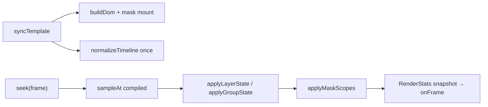

# Phase 9 — 2.5D transforms + stack-scoped masks

**Статус:** ✅ DONE (PRs #41–#47, merge в `main`, июнь 2026)  
**Канон:** `docs/DEVELOPMENT_PROMPT.md` §6.2, §6.5, §11.4; единый runtime `@titulus/runtime`  
**Предшественник:** Phase 8 (Rundown v2) — DONE

Этот документ — **единый источник правды** по Phase 9: что требовалось, что сдано, как реализовано и почему именно так. Ранее черновики лежали в `docs/new feature/`; их содержимое консолидировано здесь.

---

## 1. Задача и цели

### 1.1 Бизнес-цель

Сделать в Titulus рабочие **broadcast-графику уровня 2.5D** (наклон плоских слоёв в перспективе) и **функциональные маски по дереву слоёв** — с WYSIWYG в редакторе, анимацией на таймлайне и приемлемой производительностью на CPU-only CEF pipeline (CasparCG-aligned).

### 1.2 Что требовалось (сводка)

| Область | Требование |
|---|---|
| **Маска** | Новый тип слоя; обрезает только siblings **ниже** в том же stack; normal/inverted; скругление; 2.5D-поворот; анимация position/size |
| **2.5D** | `rotationX`/`rotationY` в UI; группы с `preserve-3d`; наследование perspective |
| **Anchor** | Единая точка pivot для translate + rotate + scale |
| **Перф** | Dirty-check DOM writes, observability (`RenderStats`), compile timeline один раз |
| **Bench** | Сцены 2.5D + mask-stack; документация; без регрессии vs Phase 0 budget |

### 1.3 Продуктовая специфика маски (заказчик)

Элемент **«Маска»** в редакторе:

- **Иконка:** прямоугольник с буквой «М», тот же размер, что у Rectangle (`h-4 w-4`).
- **Свойства:** позиция, размер, axis center (anchor), scale, скругление, угол Z, угол X, угол Y, **Режим** (обычный / инвертированный, default — обычный), Shape (rect / ellipse).
- **Без:** fill, border, opacity, blend mode.

**Режим «обычный»:**

1. Всё **ниже** маски в дереве рисуется только внутри границ маски; остальное обрезается.
2. Объекты **выше** маски не затрагиваются.
3. Маска в **группе** влияет только на siblings в **этой** группе, не на слои вне группы.
4. Вложенные группы **ниже** маски в той же ветке — под маской; вне ветки — нет.
5. Скругление маски участвует в обрезке.
6. При 2.5D (угол / угол X / угол Y ≠ 0) обрезка следует повёрнутым границам.

**Режим «инвертированный»:** видно всё **вне** области маски; внутри — вырезается. Та же логика дерева. Скругление и 2.5D — аналогично.

**Анимация:** маска анимируется по координатам и размерам как обычный слой.

---

## 2. Исходное состояние (до Phase 9)

### 2.1 Уже было в коде (не переделывали)

| Компонент | Где |
|---|---|
| Поля `rotationX`, `rotationY`, `perspective`, `anchorX`, `anchorY` | `runtime/src/schema.ts`, `shared/template.schema.json` |
| Анимация 2.5D в keyframes | `ANIMATABLE_PROPS` в `schema.ts` |
| CSS 3D строка | `runtime/src/transform.ts` |
| Тип `MaskLayer`, черновик UI | `schema.ts`, `factories.ts`, `PropertiesPanel`, `LayersPanel` |
| Bench 2D mask/alpha | `bench/bench-alpha.html` (~0.7% overhead Phase 0) |

### 2.2 Критические пробелы

1. **Маска не работала** — `clip-path` вешался на div самой маски, а не на siblings ниже (`domRenderer.ts`, Phase 8).
2. **Нет `preserve-3d`** — группа с `rotationY` не образовывала 3D-сцену с детьми.
3. **Нет rotationX/Y в UI** — только Rotate (Z) и Persp.
4. **Anchor** — `x/y` = `left/top`; pivot только через `transform-origin` без согласованной семантики.
5. **Нет dirty-check** — unconditional `style.*` каждый кадр.
6. **Нет RenderStats** — `onFrame` только `{frame, fps}`.
7. **Нет bench 2.5D** — только плоские `bench.html` / `bench-alpha.html`.
8. **UI маски** — общий case с rect (fill/border/opacity); иконка `lucide Crop`.

### 2.3 Диагностика hot path (из анализа оптимизации)

Главные источники нагрузки в DOM/CSS pipeline:

- **Timeline:** повторная нормализация, сортировка keyframes, `groups.find` на кадр.
- **DOM:** `syncTemplate` / `applyState` пишет все стили даже без изменений.
- **Маски:** `clip-path: polygon()` дороже axis-aligned `overflow:hidden`; 3D-маски требуют projected geometry.
- **Editor:** selection overlay через `getBoundingClientRect` — ок; drag должен использовать тот же `applyTransform`, что и renderer.

Titulus — **не sandbox** `broadcast-graphics/`: render authority = CasparCG + свой `domRenderer`, без PIXI/GSAP и без копирования sandbox engine.

---

## 3. Архитектурные решения

### 3.1 Принято: расширять существующие модули

Вся Phase 9 реализована **внутри** `@titulus/runtime` без нового render pipeline:

```
runtime/src/
  stats.ts          — RenderStats (9.1)
  timeline.ts       — compiled tracks (9.2)
  maskScopes.ts     — stack-scoped mask compile + 2D clip (9.3)
  maskGeometry.ts   — projected polygon для tilt/Z rotation (9.6)
  transform.ts      — pivot model, anchor compensation, transformHas3D (9.4–9.5)
  domRenderer.ts    — mount mask scopes, applyMaskScopes, preserve-3d (9.3–9.6)
```

Один `TemplateRenderer` для engine, editor, thumbnails — принцип §0.2 Titulus.

### 3.2 Сознательно НЕ делали

| Идея из черновиков | Почему отклонено |
|---|---|
| `RendererBackend` interface | Нарушает single-runtime; premature abstraction |
| Параллельный тип `Transform2D3D` | `Transform` уже расширен в schema |
| Публичный `FrameDiff` / `compileScene.ts` | Логика compile — в `timeline.ts` + private cache в `domRenderer` |
| WebGL/Canvas2D-as-primary | §0.2 CPU-only + HTML5; GPU только через GPU Gate |
| Outer/inner wrapper на каждый слой (MVP) | Scope creep; dirty-check дал основной выигрыш |
| Matrix world-transform для всех групп | CSS cascade + anchor pivot достаточны для MVP |
| Копирование sandbox `engine/` | Sandbox policy: render НЕ authority |

### 3.3 Что взяли из «идеального 2.5D плана»

- Compile stage один раз на `syncTemplate`
- Dirty-check style writes + stats
- Mask cost tiers (fast rect / rounded / projected polygon)
- Quantization geometry key для clip-path
- Selective `preserve-3d` (только при `has3D`)
- Bench scenes до «раздувания» фич

---

## 4. План выполнения: 7 PR

Каждая подзадача = отдельный PR, **merge commit** (не squash), ветка `feature/phase-9-*`.

| PR | Задача | Merge commit area |
|---|---|---|
| **#41** 9.1 | RenderStats + dirty-check | `runtime/src/stats.ts`, cache в `domRenderer` |
| **#42** 9.2 | Timeline compile + indexes | `timeline.ts`: `CompiledDirector`, binary search |
| **#43** 9.3 | Functional masks 2D + UI | `maskScopes.ts`, mount stack, UI cleanup |
| **#44** 9.4 | rotationX/Y UI + anchor fix | `transform.ts`, `PropertiesPanel`, `CanvasArea` |
| **#45** 9.5 | preserve-3d + perspective inheritance | `domRenderer`, `transformHas3D` |
| **#46** 9.6 | 3D-rotated masks | `maskGeometry.ts`, projected clip-path |
| **#47** 9.7 | Bench + документация | `bench-25d.html`, `bench-mask-stack.html`, этот файл |

---

## 5. Что сделано — по PR

### PR 9.1 — RenderStats + dirty-check

**Зачем первым:** без observability нельзя доказать оптимизации (verification-loop).

**Реализация:**

- `runtime/src/stats.ts` — тип `RenderStats`: `styleWrites`, `skippedWrites`, `frameTimeMs`.
- Per-node cache (`LayerNode.cache`, `GroupNode.cache`) — `setStyle()` пишет в CSSOM только при изменении строки.
- `OnFrameFn` расширен: `{ frame, fps, stats? }`.
- `channel.html?hud=1` — HUD со stats в engine preview.

**Почему так:** минимальный diff, без отдельного `FrameDiff` API; счётчики сбрасываются в начале `applyState`, snapshot в `onFrame`.

**Верификация:** повторный `seek` на том же кадре → `skippedWrites` >> `styleWrites`. Важно: после `syncTemplate` кэш уже обновлён — второй `seek` даст 0 writes (ожидаемо).

---

### PR 9.2 — Timeline compile

**Реализация:**

- `NormalizedTimeline` дополнен compiled tracks: sorted keyframes per `(targetId, prop)`, pre-resolved easing.
- `sampleTargetTrack()` — binary search вместо sort/filter на hot path.
- `normalizeTimeline()` вызывается **один раз** в `syncTemplate`, не на каждый `seek`.

**Почему так:** публичный API `sampleAt` / `actionsCrossed` сохранён — backend/WS без изменений.

---

### PR 9.3 — Stack-scoped masks 2D + UI

**Runtime — mount model (post sergey-v1 merge):**

```
stack container (root или groupStacks[gid])
  maskScopeWrapper  ← mount для frontmost mask
    clipHost  ← full-container; clip-path / SVG mask описывает зону
      … все siblings НИЖЕ маски в back-to-front массиве (рекурсивно) …
  mask layer (видим только в editor selection)
  … siblings ВЫШЕ маски mount в containerEl напрямую …
```

**Файлы:**

- `maskScopes.ts` — `computeMaskScopes()` (slice(0, i)), `maskClipStyle()` (normal/inverted, rect/ellipse, corner radius; inverted использует inline SVG luminance mask).
- `domRenderer.ts` — `mountStackRange()` рекурсивный split по frontmost mask; `applyMaskScopes` выставляет full-container clipHost + clip-path.
- `maskGeometry.ts` — `projectMaskOutline()` для projected rect/rounded/ellipse.
- Маска в эфире: `background: transparent`, `pointer-events: none`.

**UI:**

- `PropertiesPanel` — отдельный case mask: Mode, Shape, Radius; без Opacity/Blend/Fill/Border.
- `LayersPanel` — SVG `MaskIcon` (квадрат + «М»).
- `template.schema.json` — type-specific поля (`fill`/`border*`/`maskMode`/`shape`/...) объявлены прямо в `layer.properties`; type-safety сохранена через `allOf/then` (required per type).

**Почему clipHost, а не clip на маске:** семантика маска.txt п.1 — обрезка **соседей**, не самого mask div. Fast path: `clip-path: inset(...)` / `ellipse(...)` на full-container; inverted — inline SVG luminance mask.

---

### PR 9.4 — 2.5D UI + anchor fix

**UI:** поля **Tilt X** / **Tilt Y** (`rotationX`/`rotationY`) в Transform section.

**Anchor model (ключевое):**

- `x`/`y` в schema = **позиция pivot (anchor) в parent space**.
- DOM: `left = x - width*anchorX`, `top = y - height*anchorY`.
- `anchorCompensatedUpdate()` — при смене anchor в editor `x`/`y` компенсируются, чтобы визуал не прыгал.
- `CanvasArea` drag preview использует `applyTransform()` — WYSIWYG с renderer.

**Почему не matrix engine:** default `anchorX/Y = 0` → поведение идентично старым шаблонам; минимальный breaking surface.

---

### PR 9.5 — preserve-3d + perspective inheritance

**Реализация:**

- `transformHas3D(t)` — `rotationX≠0 || rotationY≠0 || perspective>0`.
- Root + groups: `transform-style: preserve-3d` только если subtree has 3D.
- Group: CSS `perspective: Npx` на element; дети получают `skipPerspective` в `applyTransform` если ancestor уже задал perspective.

**Почему selective:** `preserve-3d` на всех слоях плодит compositor layers (§6.5 perf killer).

---

### PR 9.6 — 3D-rotated masks

**Реализация:**

- `maskGeometry.ts` — проекция 4 углов маски при `rotation≠0 || rotationX/Y≠0`.
- `maskNeedsProjection()` переключает `clipMode: 'projected'`: full-container `clipHost` + `clip-path: polygon(…)`.
- Quantization 0.5px + `maskGeometryKey` для снижения churn.
- В projected mode дети **не** смещаются относительно mask origin (absolute coords в container).

**Почему упрощённая perspective math:** MVP reimplement-by-reference; финальная SDI parity — Phase 3 hardware. Достаточно для editor/engine WYSIWYG в типовых tilt-сценах.

---

### PR 9.7 — Bench + документация

| Артефакт | Назначение |
|---|---|
| `bench/bench-25d.html` | CSS 3D tilt stress (8 cards, rAF wobble) |
| `bench/bench-mask-stack.html` | `TemplateRenderer` + mask stack + animation |
| `docs/phase9-25d-masks.md` | этот документ |
| `.cursor/rules/10-development-plan.mdc` | Phase 9 DONE |

**Smoke:** `bg_engine` 3s на `bench-mask-stack.html` → `drops=0%`, p50≈20.7ms.

---

## 6. Текущая архитектура (hot path)



**Порядок CSS transform** (в `transform.ts`):

```text
perspective(N) → rotateX → rotateY → rotate(Z) → scale
```

Pivot через `transform-origin` на unscaled box; позиция через derived `left`/`top`.

---

## 7. Маски — техническая семантика

`rootStack` и каждый `groupStacks[gid]` хранятся **back-to-front** (последняя
запись = frontmost, см. `runtime/src/stackOrder.ts`). По спецификации (§1.3 п.1)
маска обрезает siblings **ниже** в видимом дереве = записи **до** неё в массиве.
Это значит `slice(0, i)` для `affected`, а не `slice(i + 1)`.

| Правило | Реализация |
|---|---|
| Scope | `computeMaskScopes()` обходит `rootStack` + каждый `groupStacks[gid]`; mask на index `i` → `affected = entries[0..i]` (записи **до** маски в back-to-front массиве = ниже по z) |
| Mount | `mountStackRange()` — рекурсивный split по **frontmost** маске в диапазоне; нижние siblings монтируются в её `clipHost`, верхние — в `containerEl`, сама маска mountится между ними |
| Normal 2D | `clipHost` full-container; `clip-path: inset(...)` / `ellipse(...)` с координатами mask rect в canvas-space |
| Inverted 2D | Inline SVG luminance mask (`<mask>` white + black cutout) через `mask-image` / `mask-mode: luminance`. Заменяет `polygon(evenodd)`, который давал треугольные артефакты |
| Rotated/tilted | `projectMaskOutline()` → `clip-path: polygon(...)` (поддерживает rect, rounded rect, ellipse) |
| Nested masks | Рекурсивный `mountStackRange` внутри parent `clipHost` |
| Mask invisible on air | Прозрачный fill; editor — selection overlay |

**Координатная модель:** `clipHost` всегда full-container (`left:0, top:0,
width:canvasW, height:canvasH`). Children сохраняют свои canvas-координаты —
маска описывает видимую зону, а не контейнер-якорь. Это решает баг
«добавление маски сдвигало координаты других объектов».

**Cost tiers (§6.5):**

| Tier | Условие | Механизм |
|---|---|---|
| T1 cheap | Axis-aligned rect, no rotation | `clip-path: inset(...)` / `overflow: hidden` |
| T2 medium | Rounded rect / ellipse | `clip-path: inset(... round N)` / `ellipse(...)` |
| T3 expensive | Any rotation / tilt | `clip-path: polygon` (projected outline) + quantization |

---

## 8. Bench и регрессия

Перед mask-stack bench:

```bash
cd runtime && npm run build
```

### 2.5D compositor stress

```bash
engine/build/Release/bg_engine \
  --consumer=null \
  --url="file://$PWD/bench/bench-25d.html" \
  --fps=50 --duration=60 \
  --width=1920 --height=1080 \
  --cache-dir=/tmp/bench-25d
```

### Stack-scoped masks (runtime path)

```bash
engine/build/Release/bg_engine \
  --consumer=null \
  --url="file://$PWD/bench/bench-mask-stack.html" \
  --fps=50 --duration=60 \
  --width=1920 --height=1080 \
  --cache-dir=/tmp/bench-mask
```

**Критерий:** сравнить `SUMMARY` (p50/p99, drops%) с Phase 0 (`docs/PHASE0_BENCH.md`). Цель Phase 9 — не вводить новый класс sustained drops на типовых сценах. Mask/alpha A/B по-прежнему через `bench/bench-alpha.html` (≤5% overhead).

### Editor / channel HUD

`channel.html?channel=…&hud=1` — `styleWrites` / `skippedWrites` per frame.

---

## 9. Известные ограничения MVP

- 3D mask projection — упрощённая модель; extreme perspective может чуть расходиться с compositor ground truth.
- `clip-path: polygon()` на анимированных масках дороже axis-aligned — в dense scenes предпочитать плоские маски.
- Outer/inner layout/compositor split не реализован — возможная Phase 10+ оптимизация.
- `compositorLayers` в RenderStats — не в MVP (зарезервировано).
- SDI parity 2.5D на DeckLink — отложено до Phase 3/6.4 hardware validation.
- Matrix-based world transforms для глубоко вложенных групп — aspirational; CSS cascade достаточен для MVP.

---

## 10. Что осталось на будущее (не Phase 9)

Из черновика «идеального движка» — **намеренно отложено:**

- `RendererBackend` + WebGL path
- `FrameDiff` как публичный контракт
- Temporal coherence evaluator (skip static layers per frame)
- `will-change: transform` selective на animated tracks only
- CI regression-gate на `compositorLayers`
- Cost indicator в UI при tilt-маске
- Editor: упростить overlays во время playback

---

## 11. Чеклист приёмки Phase 9

| Критерий | Статус |
|---|---|
| Маска обрезает siblings ниже в stack (root/group) | ✅ |
| Объекты выше маски не затронуты | ✅ |
| Inverted + rounded + ellipse (2D) | ✅ |
| 3D tilt masks (projected polygon) | ✅ |
| rotationX/Y в UI + keyframes | ✅ |
| preserve-3d для групп с 3D subtree | ✅ |
| Anchor pivot согласован (rotate/scale) | ✅ |
| dirty-check + RenderStats | ✅ |
| Editor WYSIWYG = engine (`@titulus/runtime`) | ✅ |
| WS take/update/clear без регрессии | ✅ (без изменений WS) |
| Bench scenes + документация | ✅ |
| Formal 60s multi-channel soak 2.5D+mask | ⏳ рекомендуется на bare-metal |

---

## 12. Ключевые файлы

| Файл | Роль |
|---|---|
| `runtime/src/domRenderer.ts` | Mount, apply state, masks, 3D |
| `runtime/src/maskScopes.ts` | Stack scope compile, 2D clip styles |
| `runtime/src/maskGeometry.ts` | Projected mask quads |
| `runtime/src/transform.ts` | Pivot, CSS 3D string, `transformHas3D` |
| `runtime/src/timeline.ts` | Compiled tracks |
| `runtime/src/stats.ts` | RenderStats |
| `frontend/src/editor/panels/PropertiesPanel.tsx` | Mask + Tilt X/Y UI |
| `frontend/src/editor/panels/LayersPanel.tsx` | MaskIcon |
| `frontend/src/editor/CanvasArea.tsx` | Drag + applyTransform |
| `shared/template.schema.json` | Mask schema |
| `bench/bench-25d.html`, `bench/bench-mask-stack.html` | Regression scenes |

---

## 13. Ссылки

- Канон: `docs/DEVELOPMENT_PROMPT.md` §6.5, §11.4
- Архитектура: `docs/ARCHITECTURE.md`
- Phase 0 bench: `docs/PHASE0_BENCH.md`, `bench/run-bench.sh`
- Git: PRs [#41](https://github.com/Requestin/Titulus/pull/41)–[#47](https://github.com/Requestin/Titulus/pull/47)
- Sandbox policy: `.cursor/rules/05-sandbox-policy.mdc` — render из CasparCG, не из broadcast-graphics
