# Новый интерфейс `sergey-v1`

Иллюстрированное описание интерфейса, подготовленное Сергеем. Документ
автоматически преобразован из [исходного DOCX](new-interface.docx); изображения
извлечены в [`new-interface-assets/media/`](new-interface-assets/media/).

Это reference UX ветки `sergey-v1`, а не готовый план прямого merge. Решения о
переносе и engine gates находятся в
[Phase 21 — New Designer Merge](../development-phases/phase-21-new-designer-merge.md).

## 1. Общая структура

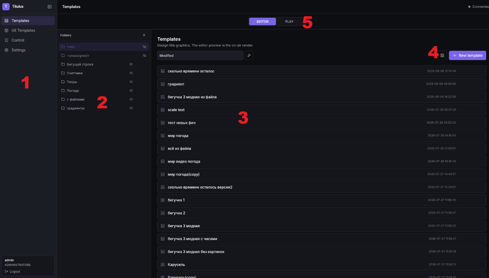

1.  Раздел меню. Есть 5 пунктов:

- Templates. Основной раздел создания темплейтов.

- Ue Templates. Фича которую в дальнешем реализуем. Идея в том чтоб управлять UE движков из нашего же плейаута и делать темплейты, которые будут вызывать blueprint. Предлагаю в нашу версию ее пока не переносить. Так же под это создан в настройках режим запуска движка который бы брал ue поток и отдавал в SDI, я его так до конца и не довел, это тоже надо не реализовывать.(с commit ee6d30c). Это был отдельный композер не затрагиваюший наш движок.

- Control – главное управление в режиме playout. Довольно сильно поменялось, ниже опишу.

- Settings - настройки, немного структурировал и заложил возможность дальнейшего наполнения под задачи.

- Logout.

> так же наверху появилась кнопка чтоб можно было данный раздел свернуть в тонкую полоску чтоб не мешать.

1.  Раздел папок templates. Данное поле resizable по ширине. Необходимо для удобного поиска шаблона в базе. Папки могут быть только одноуровневые. В структуре темплейт никогда не кладется, а ему присваивается тег к какой папке он принадлежит. По умолчанию новый темплейт не состоит ни в какой папки и находится в разделе \<All\> и \<unassigned\>. Чтоб привязать темплейт к папке, надо драгом перенести на папку. У папки есть 3 кнопки управления: глаз, карандаш, корзина. Глаз означает что данная папка и соответственно эти темплейты будут видны в разделе Control. Если глаз зачеркнут, то из Control данные темплейты пропадут. При удаление группы, он либо удаляет всю папку с темплейтами, либо только папку, а темплейты переносит в unassigned. Это он спросит при удаление.

2.  Список темпелейтов. Темплейты можно переименовывать, копировать и удалять через соответствующие клавиши справа.

3.  В верхнем меню есть меню где можно сортировать по дате изменения или по имени через выпадающее меню. Справа на верху есть клавиша меняющая вид на список или табнейлы. Табнейлы генеряться при сохранение темплейта.

4.  На верху есть раздел переключения на режим тестирования.в это режиме темплейт можно сразу толкнуть на канал что выбран в верхнем меню. Этот раздел раньше был в разделе control.

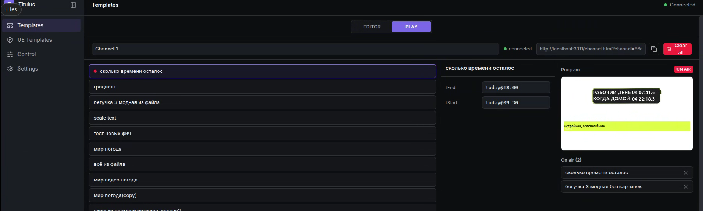

2.  Раздел Templates editor.

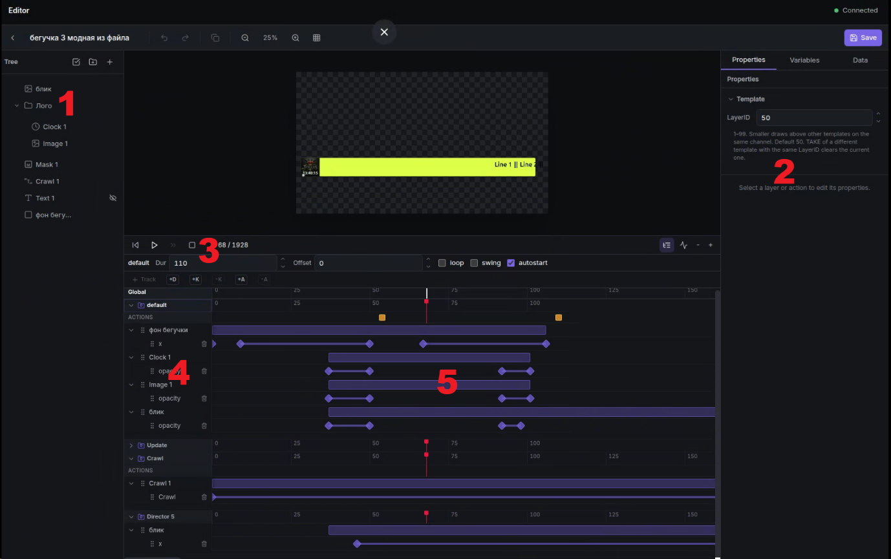

1.  столбец дерева темплейта. В старой версии называлось layers, теперь layers это другое понятие. Данное поле resizable по ширине. Здесь организовано дерево объектов которые есть в темплейте. Что выше в дереве, то получается ближе к смотрителю, как бы выше. Есть папки и вложенность папок не ограничена. Функции дерева:

- можно драгом переносить любой объект или папку объектов между собой.

- Можно выделить несколько объектов и перенести. Для этого наверху раздела tree есть клавиша 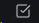.

- Если тянуть объект или группу объектов и зажать Ctrl то при отпускании создаться копия объекта или группы объектов. При копирование скопируются и все треки анимаций что были привязаны к данным объектам.

- Все объекты можно переименовывать, удалять и лочить от изменений.

> Список типа объектов:

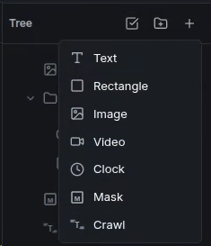

Добавился новый объект Crawl – бегущая строка. Ниже расскажу про нее.

1.  Раздел параметров, данных и переменных.

    1.  **Properties**. Раздел где отображаются параметры объектов дерева.Если не выделен ни один объект в разделе параметров отображается к какому слою привязан данный темплейт.

        1.  **Слои** – это понятие какой темплейт выше другого выходит в control. Если разные темплейты имеют один и тот же слой, то сначала выполняется команда out для первого темплейта(что уже в эфире), а затем команда take для нового темплейта. Тем самым мы как бы выбиваем один темплейт другим таким же. Данный параметр может принимать значение от 1 до 99. По умолчанию у любого темплейта значение равно 50.

        2.  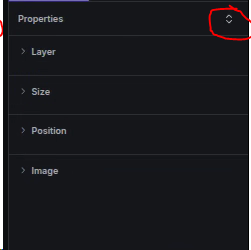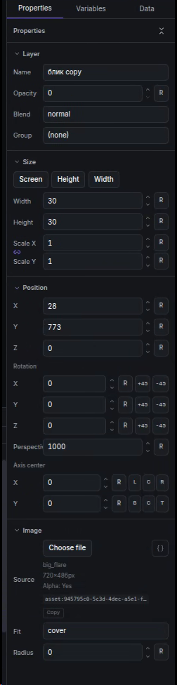При выделение какого-то объекта в данном разделе выводится список параметров данного темплейта. При нажатии слева наверху на кнопку можно свернуть/развернуть группы параметров и разворачивать по отдельности. Все числовые параметры можно менять стрелочками или тянуть мышкой вправо влево, есть клавиша сброса и для углов +45 и -45.

        3.  Раздел **size**. Есть 3 быстрых клавиши: Screen, Height, width – меняют быстро размер объекта по размерами экрана. Screen ставить 1920х1080, height меняет только высоты до 1080, width меняет только ширину до 1920. Между scaleX и scale y есть клавиша чтоб можно было залочить и изменять скалирования по обоям осям. Если надо делать анимацию с залоченными scale – то надо добавлять оба трека(scalex и scaley) и тогда это будет верно работать.

        4.  **Position**. Здесь добавилось поле Z. при значение данного поля отличного от 0, включается режим рендера 2.5d, что делает дороже кадр. Данной поле стало необходимо только когда вы начинаете крутить объекты не в плоскости рендера и они начинают пересекаться. Лучше просто так это поле не крутить.

        5.  **Rotation**. Z – это поворот в плоскости рендера, он самый дешевый. При изменение x или y включается режим 2.5d, удоражает кадр. без необходимости не использовать. Кручение происходит отностительно axis center.

        6.  **Axis center**. Точка относительно чего происходит поворот объекта, и относильтельно чего считаются координаты.есть быстрые клавиши замены: L(left),C(center),R(right),B(Bottom),C(Center),T(top). Для группы

        7.  Параметры самих объектов.

            1.  **Rectangle**. Имеет 2 режима:

> 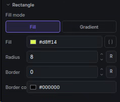 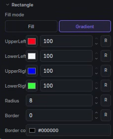
>
> Fill – режим когда он одноцветный, gradient – режим когда можно создать градиентную заливку для объекта, выбирая цвет для каждого угла и на сколько он заливает свою сторону.
>
> Цвет в режиме fill можно заполнить из переменной, можно потом добавить чтоб можно было и для градиента заполнять значения из переменной.

2.  **Text**. Здесь добавились режим выбора заглавных букв.

> 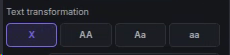
>
> x- как есть. АА – всегда заглавные, Аа – первая буква заглавная остальные строчные, аа – все строчные. В дальнейшем надо добавить импорт шрифтов, добавим после мержа.

3.  **Image**.

> 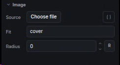
>
> При нажатии choose file открывается мими ман по картинками.
>
> 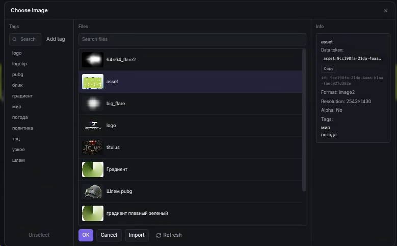
>
> Можно импортировать новый файл и выбрав с диска и он загрузиться и можно будет его описать.
>
> Можно положить в папку /var/lib/titulus/uploads/Image и при нажатии клавиши refresh он автоимпортнет их в бд.
>
> Так же к картинке можно привязать tag, чтоб удобно по ним было искать в дальнейшем. Есть меню создания новых тегов.
>
> 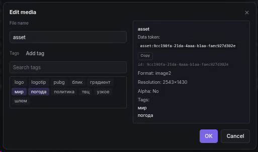
>
> Список tag общий для видео и для изображения.
>
> У assetid есть кнопка copy чтоб можно было потом ее скопировать и использовать в переменных.
>
> При импорте не поддерживаемых форматов картинков типа tiff – движок сам их конвертит в png. Справа выводится список параметров картинки.

4.  **Video**.

> 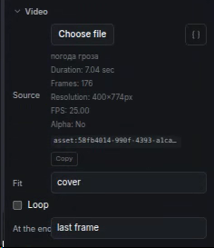
>
> При нажатии choose file открывается похожее как у картинки мини мам по видео, так же есть теги и поиск. Можно автоимпортировать если положить в пакпку /var/lib/titulus/uploads/Video
>
> Так же после выбора видео файла он сразу добавляется на таймлинию и его можно там двигать, чтоб определить время его старта. В параметрах видео есть клавиша loop и at the end. Параметр at the end имеет значения 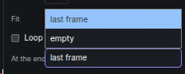
>
> Это определяет, что будет после окончания клипа если он не в режиме loop.
>
> И картинка и видео можно отдать на внешнее управление переменных. При импорте автоконвертит в кодеком vp9. Может это надо поменять при мерже.

5.  **CLock**. Часы в режиме countup и countdown поменялось что можно параметр starttime и endtime передать в переменные. А в переменных задать день не числом а сегодняшним днем, например today@18:00, что подставить сегодняшнее число и время.

> 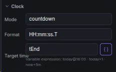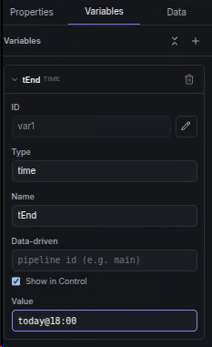

6.  **Crawl**. Бегущая строка.

> 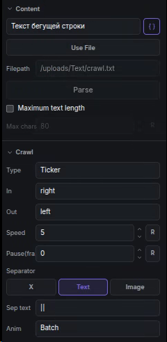
>
> Описание как пользоваться выделил в отельный документ: crawl parameter.md

2.  Раздел **Variables**. Раздел где можно сделать переменные и их использовать внутри темплейта или дать на управление в control оператору.

> 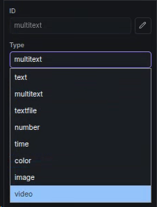 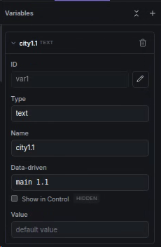
>
> 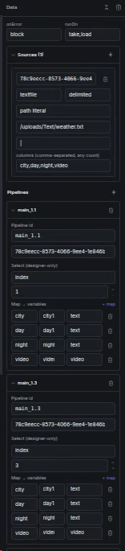Добавились типы объектов. Имена потом эти можно использовать в параметрах объекта, частично это все и так работало в той версии, стало более обширно. Их так же можно сворачивать.

3.  Раздел **Data**. Данный раздел необходим если хотим парсить данные из файла и вставлять их в переменные.

> в параметр source описываем какой файл мы парсим, какая его структура и какие названия столбцов(параметров) мы его данным присваеваем. Далее создаем pipeline где мы можем присваивать переменным значения из этого файла. Более подробно описал это в файле: template-editor-data.md

2.  Раздел управления анимациями - **timeline**. Есть 4 клавиши команды: 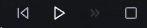

\- перепрыгнуть на начало. Перематывает глобальный playhead на нулевой frame

\- Play. Запускает глобальный playhead.

\- continue. Запускает директор который ждет continue.

\- Stop/pause. Останавливает все playhead.

Так же справ на этом уровне есть изменение вида таймлинии на режим кривых безье, и изменение масштаба таймлинии. Масштаб всегда отталкивается от положение глобльного playhead.

3.  Дерево всех треков таймлинии. У нас есть глобальная таймлиния, по которой движется глобавльный playhead, но так же у каждого директора есть своя таймлиния по которой бегают playhead данного директора. В новом темплейте есть всегда 2 директора(default и update). Default – это стандартный директор где создаются все новые треки анимаций. Update- директор который используется для реализации обновления данных темплейта(например выдан титр и мы хотим выдать такой же с другими данными, тогда срабатывает этот директор где происходит анимация и есть action в режиме tag=update data).

    1.  **Треки**. Наверху таймлинии есть кнопвка +track. Необходимо выбрать объект и тогда при нажатии данной клавиши откроется меню выбора доступных треков анимаций для данного объекта.

> 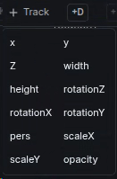
>
> При добавление нескольких треков к одном объекту, они группируются в папку треков объекта.
>
> 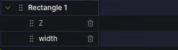
>
> Каждый трек можно драгом перенести в другой директор и там тоже создаться папка треков данного объекта.
>
> При выделение объекта в дереве объектов сразу выделяются все его треки на таймлинии.
>
> **Кейфремы**. Для создания анимации на треке, надо поставить playhead в начальную точку, изменить параметр трека в разделе properties(или в редакторе перемещением объекта) если необходимо, далее переместить playhead в другую точку и там изменить данный параметр. В этих точках создадутся кейфреймы. И от них будет создана анимация. Чтоб изменить тип анимации с линейной на более мягкие, надо выделаить трек и перейти в режим curve editor и поменять тип каждого ключа нажимая на него и меняя тип ключа.
>
> 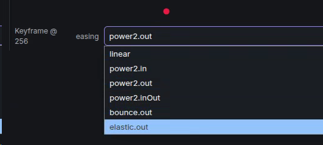
>
> Или можно добавлять новые ключи просто кликая в нужном месте, или поставить playhead и нажать клавишу +k.
>
> Удалить keyframe – выделить его и нажать -k
>
> **Анимация**. Между двумя кейфреймами если они имеют разные значения, создается полоса анимации. Ее можно двигать по таймллинии вправо и влево. Так же если у папки объекта анимаций создается своя анимация на его уровне, которая имеет размер по сумме всех анимаций что входят в него. Эту анимацию так же можно двигать. Так же можно потянуть за крайнюю точку анимации и растянуть ее, если потянуть за точку в группе анимаций, то внутри они все потянутся пропорционально расположению. На таймлинии можно выделять множество кейфреймов и после выделения так же их двигать.
>
> **Директора**. Есть клавиша +d – которая создает дополнительные директора для создания сложных независимых анимаций, которые надо останавливать и циклить не зависимо от основной анимации. Удалить директор через корзину около его названия.
>
> **Actions**. Тип события который привязывается к директору и вызывается когда playhead данного директора доходит до данного кадра. В одном кадре может быть не ограниченного количество actions.
>
> 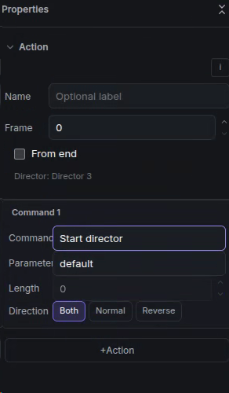 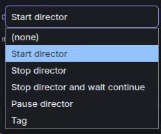 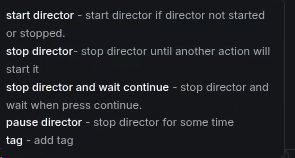
>
> Параметр from end – позволяет установить кадр action с конца. Это необходимо для установки экшенов для crowl, т.к. она имеет плавающую длину директора.
>
> Direction - направление движения playhead для срабатывания playhead.
>
> При добавление экшена директору у директора появляется отдельный трек экшенов.

3.  Раздел **Сontrol**.

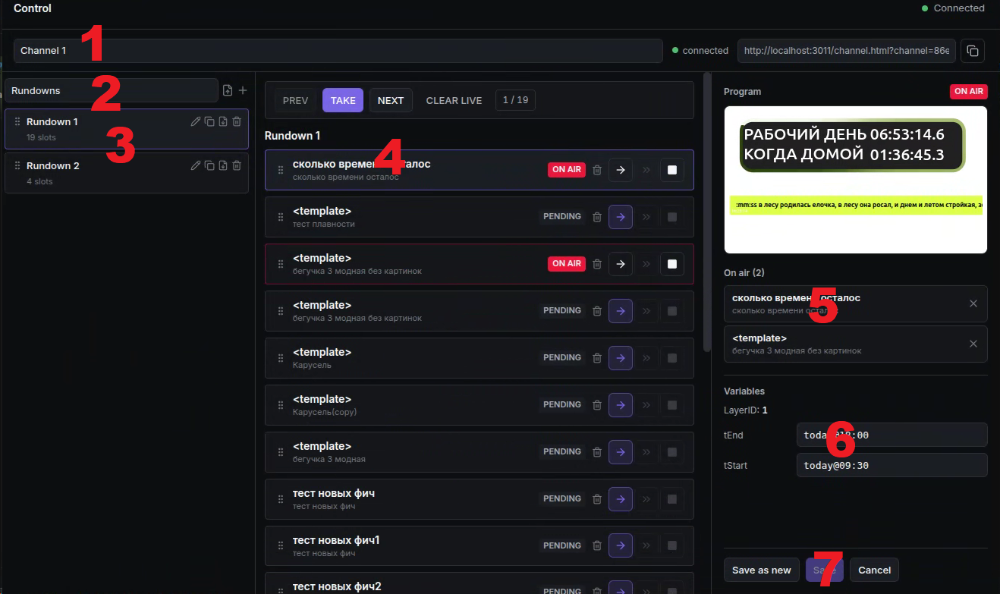

1.  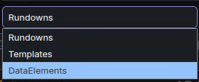Выпадающий список где выбираем каким каналом управляем.

2.  Выпадающий список где можем переключаться между списком rundown, templates, dataelements.

    1.  **Rundowns**. В каждом канале можно создавать сколько угодно рандаунов и больше не надо их привязывать к каналам. В каком канале создале рандаун, к тому каналу он и принадлежит. Клик по названию рандауна окрывает список данного рандауна справа. Толкать графику можно из разных рандаунов. Все запущенные темплейты видно в поле 5. Рандаун может формироваться из темплейтов и датаэлементов.

    2.  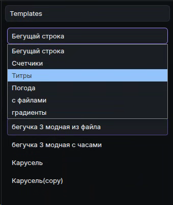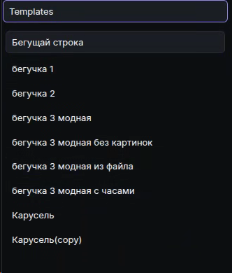**Templates**. Ниже выводится выпадающий список папок доступных в control(c включенным глазиком) и темплейты что есть в этой папке. Из этого списка темпллейт можно одним кликом выбрать и справа в поле 6 появятся его изменяемые параметры. После чего ниже в поле 7 есть кнопки сохранить. При сохранение темплейта из него создаться dataelement. Но можно просто драгом добавить темплейт в рандаун и толкнуть в эфир.

    3.  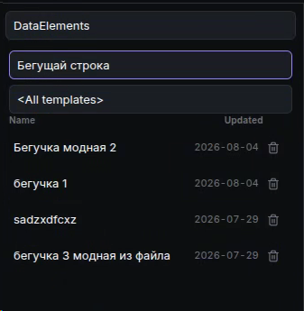**Dataelements** – сущность которая ссылается на какой то датаэлемент, но имеет свои заполненные изменяемые данные. К одному темплейту может быть привязано неограниченное количество датаэлементов. В данном разделе так же можно выбрать папку темплейтов и есть список темплейтов, тогда он выведет датаэлемнты только одног темплейта. Их тоже можно добавлять в рандаун драгом.

3.  **Список рандаун**. В данный список можно драгом кидать templates и dataelements.

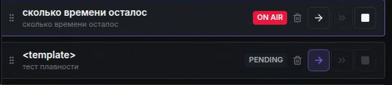

> Если добавляем датаэлемент – то мы большими буквами видим его имя и маленькими название темплейта. Если сразу добавить темплейт – большими буквами будет \<template\> , а маленькими так же название темплейта.
>
> Есть 3 клавиши управления: Take, Continue, Clear.
>
> Continue не активно до тех пор пока директор не встал в позицию stop and wait continue. После этого если вызвать continue – директор продолжит анимацию и закончит свое выполнение.
>
> Если есть 2 датаэлемента привязанные к одному темплейту у которого есть оформленный директор update – то при толкание второго он вызывает директор update и после этого статус on air переходит на него.

4.  **Settings**.

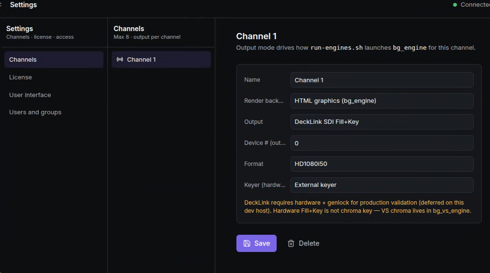

Здесь сделал дополнительный столбец для группировки настроек.

Из ного добавлена папка пользователей и групп и правка прав.

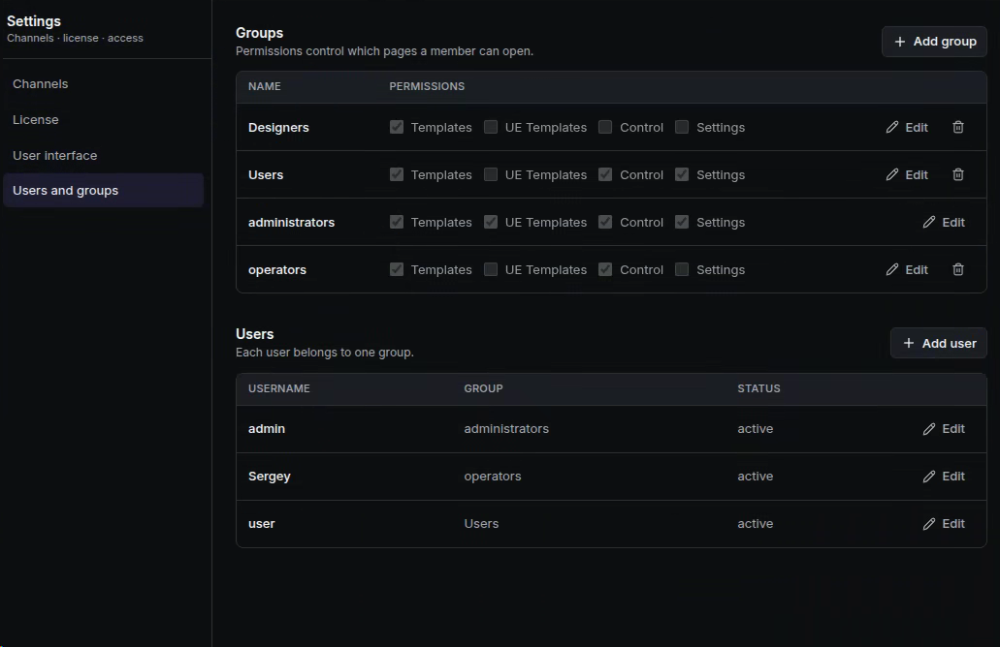

Соответсвенно UE templates право пока не делаем.
